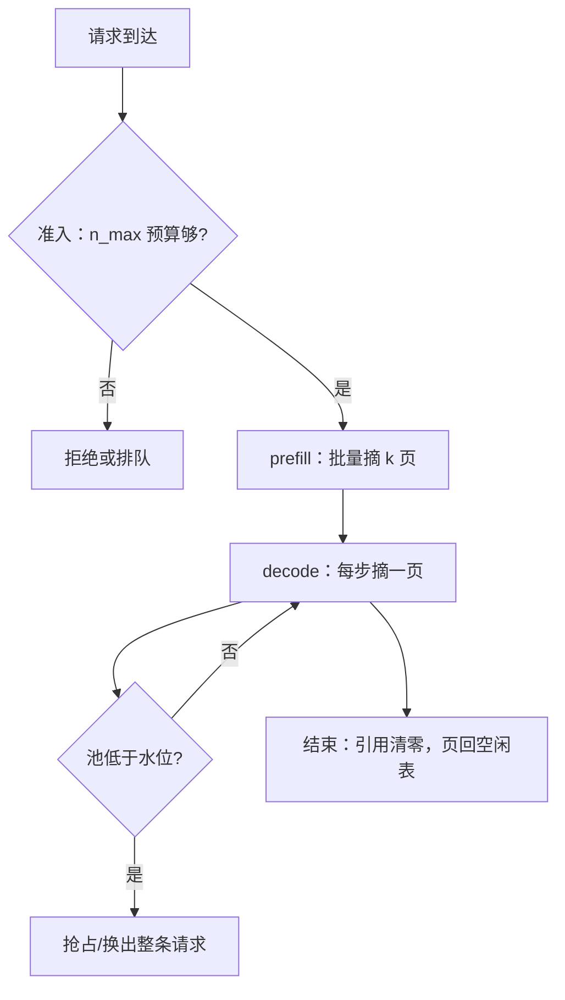

# 分页与碎片管理

碎片是承诺与用量之差：按最坏情况预留，就是在为永远不会发生的请求付费。

<footer>—— 据 Kwon et al., PagedAttention, SOSP 2023 的碎片分析整理</footer>

[上一课](/llm/kv-lifecycle-ownership)立了所有权状态机：页从池里出来、独占、共享、归还，写权与释放都由引用计数裁决。缺口是页本身怎么切、怎么发：池子管理得不好，所有权再干净，显存也会在「明明还有空」的时候拒绝新请求。本课写碎片的两种形态、分配器的策略，以及利用率该怎么记账。块大小怎么选是[已写过的权衡](/llm/paged-kv-block-size)，本课只引用其结论；分页注意力的寻址与 gather 也留在 [PagedAttention](/llm/paged-attention)。

## 问题

连续预留的账是这样的：按最大长度 $n_{\max}$ 给每条请求留一整段，实际用到 $n$。利用率是 $n / n_{\max}$ 的期望——对话负载里这个比值常不到一半，剩下的是为「万一写长」预付的内部浪费。更糟的是外部碎片：请求来了又走，长短不一，空闲字节总量够接一条新请求，却凑不出一段足够长的连续空间。Kwon 等人在 SOSP 2023 的测量里，现有系统只有约 20%–38% 的 KV 内存真正存了有效数据，其余被预留、内部浪费和外部碎片吃掉。分页的命题就是把这两项同时压掉：空闲页可拼给任何请求，外部碎片基本消失；最后一页没填满的平均浪费从「半段预留」降为「半页」。

## 方法

分配器是页池的守门人，要回答三个问题。

**从哪拿**：空闲页用空闲表管理。多数请求每次解码只需一页，first-fit 从表头摘即可；预填充一次要 $k=\lceil n_{\rm prompt}/B \rceil$ 页，可批量摘连续段以减少元数据。预留水位线（watermark）给系统留缓冲：池子低于水位就停止接新请求或触发[抢占](/llm/vllm-scheduler)，而不是等到分配失败再回滚。

**何时还**：请求结束、共享引用清零，页回空闲表——这在上课的状态机里。分页特有的问题是**增长中途失败**：解码到一半池子空了，这条请求既不能回滚也不该弃。正确姿势是 admission 时按 $n_{\max}$ 做准入检查、运行时按需分配，并在水位触发时抢占整条请求换出，而不是让页分配在 decode 中途失败。

**怎么算账**：三种口径必须分开——reserved（池子划给 KV 的总量）、allocated（已挂在块表上的页）、in-use（有效 token 占的槽位）。碎片率 $= 1 - {\rm in\text{-}use}/{\rm allocated}$，内部碎片全在这里；allocated 与 reserved 之差是没分出去的池。汇报时混用三者，「利用率 90%」可以是三种完全不同的系统。

## 机制

分页消灭碎片不是魔法，是把「连续性」从物理约束降级为逻辑约定：注意力只认逻辑位置，物理上页散在池里无所谓，代价是内核多做一层译址。于是页大小 $B$ 成了唯一剩余的碎片旋钮：$B$ 大则平均半页浪费是 $B/2$ 个 token 槽，$B$ 小则块表条目多、gather 的合并访问变差。16 与 64 之间选哪个取决于长度分布——短回复为主的负载用大页纯属浪费，这里只引用[块大小权衡课](/llm/paged-kv-block-size)的结论：负载相关，别抄默认值。

碎片会计决定调度质量。[准入控制](/llm/serving-metrics)若按 in-use 估容量，会在碎片高的时刻误判「还有空间」，decode 中途分配失败；若按 reserved 估，又把可用页白白锁死。正确输入是 allocated 加水位。另一处机制是**碎片不会自己长回来**：池子跑久了不会像 C 堆那样在页级产生洞（页等大），但前缀缓存会 pin 住大量只读页，把「空闲表很满、可分配页很少」的状态伪装出来——这要靠缓存逐出回收，不是分配器能解决的。

半页浪费是期望不是上界：长度恰为 $B$ 整数倍的负载内部碎片为零，而长度全部落在 $B+1$ 的负载永远浪费接近整页。评估页大小时用真实长度分布算，别用均匀假设。

## 边界

分页不减少有效 token 的字节，[那份账](/llm/kv-cache-size-math)由模型宽度和长度决定；它消灭的是预留与碎片，别把容量收益写两遍。CUDA Graph 喜欢静态形状，按「最大页数」锁图的实现会把灵活性换成内部碎片回潮。页池与专家权重、CUDA 上下文共享显存时，水位线要按整卡算。最后，碎片率只在固定负载分布下才可比：短对话测出的 98% 利用率，搬去长文档问答就是另一个系统。

## 小结

- 连续预留的浪费是预留与用量之差；分页把它压成页内的平均半页。
- 分配器三问：从哪拿、何时还、怎么算账；水位线把「中途失败」换成提前抢占。
- reserved / allocated / in-use 三种口径必须分开，碎片率定义在后两者之间。
- 页大小是剩余的唯一碎片旋钮，结论随长度分布变。
- 前缀缓存 pin 页会伪装成碎片，回收靠逐出不靠分配器。
- 出处：Kwon et al., PagedAttention, SOSP 2023（20%–38% 有效利用率与碎片分析）；块大小结论见本仓库 PagedAttention 与分页 KV 课。
