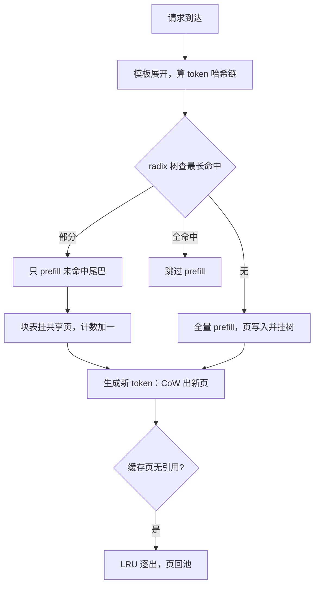

# 前缀缓存与跨请求共享

复用的单位不是请求，是前缀；共享省下的是第二次相同计算，前提是你能严格定义什么叫相同。

<footer>—— 据 Kwon et al., SOSP 2023 的共享前缀与 copy-on-write；索引结构见 SGLang 的 RadixAttention</footer>

[上一课](/llm/kv-paging-fragmentation)把池子管住了：水位线、按需分配、三种口径。但分配器只会一页一页地发，十个用户带着同一段系统提示到来，它就老老实实复制十份。共享是容量与延迟的第三根杠杆：不改每 token 字节（量化的事）、不删历史（驱逐的事），只把相同的计算付一次。本课写共享的簿记与正确性：什么算同一前缀、共享页挂在谁名下、命中与逐出怎么记账。前缀树的索引结构与多轮命中路径已各自写过，不重画；云侧计费口径也不在本课。

## 问题

系统提示、少样本示例、待问答的文档，在流量里高度重复。逐请求复制付三笔账：预填充的算力与 TTFT、KV 容量、以及调度上的排队时间。命中的定义是严的：从位置 0 起，**chat 模板展开后的 token 序列**逐个相同——不是用户可见文本相同。模板里注入的日期、随机种子、用户名，都会让序列在中途分叉，共享截止于第一个不同的 token；开头的可变项甚至能让 2K token 提示的共享量变成零。命中还有空间前提：请求必须落在持有该前缀的副本上，负载均衡若把同前缀请求打散到各卡，命中率在纸上再漂亮也是零。

## 方法

**缓存键**。共享的第一件事是给页起一个可比较的名字：按页把 token 序列做成哈希链，父页哈希进子页，查最长命中即沿链走。键里必须带上影响 KV 数值的因子：精度（FP16 页与 INT8 页不是同一指纹，见 [KV INT8/FP8](/llm/kv-int8-fp8)）、LoRA adapter（同前缀不同 adapter 的键值不同）。采样温度不进键——它不影响 KV，只影响输出。

**索引与命中**。[radix 树](/llm/sglang-radix-tree)把「已缓存的 token 序列」组织成可查最长前缀的结构；命中后请求的块表直接挂上共享页，引用计数加一——这正是第一课状态机的共享态，写时复制发生在生成首个新 token 的分叉处，共享段永远只到输入末尾。

**放置与逐出**。命中依赖[缓存感知路由](/llm/kv-aware-routing)把请求送到对的副本；共享页在无活跃请求引用时退化为纯缓存，按 LRU 逐出，判定必须与活跃引用解耦——缓存页可以丢，活跃页不能。

## 机制

共享改的是容量的期望值：$N$ 条请求共享同一段提示时，提示段从 $N\cdot\mathrm{KV}(n_p)$ 塌缩成 $\mathrm{KV}(n_p)$，生成段仍按请求各付各的（多样本公式见 [KV 大小计算](/llm/kv-cache-size-math)）。它省的时间全在 TTFT——预填充少算或不算；decode 每步仍要扫全部可见 KV，带宽一步没省，别把 TTFT 收益写进 TPOT。正确性由 copy-on-write 保证：共享页只读，任何写入（包括投机解码的草稿回滚）先复制，这就是第一课「写权只属唯一引用者」在共享场景的兑现。

命中率的统计口径决定这套机制可不可信：分母应是**可命中请求**（携带长共享前缀的请求），而不是全部请求。一个以随机对话为主的站点，前缀缓存命中率天然低，不代表实现坏了；反之，把「命中页数 / 总页数」当命中率，一份被千次引用的系统提示页会把数字撑到虚高。

把日期、随机 ID 之类可变内容注入提示开头，是最常见的自伤：命中在第一个不同 token 处截止，后面的 1999 个 token 白算。可变部分挪到提示末尾，固定前缀的共享就能延续。

## 边界

语义相似不命中：换一个说法的同一份文档在页表眼里是全新序列，模糊复用是检索或 [Prompt Cache](/llm/prompt-cache) 模块拼接的事。非前缀的重复块（多文档拼接）在自动前缀共享下只有第一块命中，[LMCache](/llm/lmcache) 一类方案处理的是这个问题。多轮对话要靠严格的「前缀加长」才命中，助手历史必须进索引（见[多轮前缀命中](/llm/multi-turn-prefix)）。最后，共享与量化互相牵制：改精度等于改指纹，滚动升级模型或 adapter 时，旧键的页要成批失效，否则命中到过期数值。

## 小结

- 共享的对象是从位置 0 起逐 token 相同的前缀，判定发生在模板展开后的 token 上。
- 缓存键带精度与 adapter，不带采样参数；radix 树查最长命中，引用计数管共享。
- 收益在 TTFT 与容量期望值，不在 decode 带宽；生成段仍按请求各付。
- CoW 保证共享页只读；逐出只针对无引用的缓存页，与活跃集解耦。
- 命中率的分母是可命中请求；放置（路由）决定命中的下限。
- 出处：Kwon et al., SOSP 2023；Zheng et al., SGLang/RadixAttention, NeurIPS 2024；据本仓库既有课程整理。
