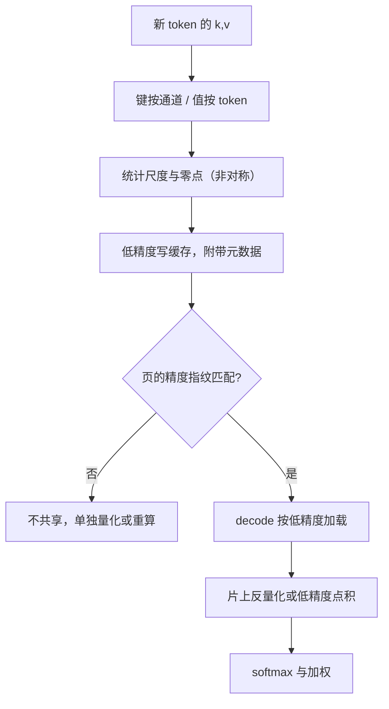

# KV 量化：INT8 与 INT4

压缩 KV 的第一刀不改注意力看得见什么，只改每个数字占几个比特；刀钝与否，取决于键和值愿不愿意被当成权重对待。

<footer>—— 据 Liu et al., KIVI, ICML 2024 对 KV 元素分布与量化轴的分析整理</footer>

[上一课](/llm/kv-prefix-cache)把相同的计算付一次，但每一份缓存仍按 FP16 宽度计费。本课进入压缩单元：量化是四刀里最钝也最稳的一刀——不改可见集、不改模型，只改缓存里存的数字与读出来的方式。8-bit 档的尺度、轴与核边界已在 [KV INT8/FP8](/llm/kv-int8-fp8) 写过，2-bit 的免调非对称方案在 [KIVI](/llm/kivi)。本课收在 INT8 与 INT4 两档的选型：何时一字节已够，何时必须半字节，代价落在哪。

## 问题

把元素宽度从 2 字节打到 1 字节，同样预算下长度或并发翻倍；打到 0.5 字节再翻一倍。但 KV 不是权重：权重离线、可校准、分布稳；KV 在线追加、带激活异常值。键沿通道常有固定的大幅度通道，尺度被它们绑架后，其余通道的量化阶梯粗到不可用——对称逐张量的 4-bit 在第一步就会崩。另一头，8-bit 的保护带宽可能过剩：逐 token 尺度的 INT8 在很多模型上几乎无感。选型的实质是：误差预算、元数据开销与核支持三者的交点，而不是比特越少越好。

## 方法

**轴与粒度**。经验结论稳定：键按通道量化、值按 token 量化。键的异常集中在少数通道，逐通道各配尺度才不被绑架；值更像随 token 变化的混合系数，逐 token 尺度即可。INT8 走逐 token 或逐块（32–128 token）粒度；INT4 必须非对称仿射加更细的组（逐通道或 64–256 通道一组），并沿通道攒一组 token 再统计——这要求转置访问或分块缓冲，是 4-bit 工程复杂度的真正来源。

**残差窗口**。最近 $R$ 个 token 留在高精度：当前句的键值对下一步最重要，噪声预算应花在远历史上。$R$ 取几十到几百，量化误差对正在展开的局部上下文免票。

**核兑现**。省的是带宽，不是容量本身：decode 每步把缓存从 HBM 扫进片上，若实现「存 8-bit、读出后先解回 FP16 再算」，显存降了而带宽几乎不降。要吃到红利，需要量化感知的注意力核，或至少在片上完成反量化（机制见 [KV INT8/FP8](/llm/kv-int8-fp8) 的 profiler 论证）。

## 机制

误差是加性噪声，进入点积后变成 logit 扰动，再经 softmax 放大或吸收。键的误差直接改注意力分布：softmax 对大 logit 敏感，系统性偏移会挪动注意力的落点，长上下文的针检索最先露馅——针的 logit 优势被噪声稀释。值的误差进输出残差，逐层累积但被均摊，所以值比键耐受，这正是「键按通道、值按 token」的机制根据。8-bit 的误差通常小于 logit 间距，短上下文无感；4-bit 把噪声推到与间距同量级，轴与粒度就不能再省。

量化还牵动共享与调度：[前缀缓存](/llm/kv-prefix-cache)的指纹必须带精度，FP16 页与 INT4 页不能共享；批量间混布不同精度的请求，会让每步带宽核算与水位预算都对不上账。

Llama-3-8B 的 KV 是 128 KiB/token（FP16，口径见第一课），INT4 打到 32 KiB，同卡理论上多装 4 倍会话。但逐通道尺度与零点是 FP16 元数据，粒度每细一档账本厚一截——净收益是「元素字节 ×4 减元数据」，不是 ×4。

## 边界

4-bit 不是安全终点：更极端的 [FP4](/llm/kv-fp4) 与 2-bit 需要更强的轴处理与残差窗口，收益也逐档递减。评估不能只看困惑度——短文本 PPL 几乎不动而长上下文任务已掉点，要用针测试与长文档问答验收。GQA 下尺度要聚合到 KV 头，不能按查询头重复统计。混精度共存会破前缀指纹，滚动升级要成批失效旧页。最后，权重量化的经验（[GPTQ](/llm/gptq)、[SmoothQuant](/llm/smoothquant) 一类校准）不能直接搬给 KV：未来 token 未出现，在线统计才是主路径。

## 小结

- 量化改的是每元素字节与读出方式，不改可见集；decode 的红利在带宽，必须由低精度核兑现。
- 轴不对称：键按通道、值按 token，机制是键的异常通道与值的残差角色。
- INT8 逐 token 常已够用；INT4 需要非对称、细粒度与通道攒批，复杂度涨在元数据与访存。
- 最近窗口留高精度，误差预算花在远历史。
- 精度进前缀指纹；评估看长上下文任务，不只看困惑度。
- 出处：Liu et al., KIVI, ICML 2024；8-bit 口径据本仓库 KV INT8/FP8 课；不发明文献。
