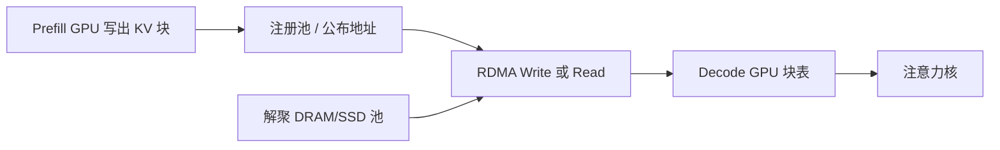

# KV RDMA 远端拉取

    
预填充和解码拆到不同机器之后，键值必须在网上搬家；走 GPUDirect RDMA，网卡对着 HBM 做远程写，而不是先弹到主机内存再拷回卡上。

<footer>—— Qin 等，Mooncake Transfer Engine；对照 Zhong 等 DistServe 把 KV 作为分离式服务的中间状态</footer>

分层缓存解决「这份 KV 放哪一层介质」。集群一放大，问题变成「这份 KV 在哪台机器上，解码卡怎么把它读过来」。Prefill 实例写出分页块，Decode 实例要在注意力开始前看到同一份字节。TCP 加主机缓冲能跑通，但体积随层数、KV 头、精度和长度线性涨，弹跳路径会把 TTFT 的下界钉在主机内存拷贝上。RDMA 远端拉取把块登记成可远程访问的内存，对端用单向写或读直接落到 GPU 或 pin 住的主机池。本篇写这条数据路径；介质层次见 [分层 KV](/llm/kv-tiered-storage)，网卡直达显存的背景见 [InfiniBand 与 GPUDirect](/llm/infiniband-gpudirect)。

## 问题

DistServe（Zhong、Liu、Chen、Hu、Zhu、Liu、Jin、Zhang 等，OSDI 2024，arXiv:2401.09670）把预填充与解码拆到不同 GPU，消除两阶段互相抢连续批，并使两套并行度可以分别选。代价是中间状态——主要是 KV——必须跨设备移动。Splitwise（Patel 等，ISCA 2024）在生产轨迹上做了同类拆分。Mooncake（Qin 等，arXiv:2407.00079）进一步把 KV 当成一等资源：预填充集群、解码集群、以及由各节点 CPU/DRAM/SSD/RDMA 拼成的解聚缓存池。调度器问的不是「哪张卡最闲」，而是「KV 在哪、搬过去要多久、会不会打穿 SLO」。

传输体积很容易估。每层每 token 的 KV 大约是 $2 h_{\mathrm{kv}} d_k$ 个数（MLA 则是潜向量加小 RoPE 键）。乘上层数、精度字节、提示长度，一次长上下文交接可以到数百 MB 乃至数 GB。PCIe 弹跳路径上，主机拷贝与网卡 DMA 串起来；GPUDirect RDMA 让 NIC 成为 GPU 的 PCIe 对等体，注册过的 HBM 缓冲区可以直接当 RDMA 本地或远端内存。Mooncake 的 Transfer Engine 把 RDMA、TCP、NVLink 等后端收成统一搬运层，SGLang 与 vLLM 都把它接成 PD 分离和跨实例共享的连接器。

### 延迟预算里传输必须可重叠

预填充还在算后面的层时，已经算完的层可以往解码侧推——层间流水把传输藏进剩余计算。若等到整网前向结束再一次性 dump，解码实例会空等一个完整 TTFT。反过来，解码侧若在块到齐之前就开注意力，会读到半新半旧的块表。协议必须有「层 $k$ 的块已提交」的完成语义，而不是只靠一条连接上的字节流。

拓扑比协议更先决定天花板。NIC 与 GPU 同属一条 PCIe 交换机（PIX）时，GPUDirect 才能接近线路速率；跨根复合物或跨 NUMA 时，BAR1 窗口变窄，pin 住的主机内存池反而更快。vLLM/Mooncake 文档把 CPU pinned pool 写成多数拓扑的默认，不是因为 RDMA 理论不行，而是因为机架布线经常不是 PIX。

## 方法

### 注册、块粒度、零拷贝

RDMA 要求内存先注册（`ibv_reg_mr` 或 DMA-BUF）。服务引擎不能对每个 token 注册一次：开销和 pin 住的页表都吃不消。实践是预注册一块大池，KV 按 [分页块](/llm/paged-kv-block-size) 从池里切。Mooncake 侧可以是 CPU pinned 池（GPU→池→RDMA→对端池→GPU）或 CUDA 池（GPUDirect，NIC 读 BAR1）。块哈希（前缀缓存用的指纹）同时当对象键：对端按哈希 RDMA Read，或本端 RDMA Write 到对端已公布的地址。

完成队列与批量是延迟的另一半。一块一块轮询会把小块的 QP 往返变成主导；按层或按若干块打包，一次发一串 RDMA Write，用一条完成事件表示「这一层可解码」。PCIe relaxed ordering（Mooncake 里 `IBV_ACCESS_RELAXED_ORDERING` / `MC_IB_PCI_RELAXED_ORDERING`）在 GPU 路径上往往决定能不能从十几 GB/s 走到接近 400 Gb/s 网卡的有效带宽——这是工程开关，不是算法创新，但关掉它，论文里的「RDMA 很快」会在基准上消失。

### 拉取还是推送

两种方向。推送：预填充实例在层结束时把块写到解码实例公布的缓冲。拉取：解码实例（或缓存池客户端）拿着块地址去读。推送适合「一对一交接、解码槽位已预留」；拉取适合「全局池、多个解码副本按需取热前缀」。Mooncake Store 把后者做成集群级前缀缓存：实例按哈希复用，而不是每条请求都从预填充卡再传一遍。失败要有超时与回退：RDMA 读失败应落到重做预填充，而不是让解码读零页。

## 机制

### 为什么 RDMA 对 KV 特别合适

KV 块在写出后只读，没有训练梯度那种双向归约。单向 RDMA Write 语义与「把只读块放到对端」同构，不需要 NCCL All-Reduce 的树。消息大小从几十 KB（单层一块）到数 MB（一层整序列），正好落在 InfiniBand 有吞吐的区间；过小则 QP 速率不够，过大则占满 HBM 注册池。GPUDirect 省掉的是主机弹跳，不是集合通信算法。

与专家并行的 All-to-All 不同：EP 每步都要按路由打散 token，KV 拉取通常一次交接、随后本地解码。因此可以把昂贵的注册与连接建立摊到会话生命周期，而不是摊到每个 token。会话亲和（[KV 感知路由](/llm/kv-aware-routing)）进一步减少「每轮重新拉取同一前缀」。

IBGDA（InfiniBand GPUDirect Async）让 GPU 自己提交工作到网卡，少一次 CPU 敲门。DeepSeek-V3 报告在解码期 EP 的点对点 IB 传输上使用它以降延迟。KV 拉取同样受益，但实现要处理 GPU 侧门铃与完成通知，不能假设 Verbs 主机路径直接可搬。

### 与分层缓存的交界

远端拉取的源不必是预填充卡的 HBM。它可以是本机 DRAM、远端 DRAM、甚至 SSD 上的对象经网关注册后暴露。调度器要同时看「计算空闲」和「字节在哪」。Mooncake 的 Conductor 一类索引器维护前缀命中与介质（gpu/cpu/disk），路由器按最长匹配选实例，传输引擎再决定是本机映射还是 RDMA。没有索引、只靠随机挑解码卡，RDMA 再快也在搬不该搬的块。

## 边界与工程取舍

RDMA 不是免费带宽。QP 数量、CQ 轮询线程、注册池大小、ECMP 源端口、NUMA 亲和都会把有效带宽打到标称的几分之一。安全上，把 HBM 暴露给 RDMA 等于扩大信任域：生产应隔离租户、限制 rkey 范围，而不是整卡开放。TCP 回退必须存在，否则机房改一次网卡驱动服务就停。

不要把 DistServe 的 goodput 数字当成「接了 RDMA 就 7.4×」：那是分离计算干扰、重配并行度之后的端到端结果，传输只是其中一项成本。不要在非 PIX 拓扑上强开 GPUDirect 再抱怨「RDMA 很慢」。MLA/GQA 缩小了 $M$，同一条链路能叠更长上下文，这是模型侧给传输的礼物，不是传输协议自己变快。

出处：Qin 等，*Mooncake: A KVCache-centric Disaggregated Architecture for LLM Serving*，arXiv:2407.00079；Zhong 等，*DistServe*，OSDI 2024，arXiv:2401.09670；NVIDIA GPUDirect RDMA 文档；DeepSeek-V3 报告中的 IBGDA 解码通信。实现以 Mooncake Transfer Engine 与各引擎 connector 为准。

## 小结

- PD 分离与全局前缀缓存都要把 KV 块跨机移动；RDMA 远端拉取是这条路径的低延迟实现。
- GPUDirect 去掉主机弹跳，但依赖 NIC–GPU 的 PCIe 近邻；否则 pinned CPU 池更稳。
- 块粒度注册、层间流水、完成语义，比「用了 RDMA」四个字更决定 TTFT。
- 只读块适合单向 Write/Read；会话亲和减少重复拉取。
- 失败回退是重做预填充，不是读未完成的块表。
- 出处：Mooncake；DistServe；GPUDirect RDMA。
