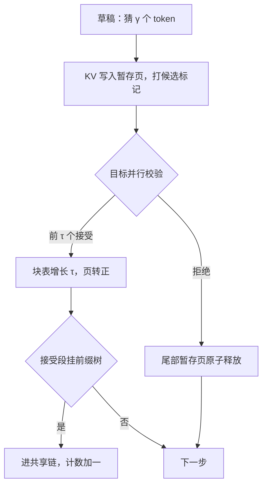
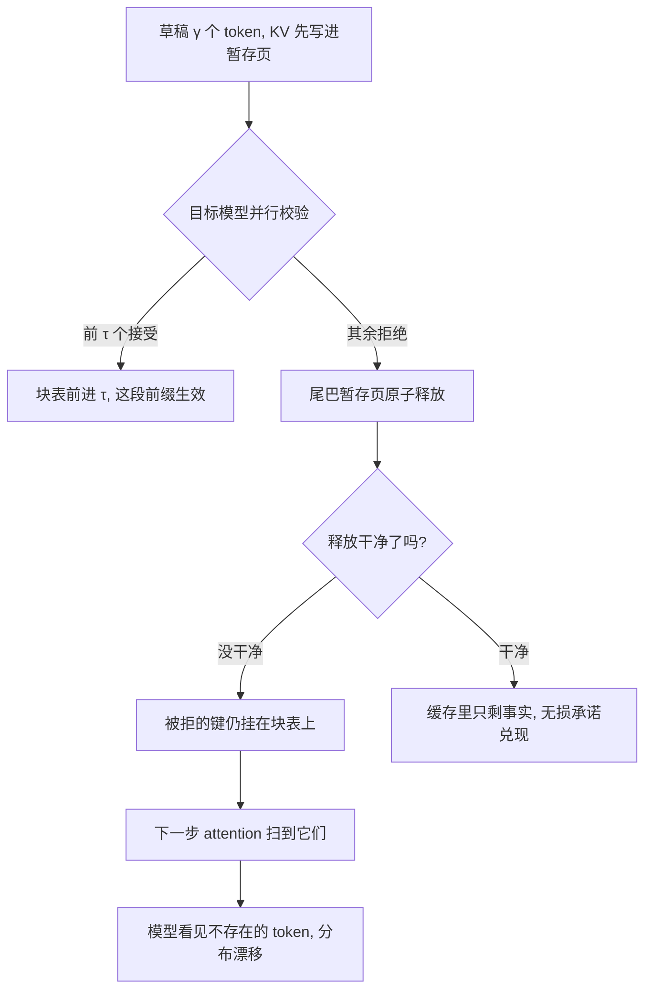

# KV 与投机解码

投机解码把一步变成一个接受长度可变的块；缓存侧的一切麻烦都来自同一件事——先写了，但还没被允许生效。

<footer>—— 据 Leviathan et al., ICML 2023 的接受–拒绝结构整理</footer>

[上一课](/llm/kv-longcontext-budget)把预算留了回滚余量，本课解释这笔余量付给谁。[投机解码](/llm/speculative-decoding)让草稿先猜 $\gamma$ 个 token、目标一次并行校验；无损性由[接受–拒绝规则](/llm/speculative-sampling)保证。但保证分布无损的是算法，缓存是有状态的：草稿 token 的 KV 已经写进页里，拒绝之后能不能干净地撤掉，决定了无损性在系统里是否兑现。本课写回滚协议、峰值预算与树分支的页管理。接受率怎么调、草稿怎么选不是本课主题。

## 问题

被拒草稿的 KV 若留在缓存里，下一步的因果注意力会 attend 到这些键——**模型看见了不存在的 token**，分布从此漂移，投机承诺作废。这是正确性问题，不是空间浪费。第二个麻烦是预算：每条请求在校验期间多挂 $\gamma$ 个位置的临时 KV，满并发时池子峰值乘上 $(1+\gamma)$ 因子；接受长度又是随机变量，预算若按均值编，坏运气的一拍就会触发抢占。第三个是树：[树状验证](/llm/speculative-tree)在同一拍展开多个候选分支，兄弟分支的键在注意力里必须互相不可见——掩码之外，物理上还得各住各的暂存页。

直觉类比：投机解码像口译员抢话——先替发言人把三句翻出来，对方点头几句就采纳几句。缓存侧的麻烦在于：抢先翻的那几句已经写进了会议纪要，摇头之后必须擦干净，否则纪要里就永远留着没说过的话。

## 方法

**提交协议**。把「写入」与「生效」拆开。草稿位置的 KV 写进暂存页并打上候选标记；校验后按接受长度 $\tau$ 把前 $\tau$ 个位置的页转正、块表前进 $\tau$，尾巴页原子释放。两条纪律：释放必须幂等（同一拍可能重复触发）；垃圾页不立即回发（沿用第一课的所有权——先改块表再动内存，池子的空闲表晚一拍更新无害）。

**峰值预算**。上一课的并发上限乘峰值因子 $(1+\gamma)$，再按接受长度分布的 p99 而不是均值留余；接受长度进监控分位数，与 [TTFT/TPOT 口径](/llm/serving-metrics)并列。

数字实例：$\gamma=4$、每 token 128 KiB 时，校验一拍每条请求多挂 $4 \times 128 = 512$ KiB 暂存，100 并发就是约 50 MiB 额外峰值。接受长度若均值只有 1.5、p99 却到 4，按均值编预算的池子会在最忙的一拍撞墙——所以余量按 p99 留。

**树分支**。祖先路径共享物理页直到分叉点，兄弟分支各持暂存页；接受路径转正为主干，其余整枝回滚。树越宽，一拍的峰值页数越多——树宽与批量的乘积才是真正的预算压力。

**与缓存链的接口**。暂存页永远不进[前缀共享链](/llm/kv-prefix-cache)——未接受的候选不是事实；接受段转正后才可被后续请求共享，指纹按转正后的形状算。

## 机制

无损的兑现点在提交协议：算法保证「接受路径上的分布与目标一致」，协议保证「缓存里只存在被接受路径上的键」。两者缺一，系统级的输出分布仍会漂。带宽账同样被重写：接受长度 $\tau$ 使这一步读 $\mathrm{KV}(n)+\tau\cdot c_{\rm kv}$ 的字节、省掉 $\tau-1$ 步；decode 本是[瘦计算胖加载](/llm/arithmetic-intensity-decode)，多扫 $\tau$ 个位置的边际带宽几乎免费，这正是投机与带宽墙天然互补的原因。但互补有边界：批量加大后算力逐渐打满，「稍胖一次前向」不再免费，[EAGLE](/llm/eagle)、[Medusa](/llm/medusa) 一类自投机的树宽也要跟着批量收——收益递减时，KV 侧的峰值方差却在照付。

术语翻译：「提交协议」就是把「先写了」和「算数了」拆成两件事的簿记规则——草稿的键值先进暂存区挂个「候选」标签，等校验点头后才把标签换成「生效」。没有这道手续，缓存里就分不清哪些数字是事实、哪些只是猜测。

监控里要有一个独立指标：每拍接受长度 $\tau$ 的分布。它同时是草稿质量、预算峰值与吞吐期望的充分统计；只报「加速比」会在批量或负载变化时掩盖池子压力的真实来源。

## 边界

回滚成本与页粒度耦合：$\gamma$ 个草稿位跨页时，尾巴释放会把还活跃的槽一起让出，实现要按槽而不是按页回收。流式输出必须「验证到哪提交到哪」，未验证的草稿不能进可见流。被抢占请求恢复时，暂存页一律作废重猜——保留半拍草稿状态的成本高于收益。多请求共享批时，各请求接受长度不同，批次内块表参差，核要支持变长而非补齐到最大（与[混合批次](/llm/splitfuse)同一类约束）。最后，别把投机收益写进稳态容量规划：它是延迟优化，不是容量优化，池子的预算按峰值编。

常见误区：把投机解码的加速比写进容量规划。它省的是步数不是字节——峰值期池子反而要多养 $\gamma$ 份暂存，收益还随批量增大递减。容量按「没有投机」的稳态编，加速是延迟红利，不是容量余粮。

## 小结

- 被拒草稿的 KV 是污染源：下一步会 attend 到它，无损性必须在提交协议里兑现，不只是算法里。
- 写入与生效分离：暂存页 + 候选标记 + 按接受长度原子转正/释放。
- 预算按峰值编：并发上限乘 $(1+\gamma)$，接受长度分布按 p99 留余。
- 树分支祖先共享、兄弟隔离；暂存页永不进前缀共享链。
- 投机与带宽墙互补，但收益随批量递减；监控独立报接受长度分布。
- 出处：Leviathan et al., ICML 2023；Miao et al., SpecInfer, OSDI 2024；树验证口径据本仓库投机解码课序。
