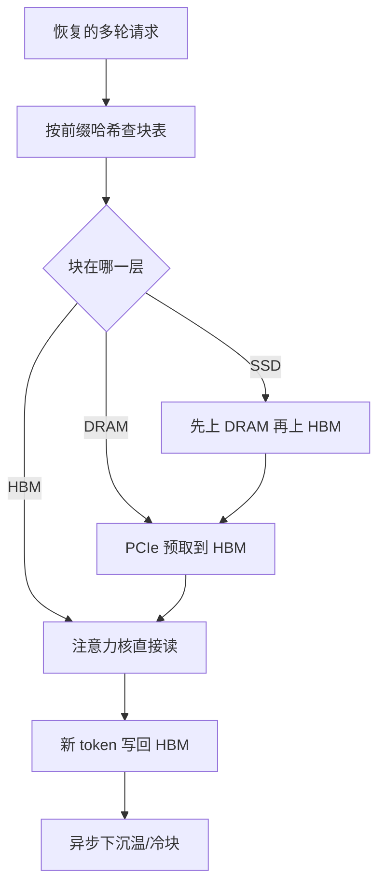

# 分层 KV：HBM→CPU→Disk

    
会话一旦空闲就把键值丢掉，下一轮只好把历史再预填充一遍；把冷 KV 放到主机内存和磁盘上，热路径仍走 HBM，才能把跨轮复用做成可扩展的存储问题，而不是每轮重算。

<footer>—— Gao 等，CachedAttention / AttentionStore，USENIX ATC 2024；对照 Qin 等 Mooncake 的分层 KV 池</footer>

自回归服务里，键值缓存随序列长度与并发线性涨，先于权重把 GPU 高带宽显存（HBM）顶满。引擎的默认策略是：请求结束或会话空闲，就把这份 KV 释放，腾给下一批。多轮对话、长文档问答、智能体工具说明书，下一条请求往往只多几十个 token，前面几千上万 token 的 KV 却已经算过。分层 KV 把「必须常驻 HBM 才能算注意力」和「必须保留才能避免重算」拆开：热块留在卡上，温块下到 CPU DRAM，冷块落到 NVMe，用预取把慢介质从关键路径上挪开。本篇写 HBM→CPU→Disk 这一条存储层次，以及它和淘汰、卸载的差别；按块换出的带宽账见 [KV 卸载](/llm/kv-offload)，跨机拉取见 [KV RDMA 远端拉取](/llm/kv-rdma-fetch)。

## 问题

一次预填充的成本跟提示长度近似二次（注意力）再加线性（MLP）。ShareGPT 一类多轮轨迹里，绝大多数预填充字节是「上一轮已经写过的历史」。Gao、He、Sharma、Kang、Jevdjic、Deng、Yang、Yu、Zuo 等人在 CachedAttention 里把这件事写成 AttentionStore：会话空闲时不要丢 KV，而要写入由 DRAM 与 SSD 组成的层次缓存；会话恢复时只预填充新增后缀。他们报告多轮场景下 TTFT 最多降约 87%、预填充吞吐最多约 7.8×，端到端推理成本最多降约 70%。这些数字绑在他们的负载与硬件上，不是「分层一定 87%」。

慢介质立刻引入第二道墙。HBM 带宽以 TB/s 计，主机 DRAM 经 PCIe 大约数十 GB/s，NVMe 再低一个数量级。若每步解码都要从磁盘读整层 KV，生成一个 token 的时间会被 I/O 钉死，算力闲着。所以分层能成立，必须满足：正在算的层与正在解码的请求的块在 HBM；即将用到的块能在计算窗口里预取上来；长期不用的块允许落到磁盘。这与操作系统的页缓存是同一屋顶线，只是「页」是 KV 块，「缺页」发生在注意力读块表之前。

### 卸载、淘汰、分层不是同一动词

[卸载](/llm/kv-offload) 把暂时用不到的 KV 搬走，目标仍是这份请求稍后还要读回来，内容不变。淘汰是丢掉：滑窗外、H2O 一类重要度筛选、或容量不够时的永久删除，数学对象从上下文里消失。分层是把保留下来的 KV 按热度放到不同介质上，语义上仍是完整历史。FlexGen（Sheng 等，2023）把权重、激活和 KV 一起放进 CPU/磁盘，追求单卡离线吞吐；AttentionStore 面向在线多轮，调度器必须知道下一层、下一请求，才能把预取做对。InfiniGen（Lee 等，OSDI 2024）进一步只把「对下一步注意力重要」的条目从 CPU 拉回 GPU，用上一层的排练减少 PCIe 流量——那是选择性地取，不是把整层当文件搬。

RoPE 若已旋进键里，截断或重排位置会使已存 KV 失效。AttentionStore 把位置编码与内容键解耦，截断窗口时可以重贴位置而不必整段重算。实现若把旋转后的键当纯内容向量存盘，窗口一滑就必须作废。

## 方法

### 三层与块表

物理槽不再只有 HBM。与 [分页 KV](/llm/paged-kv-block-size) 同一套逻辑块 ID：块表项指向 HBM 页、pin 住的主机页、或磁盘上的对象键。写路径只发生在追加新 token 时，新块在 HBM 分配；变冷的是旧前缀。Mooncake（Qin、Li、He、Zhang、Wu、Zheng、Xu 等，arXiv:2407.00079）把同一思路做到集群：预填充与解码分离，GPU 节点上闲置的 CPU、DRAM、SSD 与 RDMA 网卡组成解聚 KV 池，调度以 KV 为中心，而不是以「某张卡空不空」为中心。

放置策略不能只做 LRU。根上的系统提示被许多会话共享，先丢根会让所有分支一起变冷。AttentionStore 用调度器提示做 fetch/evict：即将轮到的会话从磁盘预取到 DRAM，再层间预加载进 HBM；长期不活跃的叶子先落盘。SGLang 的 [RadixAttention](/llm/radix-attention) 在单机树上先驱逐叶子，是同一依赖结构在 DRAM 容量约束下的特例。

### 层间预加载与异步写回

Transformer 按层串行。算第 $\ell$ 层时，第 $\ell+1$ 层的 KV 可以从主机 DMA 进来，与当前层的 GEMM 重叠。写回同理：本层刚写出的新 KV 可以在后续层计算时异步落到 DRAM/SSD，不必卡在本层结束的栅栏上。失败模式是预取窗口大于 HBM 预算：猜错下一请求会把真正热的块挤走，尾延迟比不分层更差。因此交互池通常只对「调度器已经排上的下一条」做预取，而不是把磁盘上所有前缀往卡上灌。

带宽不等式仍然成立。令一步要读的 KV 字节为 $M$，链路带宽为 $B_{\mathrm{io}}$，可重叠的计算时间为 $t_{\mathrm{comp}}$。若 $M/B_{\mathrm{io}} > t_{\mathrm{comp}}$ 且这些字节都在磁盘，则 TTFT 或 TPOT 的下界就是传输。减 $M$ 的手段：GQA/MLA、KV 量化、只拉本步窗口。增 $t_{\mathrm{comp}}$ 的手段：更大的连续批、把冷会话从交互池拿开。

## 机制

### 只读块使层次缓存比训练检查点更简单

某个 token 的 $K,V$ 一旦写入，直到被淘汰前都是只读的。搬到 CPU 或磁盘不必写回脏页，也不需要训练激活卸载那种双向一致性。脏的只有「正在追加的尾巴」。前缀共享时，热请求与冷请求可能指向同一物理块：引用计数必须跨介质，不能把 GPU 上仍有指针的块卸走。Mooncake 一类全局池还要把副本位置登记进索引器，否则路由会把请求送到「以为热、实际已落盘且未预取」的实例。

调度器感知是层次命中率的真正来源。作业队列已经决定了下一秒谁会跑，缓存策略若假装这是独立的 LRU，就会在队列里明明排着的会话上打磁盘。反过来，队列若不知道某前缀在 SSD 上要数百毫秒，会把本该延迟调度的请求提前放到 GPU 上空等。分层 KV 因此不是存储插件，而是调度与块表的联合设计。

「所有历史都保存」会把磁盘变成无限日志。生产上仍要配额：按租户、按会话 TTL、按前缀流行度。AttentionStore 的实验用主机 DRAM 加数 TB SSD 量级来说明层次，不是主张永不淘汰。

### 与 PD 分离、量化的叠放

Prefill/decode 分离（DistServe，Zhong 等，OSDI 2024）把 KV 从预填充池传到解码池，传输对象往往先落在某一层存储上。分层缓存可以充当这次传输的落点：预填充写完不必立刻占满解码卡的 HBM，先进入近 GPU 的 DRAM 池，解码实例按需拉取。KV 量化（FP8/INT8）按比例缩小每一层的体积，使同一 PCIe 窗口能叠更多层预取；它不改变层次语义，只改变不等式里的 $M$。

## 边界与工程取舍

不要把 FlexGen 的离线吞吐数字抄到聊天 SLO 上：前者接受高延迟换单卡满载，后者不能让用户等一次 NVMe 往返才出下一个字。不要假设任意 RoPE 实现都能在落盘后截断。不要在没有引用计数的块表上做跨层驱逐。磁盘层的尾延迟（GC、写放大、共享阵列排队）会进入 TTFT 的长尾，监控必须分介质报命中率，而不是只报「缓存命中」。

跨机时层次还要加上网络。本机 SSD 与远端 DRAM 谁更快，取决于集群拓扑，不是固定排序。Mooncake 用 RDMA 把远端 DRAM 做成近 GPU 的池，这时「Disk」可能只是更冷的归档，而不是默认第三层。写设计文档时应画清楚：本机 HBM / 本机 DRAM / 本机 NVMe / 远端 DRAM，各自的带宽与谁负责预取。

出处：Gao 等，*Cost-Efficient Large Language Model Serving for Multi-turn Conversations with CachedAttention*，USENIX ATC 2024，arXiv:2403.19708（系统名 AttentionStore）；Qin 等，*Mooncake*，arXiv:2407.00079；Sheng 等 FlexGen；Lee 等 InfiniGen，OSDI 2024。不要伪造「分层 KV」的单独奠基 arXiv 号。

## 小结

- 分层 KV 把已算好的键值按热度放在 HBM、CPU DRAM 与磁盘上，避免多轮对话把历史整段重算。
- 正确性依赖块只读、跨层引用计数，以及调度器提示下的预取与驱逐；纯 LRU 会打穿慢介质。
- 层间预加载把 PCIe/NVMe 延迟藏进当前层计算；预取错误会比不分层更伤尾延迟。
- 卸载是搬家，淘汰是丢掉，分层是保留但换住所；三者不要混写成同一个开关。
- 解聚服务里，分层池常常就是 PD 之间 KV 的落点。
- 出处：CachedAttention / AttentionStore（ATC 2024）；Mooncake；FlexGen；InfiniGen。
