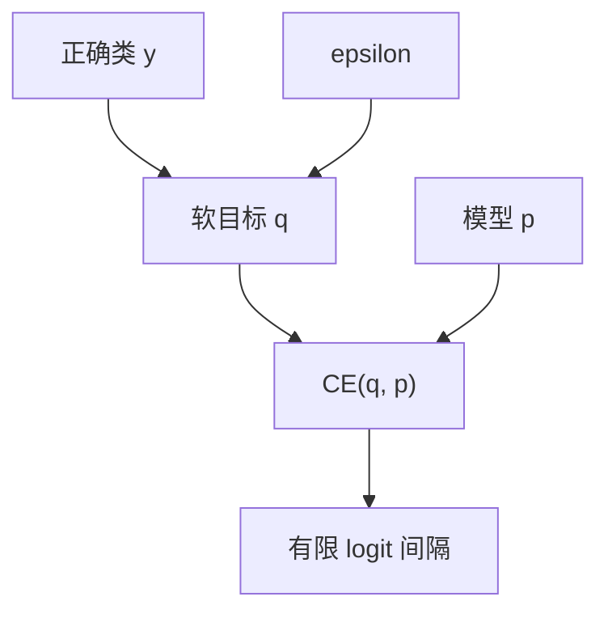

# 标签平滑

把 one-hot 目标改成正确类 $1-\varepsilon$、其余均分 $\varepsilon$，交叉熵不再奖励无限大的 logit 间隔，校准往往变好，最大似然则变差。

<footer>—— Szegedy et al., Rethinking the Inception Architecture, CVPR 2016；分析见 Müller, Kornblith & Hinton, NeurIPS 2019</footer>

[上一课](/llm/attention-dropout-droppath)把激活与路由上的噪声写完。缺口转到**目标**侧：Vaswani 等人在翻译上用了 $\varepsilon=0.1$ 的标签平滑（label smoothing）。语言模型若仍把目标当 one-hot，CE 会推动正确类 logit 相对其余趋向 $+\infty$，这与 [输出初始化](/llm/output-init-logit-scale) 钉住的有限尺度、以及主干 [z-loss](/llm/z-loss) 要压的 LSE，方向相反。本课写平滑如何改损失，以及因果 LM 为什么常常不用它。

## 问题

标准下一 token 损失是 $-\log p_{y}$。最优是 $p_y=1$，需要 $\ell_y-\ell_j\to\infty$。训练中这意味着输出层与最后一层范数可以无界增长，半精度与校准先坏。Szegedy 等人把目标改成

$$
q_y=1-\varepsilon,\qquad q_j=\frac{\varepsilon}{|V|-1}\ (j\neq y),
$$

最小化 $\mathrm{KL}(q\|p)$（等价于对 $q$ 的交叉熵）。正确类不再要求概率 1，错误类也分到一点质量，logit 间隔有限。Müller 等人指出：平滑抑制的是正确类相对最强错误类的过度自信，表示空间里同类更紧、类间更分离，对蒸馏当教师更友好。

因果 LM 的词表是 $10^4$–$10^5$ 量级，$\varepsilon/(|V|-1)$ 极小。同样 $\varepsilon=0.1$，分到每个错误 token 的目标质量可以忽略，平滑几乎只在「正确类不要 1」上起作用。翻译词表较小、且评测是 BLEU 不是 PPL，原论文的 0.1 不能直接贴到 GPT。

平滑改的是训练目标，不是解码温度。用平滑训完再以温度 1 解码，模型会偏「平」；若把温度降下来追 PPL，等于部分撤销平滑。报 PPL 的预训练不要默默开平滑。

## 方法

实现上不必物化 $q$：

$$
\mathcal{L}=-(1-\varepsilon)\log p_y-\varepsilon\,\mathrm{mean}_{j\neq y}\log p_j,
$$

第二项等于 $\varepsilon$ 乘（全体 token 的平均 $\log p$ 再扣掉正确类一项的修正）。与全词表 softmax 的融合核要一起改，Cut CE 一类只取正确类与分母的实现，必须补上对 $\log p_j$ 的均值，否则平滑是错的。

$\varepsilon$ 的扫：翻译 / 分类 0.1 是文献常客；LM 若用，数量级更小（0.01 或更低），并**同时看** CE 与下游，不要只看训练 CE——训练 CE 几乎必升。与 dropout 同时开时，噪声来源变两个，消融应能单独关平滑。

不要把平滑当成 class-balanced 的稀有词保护：它对所有错误类一视同仁，稀有词与高频词分到同样的 $\varepsilon/(|V|-1)$。要照顾频次，应改采样或损失权重，不是加大 $\varepsilon$。

## 机制

对 logits 的梯度从 $p-y$ 变成 $p-q$。正确类目标变小，梯度不再拼命抬 $\ell_y$；错误类目标非零，梯度轻微抬所有错误 logit——更准确地说，相对 softmax 均值做微小拉动。结果是 LSE 增长变慢，与 z-loss 同向但弱得多，不能替代 z-loss：平滑不显式惩罚 $z^2$，只改目标。

Müller 等人还观察到：平滑使教师的 $p$ 更适合当蒸馏目标，因为不再接近 one-hot。若你的流水线没有蒸馏，这个优点不存在。对指令微调，平滑可能伤害「必须选确定答案」的题；对开放生成，可能减轻个别 token 的过度自信。要按任务消融，不要作为稳定训练的默认保险。

## 边界

标签平滑与 label noise（随机关错标签）不是同一件事：前者是确定的软目标，后者是随机错误。也不要和 Mixup / token dropout 混写。评测 PPL、BPB 必须在**未平滑**的 CE 上算，否则与历史检查点不可比。下一课的困惑度定义以硬目标 CE 为准；若训练用了平滑，日志里应同时打 `ce_hard` 与 `ce_smooth`。

## 小结

- 标签平滑把 one-hot 改成 $1-\varepsilon$ 与均分 $\varepsilon$，阻止 CE 要求无限间隔。
- 大词表 LM 上每错误类分到的质量极小；翻译上的 0.1 不是 LM 默认。
- 训练 CE 会升；报 PPL 必须另打硬目标 CE。
- 它弱于 z-loss，也不是稀有词加权；与 dropout 分开消融。
- 出处：Szegedy et al., CVPR 2016；Müller, Kornblith & Hinton, NeurIPS 2019；Vaswani et al. 在翻译中的使用。
