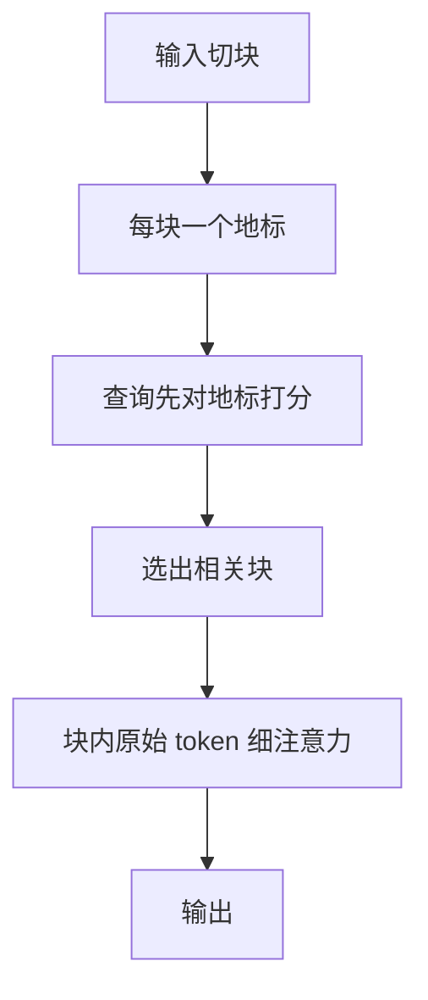

# Landmark Attention

不必让每个查询扫完整段历史；先问每一块的地标，再只对选中的块做随机访问，上下文长度就可以从二次扫描里解开。

<footer>—— Amirkeivan Mohtashami, Martin Jaggi, Landmark Attention, 2023</footer>

全注意力把过去每一个键都放进可见集，长度一涨，[二次代价](/llm/attention-quadratic-cost)与 KV 体积一起涨。滑窗把远键整段剪掉；压缩记忆把远历史揉进固定状态，细节对不准。Mohtashami 与 Jaggi 2023 年的 Landmark Attention 走第三条路：把序列切成块，每块选出一个地标 token，查询先对地标做一次粗检索，再只对命中块里的原始 token 做细注意力。于是「任意远的某段」可以按内容跳进去，而不必常驻全部键。本篇只讲这条地标随机访问，KV 预算的其他压法见 [KV 压缩作为长上下文手段](/llm/kv-as-long-context)，按块可学习选择见 [Native Sparse Attention](/llm/native-sparse-attention)。

## 问题

长上下文要同时满足两件事：查询必须能对准很早以前的某一个字面量；计算与缓存又不能随 $n$ 二次膨胀。固定稀疏图给不出内容相关的远边；层叠滑窗的感受野是有损接力，针测会失败。若把整段 KV 都留下，decode 显存先爆。需要一种训练得出来的块级目录：目录项很少，但每一项都能把查询带回那一块的原始键。

地标机制的问题设定因此是：块内信息由谁代表、查询如何用代表做随机访问、训练时的可见集如何与推理时的「先地标、后局部」对齐。做不到对齐，上线一改图就会掉点；代表若不可学习，目录就是平均池化，精确拷贝仍然失败。

## 方法

### 按块插入地标

输入按固定块长 $\ell$ 切开，每块末尾插入一个地标 token。地标不是事后池化出来的摘要向量，而是序列里的真实位置，参与同一套注意力与前馈。训练时，块内普通 token 主要看见本块邻居；地标则看见本块全部 token，从而被梯度逼着成为该块的可寻址代表。后续位置若不能直接扫过往全部键，就只能先碰到这些地标——目录是训出来的，不是外挂检索器。

地标是序列中的一个 token，不是块均值。均值对所有查询都相同；地标的键随查询进入注意力，不同问题会点亮不同块。这是它和不可学习压缩记忆的差别。

### 先对地标、再对局部

推理或长上下文前向时，查询 $q_t$ 先对已有地标键 $\{k^{(L)}_b\}$ 打分。分高的块被视为命中，再把那些块的原始 $K,V$ 载入，做第二次局部 softmax。未命中的块既不进细算，也不必留在高速缓存里。可见集于是变成「全部地标 + 少数块的原文」，与 $n$ 解耦，只与块数（粗路）和选中块数 × $\ell$（细路）有关。

$$
b^\star=\mathrm{top}\text{-}k\left(\frac{q_t^\top k^{(L)}_b}{\sqrt{d}}\right),\qquad
y_t=\mathrm{softmax}\!\left(\frac{q_t K_{b^\star}^\top}{\sqrt{d}}\right)V_{b^\star}
$$

上式把两阶段写成分开的 softmax。也可以用地标分数做门控：超过阈值才展开该块，使 $k$ 随内容变，而不是固定配额。训练需要让地标键真能代理块内注意力质量，否则粗路点中的块细路用不上。

### 训练图与随机访问

若训练仍用满注意力、只在推理改成地标检索，分布会裂开。做法是让训练期的可见集已经分层：当前块局部边 + 过去块的地标边，必要时再对若干块做可微的软展开，使「凭地标跳进原文」成为网络的一部分。地标自己对块内做满注意力，梯度从后续查询经地标流回块内 token，代表才学得动。

与 Longformer 全局点不同：全局点是任务指定的少数中枢，地标是按块均匀铺开的目录，每一块都有入口。与 NSA 的压缩支路同类，但 Landmark 2023 的主场是「随机访问已有块」，不是三路融核；实现更接近在标准注意力上改掩码与两段式检索。随机访问强调的是：远块不必按时间顺序扫过。目录分数高，就可以直接展开第 $b$ 块，中间那些块可以不进细算。这和滑窗的平移窗口不是同一张图。

## 机制

地标能当目录，是因为 softmax 的质量可以先在块级再分配，再在块内再分配。粗路回答「哪一段可能有答案」，细路回答「段内哪一个键」。只要块长小于模型一层内的舒适跨度，块内尖峰能力仍在，拷贝与针测仍可能——失败会出在粗路漏块，而不是出在块内对准。

块长 $\ell$ 同时决定目录粒度与漏检代价。太长，一个地标要代表太多互不相关的句子，查询点中块之后仍要对很长一段做二次注意力，目录变钝。太短，地标数量接近 $n$，粗路自己又变成二次。$\ell$ 应落在「一层局部注意力已经够用、目录项数仍远小于 $n$」的区间。

两段 softmax 不是一次满注意力的恒等改写。粗路用一个键代替整块，等价于对块内键做了内容相关的池化。漏块不可逆：细路看不见的 token 权重精确为零。评测应单独报块召回，而不是只报最终损失。

## 边界与工程取舍

离散选块会漏。阈值或 top-$k$ 太狠，答案所在块进不了细路，表现为突然的针测崩溃，而不是平滑掉点。太松，又走回近似满注意力。地标本身占上下文一个位置，块很多时目录扫描也有成本，极端长度仍要考虑对地标再分级。

不要把 Landmark 理解成「推理时对 KV 做聚类」。代表是训练出来的 token，权重已经按「后续只能先看见地标」这条约束补偿过。对已训好的满注意力模型事后插地标、不微调，目录没有语义。也不要和 [MLA](/llm/mla) 混名：MLA 压的是每个 token 的秩，地标压的是序列维的块数。

取舍：需要任意位置的精确随机访问，地标或可学习块选择是对口工具；只需要最近窗口加指令前缀，滑窗更便宜。部署上，未选中块的 KV 可以下放到主机内存或丢掉，这才是「无限上下文」的工程含义——不是算力真的无限，而是细算只打在命中块上。

## 小结

- Landmark Attention 把序列切块，每块一个可学习地标；查询先对地标、再对命中块的原文。
- 地标是序列里的真实 token，经训练成为块的可寻址目录，不是事后均值。
- 可见集与长度解耦：粗路扫块数，细路只扫选中块。
- 两段 softmax 会漏块；应报块召回，不能只看语言建模损失。
- 训练可见集必须已分层，不能满注意力预训练、推理再改成地标检索。
- 压缩轴是序列块，不是头数或精度；与 MLA、H2O 不是同一件事。
- 出处：Mohtashami & Jaggi, *Landmark Attention: Random-Access Infinite Context Length for Transformers*, 2023。对照 Beltagy et al., *Longformer*, 2020；DeepSeek-AI, *DeepSeek-V2*（MLA）, 2024。
