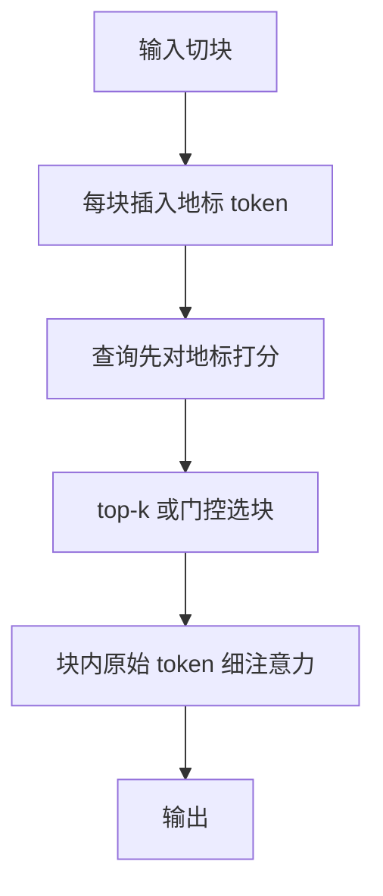

# Landmark Attention 原文

    
不必让每个查询扫完整段历史；先问每一块的地标，再只对选中的块做随机访问，上下文长度就可以从二次扫描里解开。

    <footer>—— Mohtashami & Jaggi，Landmark Attention: Random-Access Infinite Context Length for Transformers，2023</footer>

EPFL 的 Amirkeivan Mohtashami 与 Martin Jaggi 的 Landmark Attention 把长上下文写成块级目录问题：每块插入一个地标 token，查询先对地标做一次粗检索，再只把命中块的原始键值载入做细注意力。远块不必按时间顺序扫过，目录分数高就可以直接展开——这就是标题里的 random-access。可见集变成「全部地标 + 少数块原文」，与序列长度解耦。本篇按 2023 年原文的训练图与两段 softmax 写；KV 预算的其它压法见 [KV 压缩作为长上下文手段](/llm/kv-as-long-context)，概念速览见 [Landmark Attention](/llm/landmark-attention)。

## 问题

全注意力把过去每一个键放进可见集，长度一涨，二次代价与 KV 体积一起涨。滑窗把远键整段剪掉，针测失败。压缩记忆把远历史揉进固定状态，细节对不准。Transformer-XL 的段缓存仍是邻段前缀，不是任意远的随机访问。需要一种训练得出来的块级目录：目录项很少，每一项都能把查询带回那一块的原始 token。

地标机制要同时回答：块内信息由谁代表；查询如何用代表做随机访问；训练时的可见集如何与推理时「先地标、后局部」对齐。做不到对齐，上线一改图就掉点；代表若是不可学习的均值，目录对所有查询相同，精确拷贝仍然失败。

### 随机访问对时间顺序的拒绝

滑窗与 XL 缓存都假设「有用的远信息会沿时间渗过来」。小说里的伏笔、代码里的函数定义、定理证明里的引理，往往是内容寻址而不是时间近邻。Landmark 的问题设定因此是信息检索式的：先搜哪一块，再读块内文字，中间那些块可以不进细算。

地标是序列里的真实 token，不是块均值。均值对所有查询相同；地标的键随查询进入注意力，不同问题会点亮不同块。这是它和不可学习压缩记忆的差别。

## 方法

### 按块插入地标

输入按固定块长 $\ell$ 切开，每块末尾插入一个地标。地标参与同一套注意力与前馈，占一个真实位置。训练时，块内普通 token 主要看见本块邻居；地标看见本块全部 token，被梯度逼成该块的可寻址代表。后续位置若不能直接扫过往全部键，就只能先碰到这些地标——目录是训出来的，不是外挂检索器。

### 先对地标、再对局部

查询 $q_t$ 先对已有地标键 $\{k^{(L)}_b\}$ 打分。分高的块命中，再载入那些块的原始 $K,V$ 做第二次局部 softmax。未命中的块既不进细算，也不必留在高速缓存。可见集与 $n$ 解耦，只与块数（粗路）和选中块数 × $\ell$（细路）有关：

$$
b^\star=\mathrm{top}\text{-}k\left(\frac{q_t^\top k^{(L)}_b}{\sqrt{d}}\right),\qquad
y_t=\mathrm{softmax}\!\left(\frac{q_t K_{b^\star}^\top}{\sqrt{d}}\right)V_{b^\star}.
$$

也可以用地标分数做门控：超过阈值才展开。训练需要让地标键真能代理块内注意力质量，否则粗路点中的块细路用不上。

### 训练图必须已经分层

若训练仍用满注意力、只在推理改成地标检索，分布会裂开。做法是让训练期可见集已经是：当前块局部边 + 过去块的地标边，必要时再对若干块做可微的软展开，使「凭地标跳进原文」成为网络的一部分。地标自己对块内做满注意力，梯度从后续查询经地标流回块内 token。与 Longformer 全局点不同：全局点是任务指定的少数中枢，地标是按块均匀铺开的目录。与 Memorizing Transformers 的 kNN 不同：那里检索的是过去层的 $(k,v)$ 向量，地标是序列里显式的 token 接口。

## 机制

两段 softmax 把质量分配拆成「哪一段可能有答案」与「段内哪一个键」。只要 $\ell$ 落在一层局部注意力的舒适跨度内，块内尖峰能力仍在，拷贝与针测仍可能——失败出在粗路漏块。$\ell$ 太长，一个地标代表太多互不相关的句子，目录变钝，细路二次项也回来；太短，地标数接近 $n$，粗路自己又变成二次。

两段 softmax 不是一次满注意力的恒等改写。粗路用一个键代替整块，等价于对块内键做了内容相关的池化。漏块不可逆：细路看不见的 token 权重精确为零。这与 Beacon 的区别是：Beacon 的细路默认也不看早块原文，只看摘要；Landmark 在命中之后看的是原文，因此随机访问一旦点对，细节可以精确。未命中则比 Beacon 更惨——连糊摘要都没有。

应单独报块召回，而不是只报最终损失。语言建模可以靠局部流畅撑住，同时粗路系统性漏掉定义块。

## 边界与工程取舍

离散选块会漏。top-$k$ 太狠，答案所在块进不了细路，针测突然崩溃而不是平滑掉点。太松，又走回近似满注意力。地标占上下文一个位置，块很多时目录扫描也有成本，极端长度要对地标再分级。不要把 Landmark 理解成「推理时对 KV 做聚类」：代表是训练出来的 token，对已训好的满注意力模型事后插地标、不微调，目录没有语义。也不要和 MLA 混名：MLA 压每个 token 的秩，地标压序列维的块数。

部署上，未选中块的 KV 可以下放到主机内存或丢掉，这才是「无限上下文」的工程含义——细算只打在命中块上，不是算力无限。取舍：需要任意位置的精确随机访问，地标是对口工具；只需要最近窗口加指令前缀，滑窗更便宜。

与 Activation Beacon 同时读时：一个训的是「压缩后仍可见的摘要 token」，一个训的是「可展开的目录 token」。产品若必须逐字引用，Landmark 的细路原文更合适；若只要章节大意且 $n$ 极大，Beacon 的固定压缩率更可预测。

### 原文之后的谱系

Focused Transformer 用对比学习改善缓存里相关键的区分；NSA 把压缩支路写进融核。Landmark 2023 的主场仍是标准注意力上改掩码与两段检索，实现相对直接。读 2024 年检索式 KV 论文时，地标是「块代表可学习、检索可训练」这一支的早期完整形态。

## 小结

- Landmark Attention 原文把序列切块，每块一个可学习地标；查询先对地标、再对命中块原文。
- 随机访问：远块不必按时间扫过，目录命中即可展开。
- 训练可见集必须已分层；两段 softmax 会漏块，应报块召回。
- 压缩轴是序列块，不是头数或精度；与 MLA、H2O、kNN 记忆不是同一件事。
- 出处：Mohtashami & Jaggi，*Landmark Attention: Random-Access Infinite Context Length for Transformers*，2023，arXiv:2305.16300。对照 Beltagy 等 Longformer（2020）、Wu 等 Memorizing Transformers（2022）、Zhang 等 Activation Beacon（2024）。
