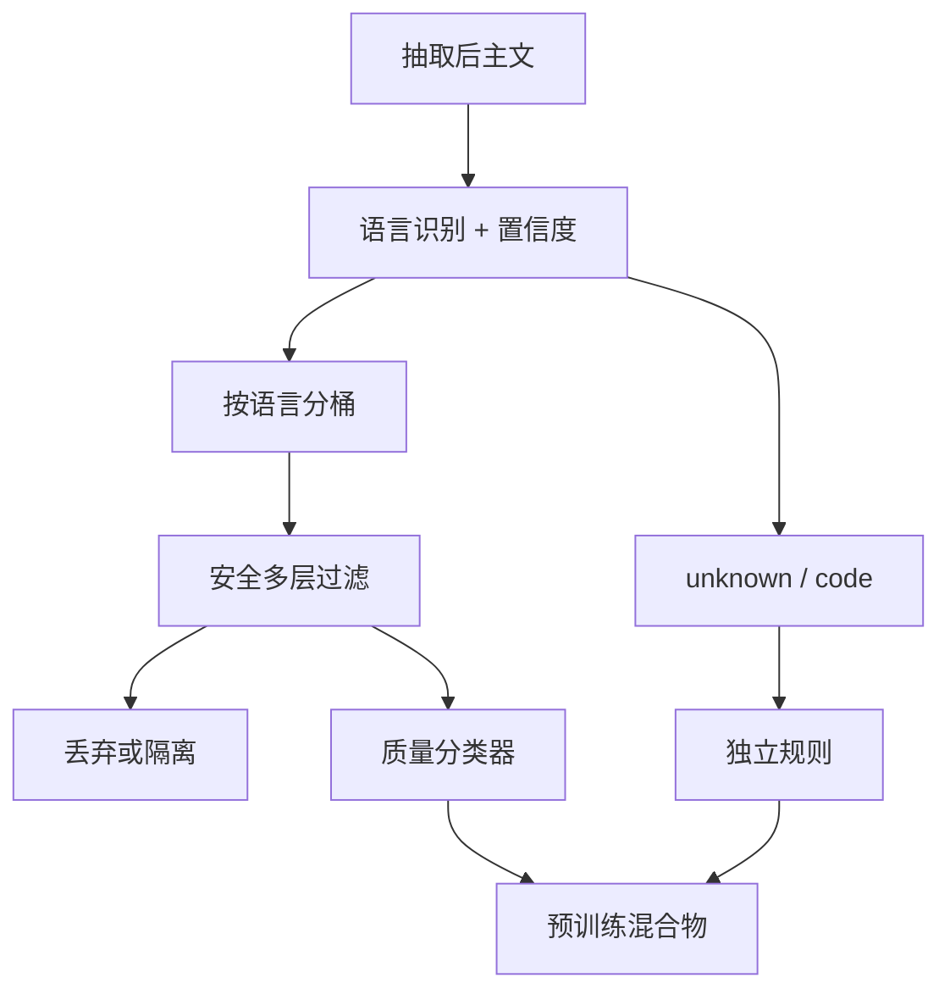

# 语言识别与安全过滤

语言识别决定后续词表、标点规则与质量阈值走哪一套；安全过滤决定哪些文档根本不应进入梯度。两者都是高召回的分类问题，错了会在配比里留下系统性偏差。

<footer>—— 综合 Joulin et al. fastText LID 与大规模网页安全过滤实践</footer>

网页管道在启发式之前通常要先回答：这是哪种语言、是否含不可接受的内容。语言识别（LID）看起来像已解决的短文本分类，但在 Common Crawl 的混合页、代码、拼音与转写上仍大量出错。安全过滤则覆盖色情、仇恨、恶意软件诱饵、以及各实验室自定义的政策类别。C4 用脏词表，后来的语料改用分类器，Gopher、Llama 与各类 FineWeb 配方都把「毒性 / 安全」当作与质量不同的一层。本篇把 LID 与安全放在一起写，因为它们共享同一失败模式：阈值在英语上校准，却应用到全世界。

## 问题

LID 的输出会路由文档：进英语启发式还是中文启发式，进哪一个质量分类器，甚至进哪一个 tokenizer 统计桶。fastText 的 `lid.176` 一类线性模型在整洁新闻上准确率很高，对极短标题、多语言夹杂、字符集损坏的页会自信地标错。标错的后果不是「少一篇」，而是后续所有规则用错语言的先验：中文页被当英语去要句号结尾，代码被当某小语种进稀有桶，配比被污染。

安全过滤的问题对称而更尖锐。词表能抓住显式脏话，放过隐晦描述与链接农场；分类器能看上下文，却把医学、法律、少数群体自我陈述打成阳性。预训练若简单丢掉所有高毒分文档，模型在需要拒绝或需要理解风险话题时会缺数据；若不过滤，又会在生成侧复制攻击性模式，并浪费算力在低价值重复垃圾上。政策没有全局正确答案，但工程必须把类别、阈值与误伤评估写出来，而不能把「安全」当成一个未定义的布尔。

### 短文本与混合页

LID 在字符级 n-gram 上工作。一篇页若上半是英语导航、下半是目标语言正文，整页分数会被模板绑架。抽取质量因此前置于 LID：先尽量丢掉样板，再识别。代码、数学、日志不该强行进 176 类自然语言桶，应有 `und` / `code` 一类出口。安全模型同样怕模板：cookie 横幅与「成人内容警告」会抬高毒性分，真正的正文可能无害。过滤应对抽取后的主文打分，并单独决定是否因「警告样板」杀页。

语言概率校准和安全分数校准不是一回事，但都会在阈值处变成硬决策。把 $p(\text{en})=0.4$ 的页丢进英语桶，与把毒性 $0.51$ 的医学页丢掉，同样是在用一个在验证集上好看的数字改写预训练分布。

## 方法

LID 实践上以 fastText 监督学习的语言 ID 最常见：字符 n-gram 袋，输出语言分布，取 argmax 并设最小置信度。低于阈值的进 `unknown`，不要为了「每个文档都有语言」而强制分配。CLD3 等基于神经网络的探测器对某些短文本更好，但运维与版本钉死成本更高。管道应记录 top-1、top-2 与置信度，便于事后发现「fr/es 混淆」一类系统误差。多语言页可按段落 LID 再拼接，或直接丢弃（若配方只要单语）。代码检测用扩展名、关键字密度或专门分类器，避免与自然语言抢桶。

安全过滤通常多层。第一层：正则与哈希名单（已知恶意 URL、CSAM 相关哈希——这类必须走合规流程，本篇不讨论检测方法细节）。第二层：面向语言的词表与短语表，注意转写与加空格绕过。第三层：轻量分类器（线性或小 Transformer）输出多标签：色情、仇恨、暴力、欺诈等。阈值按语言分桶，用人工抽样测精确率，而不是用英语验证集的 F1 直接搬家。与 [质量过滤](/llm/data-quality-filter) 分开：质量低不等于不安全，安全阳性也不等于质量高。可以先安全门、再质量打分，以免毒性分类器在乱码上的分数没有语义。

### 误伤审计与保留策略

对每个安全标签保留「高分但应保留」的样本集：医学、性教育、新闻报道暴力事件、文学作品。阈值应在这些集合上报告召回损失。仇恨类别尤其要把「报道」与「鼓吹」分开，做不到就不要用单一毒性标量。LID 也要审计：抽小语种金标准，看被吞进英语或 `unknown` 的比例。保留策略可以是丢弃、降权、或打入隔离桶供日后研究，而不是只有 drop。隔离桶不得未经审查混回训练集。

## 机制

LID 线性模型的机制是字符 n-gram 的对数线性分类：它捕捉的是正字法与功能词，而不是语义。因此对 closely related 语言（id/ms、cs/sk）与罗马化文本脆弱。置信度阈值是在用最大 softmax 当「是否像训练域」；域外页会以中等概率乱标，必须靠阈值拒绝。安全分类器若与质量分类器共享编码器，毒性与「不像维基」会缠在一起，英语非正式对话被双杀。分开模型、分开验证集，是为了让两个分数可解释。

级联机制：LID 错误会选择错误的安全词表——英语脏词表打在德语复合词上，或反过来漏掉目标语言的攻击性俚语。所以安全模型应按 LID 路由，同时对 `unknown` 用更保守的通用规则（例如只走高精确率的多语言分类器）。这是管道耦合，不是两个独立插件。

把安全过滤完全交给下游对齐（RLHF）而在预训练里零过滤，等于让预训练先记住垃圾再花钱忘掉。反过来，预训练杀光一切敏感话题，对齐阶段没有拒答与解释的素材。工程上应过滤利用性与违法内容，对「有争议但属报道」降权而不是物理删除，并在数据卡上写明。

### 与配比、评测的相互作用

LID 改变各语言 token 占比，直接进入 [数据配比](/llm/data-mixture-laws)。安全过滤改变领域：论坛、黄段子、部分社交媒体被切掉后，聊天风格的先验下降，百科上升。这会被误读成「质量提升」。评测若含毒性生成基准，过过滤可能让分数变好，同时伤害需要讨论风险的能力。报告应同时给：过滤比例按语言、人工抽样精确率、以及一两项能力探针，而不是只给「毒性下降」。

## 边界与工程取舍

LID 176 类并不覆盖所有书面语与方言；未覆盖的应进 `unknown` 而不是最近邻语言。安全分类器有时效：模因、新俚语、新绕过会让词表过期，需要定期抽检而不是一次阈值用三年。法律与政策因地而异，同一份语料的「安全」定义不能假装全球唯一；实验室应写自己的类别表。对儿童性剥削等类别，技术管道必须服从法律与专门流程，普通毒性模型不够也不该被当成够。

性能上，LID 极便宜，应全量做。大安全模型昂贵，可用小模型初筛再对灰区跑大模型，或只对高召回词表命中的页跑分类器。分布式下要广播只读模型，避免每个任务从对象存储拉一次权重。

置信度不是概率意义上的校准保证。fastText 的 0.99 只说明在其训练域内很像某语言。Crawl 上应用时，应用抽样重新画校准曲线，再选阈值。直接用作者发布的默认截止，是最常见的静默配比漂移。

## 小结

- 语言识别路由后续一切规则；低置信度应标 `unknown` / `code`，不要强制 argmax。
- 安全过滤应多层、按语言分阈值，并与质量分数分开。
- 抽取后再 LID、再安全，以免模板绑架分数。
- 误伤审计要用医学、新闻、文学等应保留集合，仇恨类避免单一标量。
- LID 错误会选错安全词表，两者是级联而不是并联插件。
- 过滤比例与能力探针应一起报告，避免把「更干净」误当成「更强」。
- 出处：Joulin et al., fastText language identification；C4 / Gopher / Llama 与 FineWeb 管道中的语言与毒性过滤实践。
