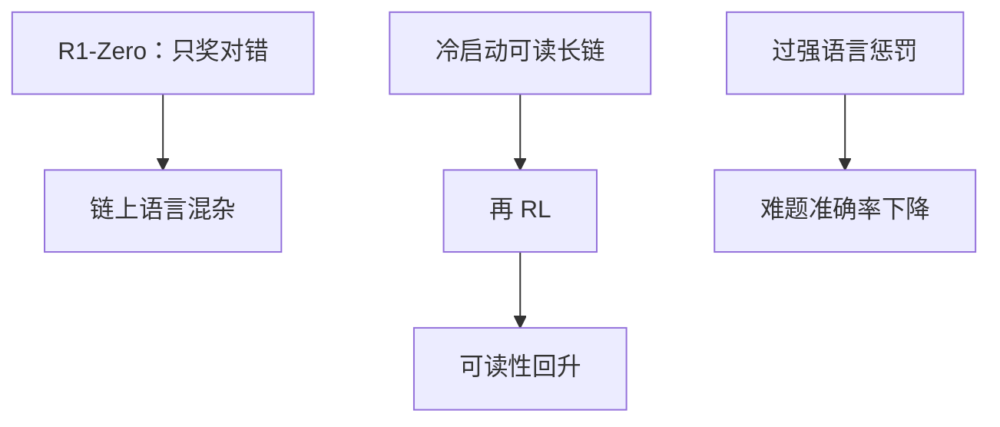

# 语言混杂

R1-Zero 在中英之间来回切：对校验器无成本，对用户不可读；冷启动 SFT 要把语言当格式约束补回去。

<footer>—— DeepSeek-AI R1 对 R1-Zero 可读性与语言混合问题的修复路径</footer>

[上一课](/llm/aha-moment)的探索相变会一并强化「碰巧常赢」的表面形式。缺口是：**校验器只看最终答案，链的语言不进 $R$，于是中英夹杂、语码转换成为无成本的工作记忆。** R1 用冷启动可读长链 + 多阶段训练修复。本课写混杂的原因与约束，接到忠实性：可读 ≠ 忠实。

## 问题

基座多语言。数学符号与英文术语在预训练里与中文叙述混排。RL 只奖 boxed 数字，混杂不降 $R$，有时还升（某些英文推理片段更常对）。产品要求单一语言或用户语言。这是多目标里漏掉的轴：语言一致性。

R1-Zero 跳过 SFT，没有「用用户语言写思维」的示范，混杂更重。R1 冷启动先示范可读链，再 RL，混杂下降。代价是探索可能变窄。数学符号、变量名、代码标识符不应计入「外语」；语码转换统计要排除公式环境，否则会把合法证明当混杂。

### 不要用语言识别当主奖励

重罚混杂会让模型为了语言牺牲搜索，难题准确率掉。应：格式轻约束 + 示范，金标仍是对错。与过长惩罚一样，权重按产品扫。

思维对用户隐藏时，混杂仍影响监视器可读性（monitorability）。内部链也需要语言政策。

## 方法

测量：语码转换次数、主语言占比、用户语言一致率。训练：冷启动 SFT 锁语言；RL 加轻量语言一致项或约束解码（不允许切语言——可能伤数学符号，要白名单）。评测：准确率与可读性分表。蒸馏学生：教师链若混杂，学生会学混杂，过滤或改写教师链。

与混合思考：短模式更易保持用户语言；思维模式是重灾区。分模式约束。

## 机制

无成本维度会被 RL 当工作记忆用。语言、标记符号、重复填充都是候选。约束哪个，取决于产品与监视。完全不约束，监视和摘要器失败。约束过死，回到短 SFT 分布，aha / 回溯减少。R1 的多阶段是折中，不是定理。

「用户用中文问、答案中文、思维英文」有时是可接受的内部政策，但必须声明，不能当意外。

## 边界与工程取舍

纯英文题库上混杂不明显，不代表多语言部署安全。本课对中文产品尤其硬。下一课忠实性：即使用户语言干净，链仍可能不对应内部计算。

语码统计要排除公式与代码。语言轻约束加冷启动，重罚会打压搜索；内部链语言仍影响监视可读性。

## 小结

- 语言混杂因校验器不给语言定价而出现；探索相变会放大它。
- 冷启动可读示范 + 轻约束，优于重罚语言。
- 内部链语言政策影响监视，不只影响 UI。
- 蒸馏会复制教师混杂，需过滤。
- 出处：DeepSeek-AI R1 对 Zero 混语言与冷启动修复的报告。
