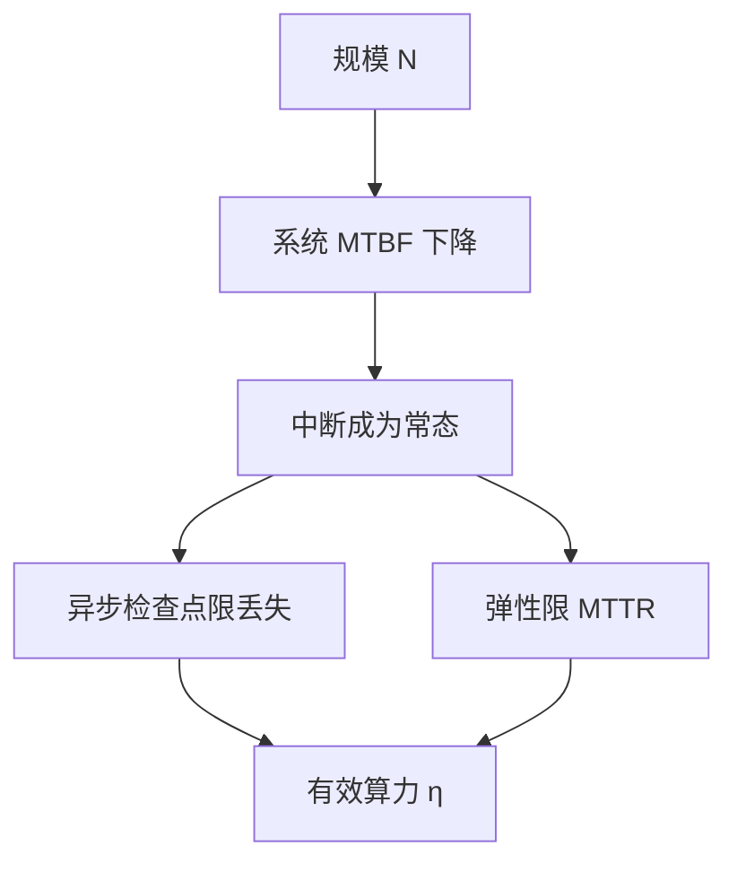

# 万卡训练的故障率

单卡难得坏，一万张卡在一起时，坏是日程上的一行：作业的有效算力由 MTBF 与 MTTR 决定，不由峰值 FLOPs 决定。

<footer>—— Jiang et al., MegaScale；对照 Llama 3 万卡训练与大规模 GPU 集群运维报告</footer>

[上一课](/llm/topology-aware-placement)把通信放在对的链路上。链路与 GPU 仍会坏：HBM、NVLink、网卡、电源、软件看门狗。本课不重讲 rank 映射。缺口是把故障当成预训练配方的一等参数：规模 $N$ 下的故障间隔、丢失窗口、弹性成功率，如何反过来约束检查点频率、并行计划的离散表、以及要不要上 DualPipe 这种状态更多的调度。数据与词表课假定 run 能跑完；本课结束「预训练工程进阶」时，承认跑完是概率事件。

## 问题

独立故障近似下，系统 MTBF 随 $N$ 下降。$N=10^4$ 时，即使单卡年故障率看起来温和，作业周尺度上也会多次中断。Llama 3、MegaScale 的公开叙述都把故障处理写成训练系统的核心，而不是运维附录。工程缺口是：用本单元已有零件把「中断」翻译成「丢失多少 token、多少墙钟」。

丢失 token $\approx$ 步速 × 距上一完好检查点的时间。异步检查点压低这段时间；弹性压低 MTTR；落后者治理减少「未死但等同于死」的等待；重放区分真故障与假尖峰，避免无谓弹性。格式可重切，则 MTTR 不必包含人工改并行脚本。

### 更复杂的日历提高故障面

DualPipe 双流、ZB 半拍、MoE A2A、Ulysses A2A，每多一种在飞状态，合法快照点越少，未完成 writer 越多。峰值 MFU 与可恢复性是权衡。故障率高的集群上，选更简单的 1F1B 可能在有效 FLOPs 上赢过理论上零气泡却常恢复失败的调度。

软件故障（死锁、NCCL 超时误判）往往多于硬件。重放与健康检测的误杀率，应计入有效 MTBF。

## 方法

配方里写三行数：目标丢失窗口 $W$、实测或假定的系统 MTBF、目标 MTTR。由 $W$ 定检查点间隔；由 MTTR 定是否需要热备与合法计划表的密度（计划越密，掉少量卡越容易贴合）。跑作业时记录每次中断的原因分类（硬件、网、数据、误杀），回写 MTBF 估计，而不是沿用厂商小册子上的单卡数字。

与数据退火对齐：后期更贵、更不可重来，检查点应更密。与评测对齐：中断后的第一次探针用于确认权重未被损坏文件污染。

### 有效算力

$$
\eta \approx \frac{\mathrm{MTBF}}{\mathrm{MTBF}+\mathrm{MTTR}}\times(1-\text{保存开销比例}).
$$

并行课所有「再挤两个点 MFU」的技巧，若让 MTTR 或保存开销上升得更多，$\eta$ 下降。这是本课程的收口：日历优化从属于可完成性。

$\eta$ 不含数据质量。跑得完但配比错，仍是失败，只是失败在数据单元。

## 机制

规模把独立的小概率合成频繁事件。同步栅栏把单点故障变成全局中断。检查点把中断变成有界回滚；弹性把「等修」变成「缩小继续」；放置降低通信诱发的故障与抖动。整条链把概率问题重新变成优化问题：最小化丢失 token 的期望，而不是最小化单步时间。

## 边界

故障率模型假设不完全独立：机架掉电是相关故障，比独立公式更狠，需要机架级冗余与跨架 PP 的额外小心。本课也不覆盖安全攻击。预训练工程进阶到此：词表细节决定离散测度，配比决定梯度预算，并行与容错决定这些预算能否在物理世界花完。

## 小结

- 本课不重讲拓扑映射；只补 $N$ 很大时中断是期望事件。
- 用丢失窗口、MTBF、MTTR 约束检查点与计划表密度。
- 更满的日历若伤害可恢复性，有效算力会降。
- 有效 $\eta$ 从属于跑完；配比正确性从属于数据单元。
- 出处：Jiang et al., *MegaScale*, 2024；Grattafiori et al., Llama 3 技术报告中的万卡训练；对照本单元检查点、弹性与落后者课。
