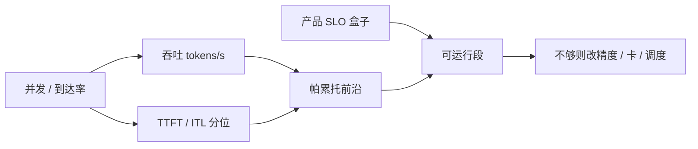

# 延迟-吞吐帕累托

稳定系统里并发等于到达率乘以停留时间；把并发当作旋钮，得到的是一条延迟换吞吐的前沿，而不是一个可以同时最大的点。

<footer>—— Little, Operations Research, 1961：L = λW；对照 MLPerf Server 用 TTFT/TPOT 门卡住 LoadGen 所承认的吞吐</footer>

服务运维常被要求「再快一点、再便宜一点」：TTFT 更短，同时每 GPU tokens/s 更高。自回归服务里这两件事在同一资源上打架。并发（或到达率）升高，连续批变更大，矩阵乘更肥，输出 token 吞吐上升；同一批里排队变长，TTFT 与每用户 ITL 变差。把所有扫到的工作点画在平面上——横轴吞吐、纵轴延迟——合法点的右下边界（或右上，取决于延迟轴是否取倒数）就是 **帕累托前沿**：再改善一端必须牺牲另一端。本篇把排队论的 Little 定律接到 [GenAI-Perf](/llm/genai-perf) 的扫描和 [MLPerf Inference LLM](/llm/mlperf-inference-llm) 的 Server 门，并接到 decode 的 [带宽墙](/llm/hbm-roofline)。不把某一条实测曲线写成硬件定律。

## 问题

单请求、batch=1 的 decode 给出最好的每用户延迟，GPU 大部分时间在等，整机 tokens/s 最低。把并发拉到显存上限，利用率最高，P99 TTFT 可能已经离开产品 SLO。两者都是真实测量，都不能代表「这张卡的速度」。需要的是：在给定硬件、模型、精度和调度器下，扫描可控旋钮（并发、到达率、最大批、prefill 并发上限），得到一组 $(T_{\mathrm{token}},\; D_{\mathrm{TTFT}},\; D_{\mathrm{ITL}})$，再按产品 SLO 切出可运行段。帕累托回答「SLO 内最大吞吐是多少」，而不是「峰值 tokens/s 是多少」。

Little 定律：稳态下 $L=\lambda W$，即平均并发 = 到达率 × 平均停留时间。生成式请求的停留时间随输出长度变，且 prefill 与 decode 两段不同。粗用仍极有用：若目标每用户延迟 $W$ 有上限，则在到达率 $\lambda$ 下并发 $L$ 被钉死；想再提高 $\lambda$，必须先把 $W$ 做短，否则只能拒绝或排队爆炸。MLPerf Server 不让你报一个打破 TTFT/TPOT 的 $\lambda$，等于在前沿上切了一刀。

### 至少三条轴，不要压成一个「延迟」

TTFT 主要由排队 + prefill 决定，对输入长度和 prefill 批敏感。ITL / TPOT 主要由 decode 步时间和调度抖动决定，对输出期批大小和 KV 带宽敏感。请求总延迟还乘输出长度。产品可能只约束其中一两个：聊天要 TTFT 与 ITL；摘要离线只在乎吞吐；交互体（MLPerf Interactive）把门收得很紧。三条轴上各有一条帕累托曲面，投影到「吞吐 vs TTFT」平面会丢掉 ITL 恶化。扫点时 GenAI-Perf 已经分列，不要只画请求延迟。

Orca（Yu et al., OSDI 2022）把迭代级批处理当作提高利用率、同时减少静态批陪跑的方法。连续批移动的是前沿的位置——同样 SLO 下吞吐更高——不是取消前沿。静态批的陪跑会让延迟在输出长度方差大时额外变差，见 [静态批 vs 动态批](/llm/static-vs-dynamic-batch)。

## 方法

固定模型、精度、KV 量化、最大上下文，用 GenAI-Perf 在流式端点上扫。第一轮：合成固定 ISL/OSL，并发从 1 到 OOM 前一档，记录 TTFT P50/P99、ITL P50/P99、output token throughput。第二轮：改用到达率负载，更接近开环。第三轮：换真实长度数据集，看 P99 被长尾提示抬多少。把点画出来，删掉未稳态、未预热、以及错误码请求。前沿是未被其它点同时在吞吐和延迟上支配的点。SLO 是水平线（延迟）和你要的垂直目标（吞吐）；可运行段是前沿落在 SLO 盒子里的部分。盒子空，就要换硬件、量化、调度或拒流，而不是再加并发。

MLPerf Server 可以理解为：LoadGen 在政策规定的延迟盒子里找最大合法 $\lambda$（再换成 tokens/s）。Interactive 盒子更小，前沿上能用的点更靠左，吞吐数字更小。用 Offline 点去承诺 Interactive 盒子，是把盒子拆掉。内部容量规划应同时保存「SLO 内最大吞吐」和「无 SLO 的饱和吞吐」，并写明 ISL/OSL。

调度旋钮会移动前沿，而不仅是在同一条线上滑动。连续批、分页 KV、分离 prefill/decode、投机解码、限制 prefill 抢占，都可能让同一 SLO 下吞吐上升。它们也引入新的拐点：PD 分离改善 TTFT 时，decode 池的 ITL 可能因并发不同而变。每改一个调度开关，整条曲线要重扫，不能只复测一个并发。硬件侧，[HBM3E](/llm/hbm3e) 提高 $B$ 与容量，decode 的 ITL 前沿下移；NVLink 域影响的是多卡 TP 的逐步同步，见 [NVLS](/llm/nvshmem-nvls)，那是另一条互连帕累托，不要和单卡 HBM 画在一张图上。

### 屋顶线告诉你前沿何时变平

并发升高时，decode GEMM 的 $M$ 变大，算术强度上升，工作点从带宽墙走向拐点，见 Williams 屋顶线。在斜边上，加并发既能摊权重流量又能提高利用率，吞吐升得快；一旦靠近算力墙或 KV 显存墙，再加并发只加排队，TTFT 恶化而 tokens/s 几乎不动——前沿变成垂直。这就是「延迟换不到吞吐」的区域，应停在拐点附近而不是 OOM。Prefill 重的工作负载更早碰到算力墙；纯短 decode 可能始终停在带宽斜边。精度从 FP16 到 FP8 减字节，斜边抬高，同一 ITL 下吞吐可以更高，质量门是另一约束（MLPerf ROUGE）。

## 机制

排队发生在引擎入口与 prefill 队列。M/M/1 一类公式只作直觉：利用率 $\rho\to 1$ 时等待时间发散。连续批把「服务台」变成每步可变的 GPU 核，有效服务时间随批大小变，所以不是经典单服务员。尽管如此，饱和时等待发散这一几何仍在：P99 TTFT 对 $\rho$ 极敏感，这是必须用分位而不是均值管 SLO 的原因。Dean 与 Barroso 的 *The Tail at Scale* 把尾延迟在大规模下的放大写清楚；生成式服务的逐步同步（多卡 TP）把单步尾延迟乘进每一个 token。

Little 定律在生成式下的细读：若只统计 decode 阶段，则「并发生成中的请求数」≈「decode 吞吐（请求/s）」×「剩余生成时间」。提高 decode tokens/s 若来自更大的批，每用户剩余时间变长，并发可以不降。这解释了为什么机房 tokens/s 与每用户 ITL 会反向。投机解码试图用额外算力换更短的逐步墙钟，移动的是 $W$，从而在同一 $L$ 下允许更大 $\lambda$——前提是验收率稳定，否则退回验证核的浪费会把前沿弄皱。

Williams et al., CACM 2009 屋顶线决定硬件能提供的 $(P,B)$ 包络；Little 决定并发、到达率与停留时间的会计恒等式。帕累托前沿是调度把工作点放进包络之后、再被排队放大的那条可观测曲线。三层不要缩成「卡更快所以 SLO 更好」。

### 多租户与拒流也是前沿上的点

不排队而拒流，等于把到达率 $\lambda$ 卡住，保护 $W$。这是前沿上选择「较小 $\lambda$、合格延迟」而不是「无限排队」。优先级队列把低优先级的 $W$ 卖给高优先级，前沿变成按类 SLO 的多条。MLPerf 没有多租户，GenAI-Perf 默认也不模拟租户权重；产品若有 SLA 分级，扫描必须按类分别画。抢占 prefill 以保 decode ITL，是显式的延迟-延迟权衡，会在 TTFT 与 ITL 两张图上同时动。

## 边界与工程取舍

不要用饱和点 tokens/s 去除以用户数当「每用户速度」。不要只扫并发 1、8、64 三个点就宣称前沿。不要把 Offline MLPerf 与内部 P99 TTFT 画在同一坐标还不加说明。不要在提示长度分布变化后沿用旧盒子。多卡 TP 的逐步 All-Reduce 会给 ITL 加一个互连下限，加并发救不了这条下限，应减 TP 或把通信留在 NVLink 域。客户端测在机房内网，用户在公网，TTFT 盒子要留 RTT。

前沿会随软件版本移动。连续批实现、CUDA Graph、KV 分页，都可能在同一硬件上改曲线。容量规划应版本化扫描结果，而不是锁死某次海报数字。盒子空时优先减工作集（量化、更短上下文）或加 $B$ / 卡数，而不是无限加副本却仍用错误工作点。

出处：Little (1961), *A Proof for the Queuing Formula: L = λW*；Williams et al., CACM 2009 屋顶线；Yu et al., Orca, OSDI 2022；NVIDIA GenAI-Perf 指标定义；MLCommons Inference 规则中 Server/Interactive 的 TTFT/TPOT 门。Dean & Barroso, *The Tail at Scale*, CACM 2013 用于尾延迟。

## 小结

- 延迟与吞吐在 LLM 服务里沿并发/到达率权衡，可观测边界是帕累托前沿。
- Little 定律约束并发、到达率与停留时间；打破 SLO 等于离开盒子谈吞吐。
- TTFT、ITL、总延迟必须分轴扫描；连续批移动前沿，不取消前沿。
- 屋顶线解释前沿何时变平；MLPerf Server 是盒子里的合规点，Offline 不是。
- 拒流、分级 SLO、PD 分离都是在前沿上选点，需要分别重扫。
- 出处：Little 1961；屋顶线与 Orca；GenAI-Perf 与 MLPerf Inference 公开规则。
