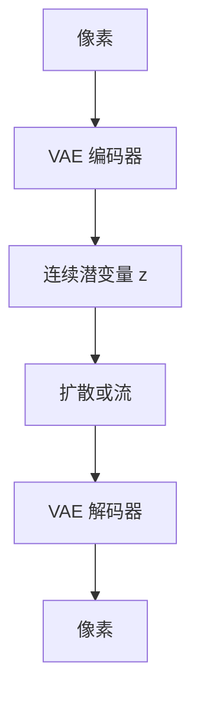

# 潜空间与 VAE

先把图压进低维连续潜变量，再在潜空间里扩散或流。像素解码器负责纹理，生成器不必每步在 RGB 上跑。

<footer>—— Kingma, Welling, VAE；Rombach 等 Latent Diffusion / Stable Diffusion</footer>

[上一课](/llm/flow-matching)与 [DDPM](/llm/ddpm) 都可以在数据空间做。缺口是算力：高分辨率 RGB 上每步 U-Net 不可扩展。Rombach 等人先训感知压缩的 VAE，再在 $z$ 上做扩散。后课 CFG 默认生成器已经活在这个 $z$ 上。

## 问题

像素扩散的空间是 $H\times W\times 3$。VAE 编码器 $E$ 给出 $z=E(x)$，解码器 $D$ 重构 $\hat x=D(z)$。与 [VQ-VAE](/llm/vq-vae) / [VQGAN](/llm/vqgan) 不同：这里的 $z$ 常保持连续（对角高斯后验），不量化成词表。LDM 的关键是：感知损失 + 对抗让 $D(z)$ 够锐，于是潜空间里的生成误差在像素上仍可看。

连续 $z$ 不能当 softmax 词表，这正是[连续对离散](/llm/continuous-vs-discrete-vision-tokens) 在生成侧的选择：扩散/流走连续潜变量；AR 走离散码。

下采样倍数（如 8×）决定 $z$ 的空间格。压太狠，文字与布局先坏——文档生成与理解侧 squish 是同一类信息损失。

## 方法

两阶段：冻好 VAE 后，只训潜空间的 $\epsilon_\theta(z_t,t,c)$ 或速度场。条件 $c$ 可以是文本塔（常与 [CLIP](/llm/clip) 文本编码器相关，但那是条件接口，不是 LLaVA 那种视觉前缀）。验收：重构 FID 与生成 FID 分开；盯文字可读性，不要只报风景 FID。

## 机制

生成器学的是 $p(z)$，细节纹理由 $D$ 的先验补全——与 VQGAN 解码器「编造高频」同类。因此潜空间 FID 好看不等于 OCR 忠实。理解用的 [ViT](/llm/vit-as-encoder) patch 与生成用的 $z$ 格，分辨率协议往往不同，统一模型必须显式对齐或分塔，见后课 Janus。

## 边界

VAE 重构天花板仍在。下一课在已有条件扩散上加无分类器引导，不改这个潜空间。

## 小结

- 潜空间 VAE 把扩散/流从像素挪到连续 $z$。
- 连续 $z$ 服务采样，不是 AR 词表。
- 重构天花板限制文字与布局。
- 出处：Kingma & Welling VAE；Rombach 等 LDM。
