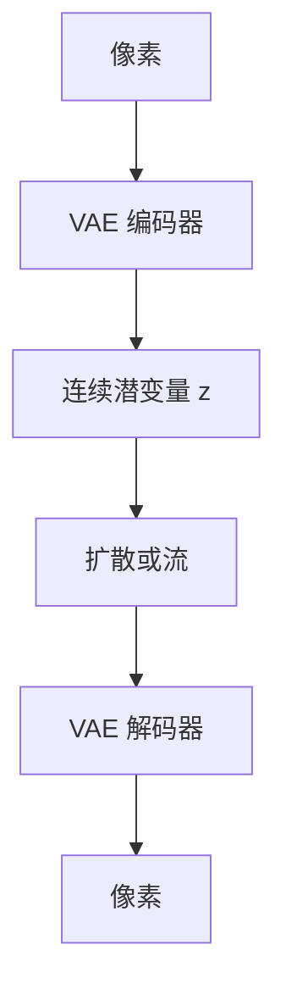

# 潜空间与 VAE

先把图压进低维连续潜变量，再在潜空间里扩散或流。像素解码器负责纹理，生成器不必每步在 RGB 上跑。

<footer>—— Kingma, Welling, VAE；Rombach 等 Latent Diffusion / Stable Diffusion</footer>

[上一课](/llm/flow-matching)与 [DDPM](/llm/ddpm) 都可以在数据空间做。缺口是算力：高分辨率 RGB 上每步 U-Net 不可扩展。Rombach 等人先训感知压缩的 VAE，再在 $z$ 上做扩散。后课 CFG 默认生成器已经活在这个 $z$ 上。

## 问题

像素扩散的空间是 $H\times W\times 3$，每一步去噪都要让 U-Net 在这个大空间上过一遍。Rombach 等人把生成拆成两段账。感知压缩丢掉人眼不可分的高频细节：VAE 用感知重构损失加 patch 级对抗目标训练（与 [VQGAN](/llm/vqgan) 的解码器同一配方，只是不量化），下采样 $f=8$ 时把 $H\times W\times 3$ 压成 $(H/8)\times(W/8)\times 4$，512 方图约 48 倍缩减。语义压缩是学布局、物体、属性的组合规律——这才是生成模型该花容量的地方。像素扩散把两段压给同一个 U-Net：绝大多数梯度与步数花在不可感知的纹理上；两阶段让生成器只做语义段，训练与采样都在缩小 48 倍的空间上算，这才有分辨率与批量的扩展余地。VAE 编码器 $E$ 给出 $z=E(x)$，解码器 $D$ 重构 $\hat x=D(z)$。与 [VQ-VAE](/llm/vq-vae) / [VQGAN](/llm/vqgan) 不同：这里的 $z$ 常保持连续（对角高斯后验），不量化成词表。LDM 的关键是：感知损失 + 对抗让 $D(z)$ 够锐，于是潜空间里的生成误差在像素上仍可看。

连续 $z$ 不能当 softmax 词表，这正是[连续对离散](/llm/continuous-vs-discrete-vision-tokens) 在生成侧的选择：扩散/流走连续潜变量；AR 走离散码。

下采样倍数（如 8×）决定 $z$ 的空间格。压太狠，文字与布局先坏——文档生成与理解侧 squish 是同一类信息损失。

## 方法

两阶段：先冻好 VAE，再只训潜空间的 $\epsilon_\theta(z_t,t,c)$ 或速度场。冻的理由：VAE 若继续更新，生成器面对的是一个移动的靶——潜分布漂，噪声水平跟着漂，日程与超参永无稳定参照；先钉住 $z$ 的分布，生成端才可复现。

归一化是这层参照的一部分。VAE 潜变量的每维经验方差常远小于 $1$：编码器把能量压进少数维，而日程、$\sigma_{\max}$ 等采样超参按单位方差数据设计。LDM 先在数据集上统计编码后潜变量的标准差 $\hat\sigma$，把 $z$ 除以它再训生成器，解码前乘回（Stable Diffusion 的 $0.18215$ 即此数）。为什么必须做：方差小一个量级等于整条信噪比曲线整体左移，前几步就把信号淹掉，网络大部分步花在近纯噪声上；归一化让像素侧调好的日程假设直接迁移。不这么做会错在哪：同一套日程训出发散或欠曝的生成器，而你以为是日程、网络或数据的问题，往错的方向调。

条件 $c$ 可以是文本塔（常与 [CLIP](/llm/clip) 文本编码器相关，但那是条件接口，不是 LLaVA 那种视觉前缀）。验收：重构 FID 与生成 FID 分开——前者钉 $D$ 的天花板，后者钉生成器；盯文字可读性，不要只报风景 FID：潜空间误差对高频文字的放大在风景图上看不见，OCR 样张过一遍才作数。

```mermaid
flowchart TD
  X["像素"] --> E["VAE 编码器"]
  E --> Z["连续潜变量 z"]
  Z --> DIFF["扩散或流"]
  DIFF --> D["VAE 解码器"]
  D --> XHAT["像素"]
```

## 机制

生成器学的是 $p(z)$，细节纹理由 $D$ 的先验补全——与 VQGAN 解码器「编造高频」同类。因此潜空间 FID 好看不等于 OCR 忠实：解码器可以把糊的笔画补成合理的字，也可以把对的字补糊，两个方向的错误都发生在生成器看不见的那一段。归一化还影响引导：CFG 类引导以潜变量为单位外推，换一个没归一的潜空间，同一引导系数的等效力度完全不同，超参不可跨空间迁移。理解用的 [ViT](/llm/vit-as-encoder) patch 与生成用的 $z$ 格，分辨率协议往往不同，统一模型必须显式对齐或分塔，见后课 Janus。

## 边界

VAE 重构天花板仍在：生成器再好也回不到 $D(z)$ 之外的细节。下一课在已有条件扩散上加无分类器引导，不改这个潜空间。

## 小结

- 潜空间 VAE 把扩散/流从像素挪到连续 $z$；感知压缩与语义压缩分段记账。
- 潜变量方差先归一（scale factor），日程与引导超参才有稳定参照。
- 连续 $z$ 服务采样，不是 AR 词表。
- 重构天花板限制文字与布局。
- 出处：Kingma & Welling VAE；Rombach 等 LDM。
