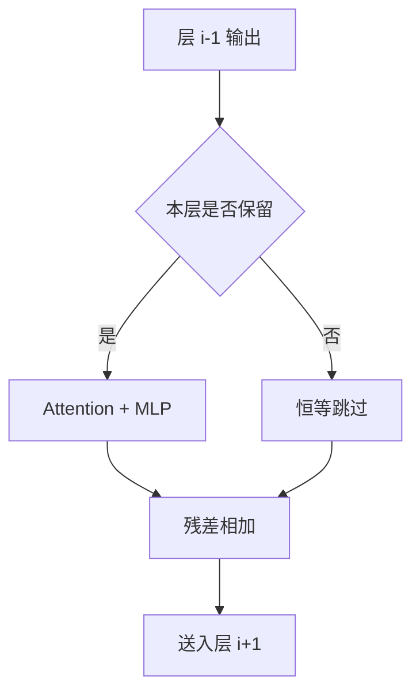

# 层剪与深度压缩

Transformer 的深度是可调度的资源：训练时随机丢掉整层，推理时可以少跑几层；很多功能并不均匀铺在每一层上。

<footer>—— Fan, Grave, Joulin, Reducing Transformer Depth on Demand with Structured Dropout, ICLR 2020（LayerDrop）</footer>

宽与深都能增加容量。结构化剪枝砍的是宽，见 [结构化剪枝](/llm/structured-prune)；层剪砍的是深：直接拿掉若干 Transformer 块，前一层的残差输出接到更后面的块，序列长度与隐宽度不变。Fan、Grave、Joulin 的 LayerDrop 在训练时按层做结构化 dropout，使模型习惯「有些块不在」，推理便可按预算跳层。Sajjad 等人系统看过预训练 Transformer 丢掉层之后的行为：不是任意层同等冗余，前面与后面的块往往更不可动。LLM 服务里，深度压缩还意味着更少的串行块、更少的 KV 写入次数——decode 延迟几乎按层数线性。本篇写层作为压缩单位时什么能删、什么必须留，以及它和宽剪、量化的关系。

## 问题

每一层是一次完整的注意力+MLP，decode 一步的墙钟大致与层数成正比（忽略流水与内核启动）。70B 级若 80 层，砍掉 16 层是 20% 的串行工作，形状仍密，核不用改——这是层剪相对通道剪枝的运维吸引力。代价是表达深度：有些能力看起来是「堆层堆出来的」，如多跳依赖、格式约束的稳定性。若功能沿深度不均匀，存在可以牺牲的块；若均匀，每砍一层都像把一条流水线拆掉一截。

另一问题是索引与残差。块 $i$ 的参数含对块 $i-1$ 输出尺度的假设。直接删中间层，等于让块 $i+1$ 吃到它从未见过的前置表示。没有恢复训练时，只有「本来就接近恒等」的块能删。LayerDrop 把这种恒等路径在训练期就暴露给优化器：以概率丢掉整层，残差直接穿过。未用 LayerDrop 训练的现成 LLM，层剪是事后手术，不是原设计。

### 哪一层更像恒等

经验上（Sajjad 等人在 BERT 一类编码器上的层丢弃；后续 LLM 上的大量工程观察）往往是：**中间块**对「再减一层」更不敏感，底部块管嵌入几何与位置耦合，顶部块管任务读出。这不是定律：解码器、MoE、不同预训练配方会改故事。可用的操作定义是：在验证集上逐层做一次消融，看损失或生成差，而不是按层号算术删。有人用相邻层表示的余弦相似度当廉价探针——太相似则更像冗余——探针会误判「相似但差一个关键旋转」的层，只能当排序先验，不能当签字。

深度压缩不是层数越少越好的蒸馏。蒸馏小模型通常同时改宽与深，并重新训练。层剪保留原宽与原词表，图仍是「同一族大模型少跑几块」。评测应对照「同宽浅模型从零训」而不是只对照原模型掉了几个点。

## 方法

训练期 LayerDrop：对每个块采样伯努利，为 0 则跳过该块的注意力与 MLP，残差与（若存在）层间连接直接传。推理时可固定子网：每隔 $k$ 层留一层，或按验证选出的子集。Fan 等人表明，这样训出的翻译模型在少层配置下比「深层模型事后删层」更稳，因为优化已经见过浅路径。

事后剪层：对已训 LLM，枚举或贪心删除使某代理指标最不伤的块，然后短微调（全参或 LoRA）让接口重新对齐。贪心一次删一层比同时删很多层安全。必须同步 KV 缓存的层索引：服务引擎按层号存 KV，删层后层号重排，前缀缓存与投机草稿的层对齐会全部错位。

更粗的深度压缩是「只跑前 $L'$ 层再接 lm_head」——等于砍掉尾巴。若 lm_head 只看最后一层，这要求最后留下的层已经是可读出的表示；许多模型并不是，尾巴其实在做对齐与风格。砍尾巴前要看最后若干层对 logits 的贡献，不能默认「越往后越冗余」。

与宽剪结合：先层剪减串行，再对留下的块做通道剪或量化。反过来先量化再层剪，假量化噪声与层接口失配叠在一起，更难归因。建议一次动一根轴。

## 机制

残差使每层在数学上都可以接近恒等：$x+F(x)$ 里 $F$ 若学小，该层可删。Pre-LN 结构里这比 Post-LN 更容易出现，因为子层输出被约束在较稳定的尺度上。LayerDrop 显式奖励可跳路径：优化器不能把关键功能只放在某一层（那一层可能被抽掉），于是功能被复制到多条深度子网——这是训练期深度压缩能在推理时选子网的原因。事后剪没有这份复制，删的是唯一副本，必须靠微调把功能迁走。

KV 与深度线性相关。少一层就少写一组 K、V，长上下文的显存与带宽一起降。这是层剪相对「只剪 MLP 宽度」在 decode 上更可预期的原因：注意力路径的层数真的少了。投机解码的草稿若是浅模型，也可以看成把深度压缩做成另一条网络，而不是在目标网上跳层，见 [投机草稿作为压缩](/llm/draft-as-compression)。

跳层与 LayerDrop 训练分布一致时，采样的子网才有概率保证。对从未 LayerDrop 的模型做随机跳层，是未定义行为，偶发「还能聊」不等于可服务。生产只允许验证过的固定子集。

### 与量化的误差预算

每层一份量化噪声时，层数越少，级联项越少，W8A8 有时在浅网上更好过。这不意味着「先剪层再量化一定赢」：浅网容量低，同样 4-bit 格子相对容量的伤害更大。应在最终深度上重做 PTQ。不要用原 80 层的 GPTQ 尺度去加载 64 层切片。

## 边界与工程取舍

能力回归：数学多步、长代码、多工具调用，对深度更敏感；短问答、分类式抽取，对砍中间层往往更稳。产品要按任务族签字，不能用平均 MMLU 掩盖长生成崩坏。安全层若被实现成顶部附近的行为，砍尾巴会改变拒答，这是对齐事故而不是压缩数字好看。

训练预算：LayerDrop 要在预训练或至少长中期训练里就打开，事后补做效果弱。对闭源只放权重的模型，只能事后剪加微调。微调数据应用下游分布，否则迁走的功能是网页语言建模，不是产品任务。

并行：流水并行按层切；层剪会打乱流水段负载，需要重新切段。张量并行不受层数直接影响。专家并行的层若含 MoE，删 MoE 层等于删掉那一层的全部专家容量，比删密 MLP 层更狠。

### 不要把「深层无用」写成定理

部分研究报告较深的层对某些探针不敏感，这是探针选择与任务的函数。把它升级成「可以安全删掉后半」会在生成长度与指令遵循上踩坑。可写进文档的是：深度是压缩轴之一；删除必须逐层验证；LayerDrop 是让该轴可调度的训练技术，不是事后任意切片的许可证。

Sajjad 等人的对象是预训练编码器层丢弃，指标含 GLUE 一类。生成式解码器的层贡献要用生成任务重测。引用时写清架构，不要把 BERT 层重要性表贴到解码器 70B 上。

## 小结

- 层剪以 Transformer 块为删除单位，形状仍密，decode 延迟与 KV 大致随层数下降。
- LayerDrop 在训练期让模型习惯跳层，推理才能按预算选子网；事后剪需要逐层消融加恢复训练。
- 底与顶通常更不可动，中间更常近恒等；这是经验，要用任务验证。
- 跳层必须重排 KV 层号，并与投机、前缀缓存对齐。
- 与宽剪、量化应分开做，并在最终深度上重校准。
- 对齐与长程生成要单独签字，平均选择题会掩盖崩坏。
- 出处：Fan, Grave, Joulin, *Reducing Transformer Depth on Demand with Structured Dropout*, ICLR 2020。层丢弃行为见 Sajjad et al., *On the Effect of Dropping Layers of Pre-trained Transformer Models*。剪枝传统对照 Han / Zhu。
