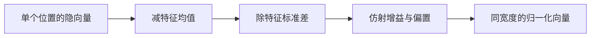

# LayerNorm

沿特征维减均值、除标准差，让每个样本自己的表示落在可比的尺度上，而不依赖批次统计。

<footer>—— Ba、Kiros、Hinton，Layer Normalization，2016</footer>

BatchNorm 用一个小批量估计均值与方差，对变长序列、小批量与自回归解码都不友好。Ba、Kiros 与 Hinton 在 2016 年提出 LayerNorm：每个样本单独沿特征维归一化。原版 Transformer 把它放在残差之后，后来的解码器把它或它的 RMS 变体放在残差分支入口。理解 LayerNorm 本身——它约束什么、仿射参数做什么、统计沿哪一维——是读 Pre-LN、RMSNorm 与 DeepNet 的前提。本文只写这一算子，不把后续变体写成它的附录。

## 问题

深度网络里，一层的输出尺度会随参数与输入漂移，下一层的线性映射与非线性因此时而饱和、时而落在线性区。BatchNorm 用批次里同一通道的统计来钉住尺度，训练与推理还要维护运行均值。序列模型的批次里样本长度不同，时间步之间也不该共享同一套「通道均值」；解码一步时批量常常为 1，运行统计与训练统计错位。

需要一种归一化：不沿 batch，不沿时间，只沿「这个 token 的特征向量」。这样每个位置自给自足，掩码与变长自然成立，推理公式与训练相同。LayerNorm 回答的就是这个接口问题，同时保留可学习的逐维缩放与平移，以免归一化把有用的尺度全部洗掉。LayerNorm 的统计单位是单个向量，不是序列，也不是批次。长度为 $n$ 的句子有 $n$ 组独立的 $\mu,\sigma$。位置信息不会进入归一化，也不会因为句子变长而改变某一 token 的 $\sigma$ 定义。

## 方法

对 $x\in\mathbb{R}^{d}$，

$$
\mu=\frac{1}{d}\sum_{j=1}^{d}x_j,\qquad
\sigma=\sqrt{\frac{1}{d}\sum_{j=1}^{d}(x_j-\mu)^2+\varepsilon}
$$

$$
\mathrm{LN}(x)=\gamma\odot\frac{x-\mu}{\sigma}+\beta
$$

$\gamma,\beta\in\mathbb{R}^{d}$ 与样本无关，随层学习。$\varepsilon$ 防止零方差。Transformer 里 $d$ 是模型宽度，$x$ 是某一位置的隐状态。注意力分数矩阵不在这里归一化；LN 发生在块的边界，对 $Q$、$K$、$V$ 的输入或对残差输出做。

原论文在循环网络上验证，强调与 BatchNorm 在小批量、序列任务上的差异。Vaswani 等人 2017 年把它写进 Transformer 的 Post-LN 块，成为后来一切变体的参照实现。

## 机制

### 特征维归一化

减均值把 $x$ 投到与全 1 向量正交的超平面，除 $\sigma$ 再把它拉到近似单位球面与该超平面的交上（仿射前）。下一层看到的是方向，以及被 $\gamma$ 重新加权的轴。这对加法残差的意义是：无论上一层把范数写得多大，Post-LN 都会在进入下一子层前把尺度收回来。Pre-LN 则只收回子层输入的尺度，残差主干可以继续涨。

因为统计不含其它 token，LayerNorm 不引入跨位置耦合。它不能替代位置编码，也不能替代注意力里的因果掩码。它只管理「这个向量有多野」。

### 仿射参数

若没有 $\gamma$ 与 $\beta$，LN 会强迫每一维在标准化后有相同的先验幅度，并禁止恢复均值。$\gamma$ 允许某些通道保持更大的动态范围，$\beta$ 允许输出带偏置，等价于在归一化流形上再做一个对角仿射。训练初期 $\gamma=1,\beta=0$，块接近纯标准化；训练后期 $\gamma$ 常学到远离 1 的值，说明网络在「要归一化」与「要保留尺度」之间折中。

把 $\gamma$、$\beta$ 融进相邻线性层在数学上不总可行：LN 是非线性（除以依赖于 $x$ 的 $\sigma$），不能与矩阵乘交换。推理融合只能做有限的常数折叠，不能取消归一化本身。

$\beta$ 与残差里的偏置、以及注意力输出投影的偏置会叠加。Post-LN 时 $\beta$ 直接进入下一层输入；Pre-LN 时 $\beta$ 进入子层，再经 $F$ 写回主干。排查「某维恒正」时，应同时看 LN 的 $\beta$ 与线性层偏置，而不是只怪嵌入。

### 在残差块中的位置

同一算子，放在 $x+F(x)$ 之后或 $F$ 之前，梯度完全不同——那是 Pre-LN 与 Post-LN 的主题。对 LayerNorm 自身只需记住：它总是沿最后一维归约。若错误地沿序列维做 LN，会把不同位置混成一套 $\mu,\sigma$，瞬间接通本该由注意力学习的耦合，并破坏因果。实现时的 `normalized_shape` 必须是宽度 $d$，不是 $n$ 或 $n\times d$。

## 边界与工程取舍

LayerNorm 对全零或近常数向量敏感：$\sigma$ 接近 $\sqrt{\varepsilon}$，输出被 $\varepsilon$ 主导。宽度极大时，fp16 下求和与平方和需要提升精度。它比 RMSNorm 多一次中心化，内核更重；在带宽已是瓶颈的训练里，这是后来改 RMS 的直接动机。

LayerNorm 不保证跨层的残差增益合理。极深 Post-LN 仍会梯度衰减，需要 warmup 或 DeepNorm，不能靠把 $\varepsilon$ 调大来修。它也不稳定 softmax 内部的 logits——那是注意力缩放的问题。把一切数值故障都归因于 LN 会误导。

从梯度看，$(x-\mu)/\sigma$ 对 $x$ 的雅可比是投影加缩放，范数大约为 $1/\sigma$。某一位置的隐状态若暂时塌成近常数，$\sigma$ 变小，梯度被放大，容易在那一 token 上出现尖峰。这与注意力汇点不同：汇点是跨位置的质量集中，LN 尖峰是单向量尺度崩溃。调试时应打印每层 $\sigma$ 的分位数，而不是只看损失。变长批次里不同样本的 $d$ 相同、$\sigma$ 各异，这是正常现象；真正异常的是同一层里大量位置的 $\sigma$ 同时贴住 $\sqrt{\varepsilon}$。

与 BatchNorm 对照时，LayerNorm 的优点是无运行统计、与批量无关；缺点是没有「跨样本的噪声」这种正则，也不能用批次里的其它例子来估计通道尺度。序列模型几乎总是接受这笔交换。

### 和 RMSNorm 的分工

需要中心化、需要 $\beta$、或必须与 2017 年以来的 Post-LN 检查点兼容时，用 LayerNorm。默认追吞吐与解码器质量时，RMSNorm 往往够用。二者都是「按 token、按特征维」的归一化，都不是位置编码。新写的块应先固定 Pre-LN 还是 Post-LN，再决定 LN 还是 RMS。

## 小结

- LayerNorm 对每个样本的特征向量减均值、除标准差，再做逐维仿射。
- 统计不沿 batch、不沿时间，故适合变长序列与自回归解码。
- $\gamma$ 与 $\beta$ 恢复被标准化洗掉的尺度与偏置，但不能与相邻线性层完全融合。
- 归约维必须是模型宽度；沿序列做归一化会破坏位置独立性与因果。
- 它稳定的是向量尺度，不自动解决深层残差的梯度衰减。
- RMSNorm 去掉中心化以换速度，函数类更窄，不是原定义的别名。
- 出处：Ba、Kiros、Hinton，*Layer Normalization*，2016；在 Transformer 中的位置见 Vaswani 等（2017）与 Xiong 等（2020）。
