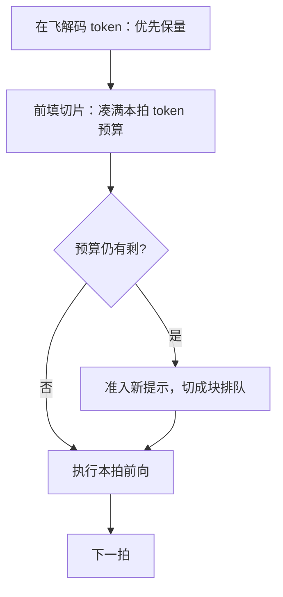
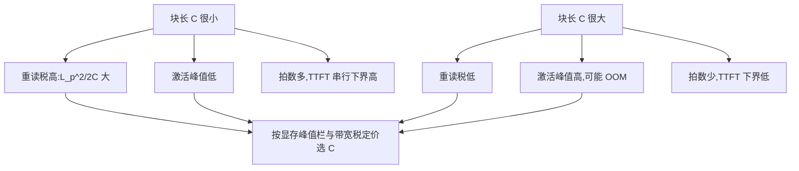

# chunked prefill 深入

切块是调度工具，不是长上下文算法；切多少是一次定价——用峰值显存与带宽税，买迭代时间的上界。

<footer>—— 据 Agrawal et al., Sarathi-Serve, OSDI 2024 与 Zhong et al., DistServe, OSDI 2024 的取舍口径整理</footer>

[上一课](/llm/lc-memory-account)把一条长请求的账立成四栏，并留下一个未定价的兑换：前填的激活峰值与反复读 KV 的带宽税可以互相换取，兑换率由块长决定。本课给这笔交易定价。基础课 [chunked prefill](/llm/chunked-prefill) 已讲清切块的机制——每块是「短查询、长键」的精确注意力、块长有饱和算力与迭代预算的两端约束、与分页和连续批处理正交。本课只补它在长上下文留下的三个缺口：块长的三方定价如何倾斜、token 预算装填的次序、以及切块什么时候不如把前填整个搬走。

## 问题

基础课给的块长经验是「几百 token」；这个数在 128K 处两头失效。一方面，重读税随提示长度二次涨：切得越碎，后面的块反复扫前面页的次数越多，128K 提示在几百 token 块长下的 KV 流量会被放大两个数量级——前填自己变成带宽作业。另一方面，块长一旦加大，单拍激活峰值随之上涨，正好打在[显存账](/llm/lc-memory-account)的峰值栏上；而 [token 预算装填](/llm/splitfuse)与[前填解码分池](/llm/pd-disaggregation)提供了块长之外的保护 ITL 的手段。三个系统给出的不是三个结论，是同一条定价曲线上的三个点。缺口是把这条曲线显式写出来，而不是背一个块长常数。

术语翻译：「重读税」就是切块的分期手续费——第 $j$ 块做注意力时，必须把前面 $j-1$ 块的 KV 从显存再读一遍。切块把一次大前填拆成 $N$ 拍来换平滑的迭代时间，代价是这些 KV 被反复搬运；税额约 $L_p^2/2C$，块越碎、提示越长，手续费越重。

## 方法

先写重读税。把长度 $L_p$ 的提示切成 $N=\lceil L_p/C\rceil$ 块，第 $j$ 块要重读前 $j-1$ 块的 KV，总重读量为

$$\sum_{j=1}^{N} (j-1)\,C \cdot B_{\mathrm{kv}} \;\approx\; \frac{L_p^2}{2C}\, B_{\mathrm{kv}},$$

相对一遍全量 prefill（读 $L_p$ 个 token 的 KV）放大 $L_p/2C$ 倍：$C$ 翻倍，税减半；$L_p$ 涨 32 倍，税涨 32 倍。再写另外两端：激活峰值由 $C$ 与层宽决定，与 $N$ 无关——峰值是买税下降的价格；TTFT 由 $N$ 拍串行决定，下界是 $\lceil L_p/C\rceil$ 乘单拍时长。于是块长的选择是一次显存换带宽的定价：峰上税下，或税上峰下。

数字实例：TTFT 的串行下界怎么算？$L_p=131072$、$C=512$ 时，$N=\lceil L_p/C\rceil=256$ 拍；若单拍前向 20 毫秒，光分期就要 $256\times20\,\text{ms}\approx 5.1$ 秒，还没算排队。把 $C$ 提到 4096，拍数降到 32，下界约 0.64 秒——大块对 TTFT 的改善是从拍数上来的，代价是那 8 倍的激活峰值。

装填次序照 [SplitFuse](/llm/splitfuse) 的 stall-free 顺序：每拍先保在飞解码的 token，再用前填切片凑满 token 预算，最后才准入新提示。这个次序不是实现细节，是 ITL 尾部的定义——顺序颠倒，解码拍就被前填挤掉，尾部立刻失控。

## 机制

长上下文把定价曲线推向「宁要大块」，原因在税的阶：重读税随 $L_p$ 二次、随 $C$ 反比，4K 时代的块长在 128K 处把 KV 流量放大到不可接受，而 ITL 的保护可以外包——前填与解码分池后，块长不必再独自扛 ITL，只承担「作业尺寸平滑」这一个职责。判断式由此得出：单卡混部、长度中等，切块仍是第一工具；流量大到值得独立前填池（[分离池](/llm/disagg-prefill-pool)），切块退居池内；超长 prefill 连分池都不够，序列要切到多卡上，那是 [Ring Attention](/llm/ring-attention) 与[上下文并行](/llm/context-parallel)的地界。MoE 上块长还要付第三笔钱：块越碎，冷专家搬运越频繁，专家缓存的命中率随块长一起掉。

重读税一手算：$L_p^2/2C$ 个 token 的 KV 重读。128K 提示在 $C=512$ 时约 1600 万 token 次读取——等于把全量 prefill 的 KV 流量再做约 128 遍；$C=4096$ 时降到约 16 遍。从 512 到 4096，省下的税是以 8 倍激活峰值买来的。

## 边界

不重讲可见性正确性——每块必须看见本请求已完成的前缀 KV，短查询长键，见基础课。不宣称切块降低注意力复杂度：总 FLOPs 仍是对 $L_p$ 的二次前填，只是时间上分期；「某引擎默认开切块」是版本选择，不是论文结论。税的公式给的是量级：核实现、页大小与并行度改变常数，不改变 $\frac{L_p^2}{2C}$ 的形状。最后，若重读税在业务长度上已不可接受，出路不是无限加大 $C$——它被迭代预算与峰值栏封顶——而是把有效 $n$ 降下来，那是「服务语义」单元的主题。

## 小结

- 块长是一次定价：激活峰值随 $C$ 涨，重读税随 $C$ 落，TTFT 由块数串行决定。
- 重读税约 $\frac{L_p^2}{2C}$ 个 token 的 KV 流量，随提示长度二次、随块长反比。
- 装填次序固定：先保解码，再填前填切片，最后准入新提示——这是 ITL 尾部的定义。
- 长上下文把块长推向大块；ITL 保护外包给分池，切块退守作业平滑。
- 超出分池能力的超长 prefill 走上下文并行，不是继续调块长。
- 出处：Agrawal 等，Sarathi / Sarathi-Serve（OSDI 2024）；Zhong 等，DistServe（OSDI 2024）；Liu, Zaharia 与 Abbeel，Ring Attention（2023）。
