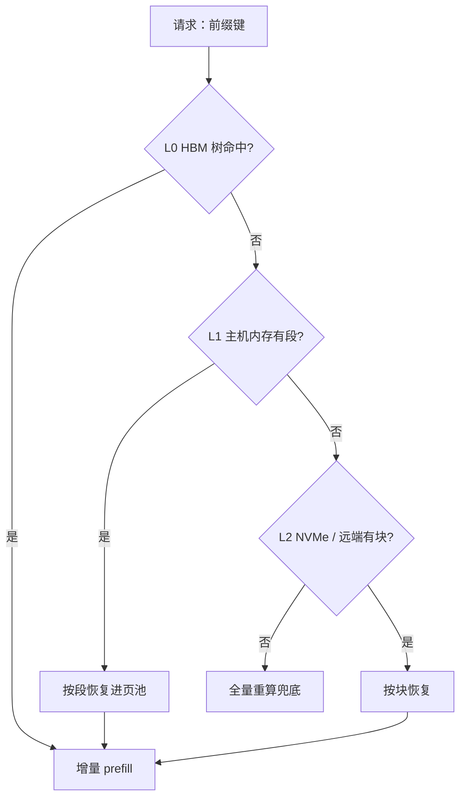
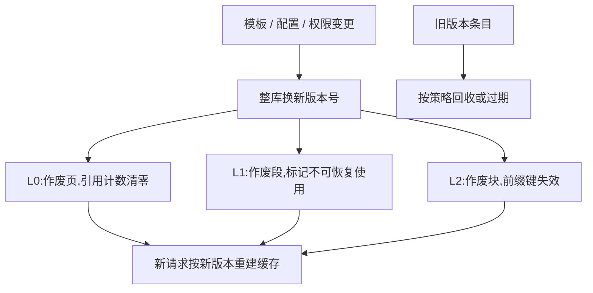

# 上下文缓存的分层

上一级缓存用空间换时间，下一级用时间换空间；分层的每一级，都是对复用概率的一次定价。

<footer>—— 据 Kwon et al., SOSP 2023；Zheng et al., SGLang / RadixAttention, NeurIPS 2024；Qin et al., Mooncake, 2024 整理</footer>

[上一课](/llm/lc-chunked-prefill)把前填切进拍里，为块长定了价。显存账里还有一项只在脚注里出现：一条 128K 会话 16 GiB，而人会话的节奏是分钟级——同一份前缀隔几分钟就回来一次。留还是丢，都不是单层能回答的问题。引擎内的[自动前缀共享](/llm/prefix-caching)与跨请求共享的[键语义](/llm/kv-prefix-cache)已有专课，[生命周期与所有权](/llm/kv-lifecycle-ownership)管页归谁；本课补的是把 HBM 页池、主机内存、NVMe 与远端缓存池装进**一个分层体系**：谁该下放、下放到哪一级、失效怎么逐层传。

## 问题

单层缓存在长上下文下从「锦上添花」变成「结构不足」。留在 HBM：三四个会话就吃满页池，新请求没页可用，冷会话把热请求挤走。直接丢掉：会话回来要重付整段 prefill——几十秒的排队加算力，用户直接流失。两个错误共享一个根源：单层的容量弹性与长会话的复用周期差着数量级。失效再把问题加深一层：系统提示升级、对话模板换版、权限变更会让缓存条目整批作废；三层若各自失效、互不一致，就会出现上层给的、下层不敢用，或下层留的、上层不知道——缓存从加速器变成正确性隐患。

数字实例：一张 80 GB 的卡，留出权重与激活后页池约 40 GiB，一条 128K 会话就占 16 GiB——HBM 只装得下两三条；同样的内容放主机内存（TB 级）能装上百条，放 NVMe 几乎不限量。三级的容量差一到两个数量级，恢复速度也差一到两个数量级——分层不是工程洁癖，是容量与速度本身就长成金字塔。

## 方法

三层各记三件事：容量、恢复带宽、管理粒度。L0 是 HBM 页池：radix 树或块哈希链索引，引用计数与写时复制，粒度是页。L1 是主机内存：换出保 KV（口径见 [KV offload](/llm/kv-offload)），粒度升到段或会话——16 GiB 的条目按页管理，元数据比数据还贵。L2 是 NVMe 与远端缓存池（[Mooncake 一类](/llm/mooncake)以 KV 为中心的做法），粒度是前缀块，按前缀哈希寻址。下放是定价问题：期望节省等于复用概率乘重算成本，下放成本等于恢复时间加存储占用。PCIe 5.0 x16 约 64 GB/s，16 GiB 会话拉回约四分之一秒，远低于重算加排队——所以长会话默认下放，只有复用概率近零才直接丢。命中链路自上而下：[路由亲和](/llm/sglang-router)把同前缀流量钉进同副本，副本内查树，L1 恢复，L2 恢复，重算兜底。

直觉类比：把三层当成厨房——L0 是灶台边的一小格调料架（伸手就到，位置极少），L1 是冰箱（要转身开个门，量中等），L2 是小区的批发仓库（开车去取，几乎装得下一切）。常用的盐留在灶台，囤货下冰箱，整箱的进仓库。做菜快慢取决于「最常用的东西放得离手多近」，缓存分层是同一个道理。

## 机制

失效半径由库的分段粒度决定，这是三层共享的一条机制：前缀树把公共部分划得越粗，命中越长，一条变更作废的子树也越大。对策是版本化——模板与配置进缓存键（[前缀缓存课](/llm/prefix-caching)已立键内容），权限变更等于整库换版，三层用同一套版本号，作废才能一致传播。驱逐在长上下文下还有一条粒度纪律：会话级 LRU 按条数淘汰，会让一条 16 GiB 的冷会话顶掉几千条热短会话——冷热必须按字节计。这是[显存账课](/llm/lc-memory-account)「按积不按条」的纪律搬进了缓存：容量紧张时先换出积大的冷条目，而不是条数多的。

恢复与重算的定价：16 GiB 的 128K 会话，PCIe 5.0 x16 拉回约 0.25 秒；重算同一段在 8B 模型上要零点几秒的裸算力，排队与干扰常把它放大到秒级。下放省的不只是算力，是把 TTFT 从重算队列里买回来。

常见误区：初学者容易以为「缓存条目丢了顶多重算一次，没什么大不了」。对短前缀确实如此；但一条 16 GiB 的 128K 会话被不一致的失效打中，意味着用户几十秒的 TTFT 和一整段重复算力——更糟的是三层失效不同步时，上层给出的页下层不敢用，正确性先于速度出问题。

## 边界

不重讲键语义与写时复制，两件事在已有课里已立。分层只对「从位置 0 起的前缀」有效：任何中段抽取（丢开头、保中段）都破坏位置连续性，KV 不能跨下标挪用——那类语义归位置外推课。换精度不是本课的事：offload 只搬家不改比特，压缩是 KV 管理线的刀。跨副本不共享缓存——路由不亲和时命中作废，那是放置问题，不是缓存问题；分层救不了错误的路由。

## 小结

- 长上下文把缓存逼成分层结构：HBM 页池、主机内存、NVMe 与远端，各记容量、恢复带宽与粒度。
- 下放是定价：复用概率乘重算成本，对恢复时间加存储占用；长会话默认下放。
- 管理粒度随层级上升：页、段或会话、前缀块；驱逐按字节计，不按条数计。
- 失效用同一套版本号逐层传播：模板、配置、权限进缓存键，变更等于换版。
- 命中链路自上而下，路由亲和是命中率的地基；跨副本不作缓存一致性。
- 出处：Kwon et al., SOSP 2023；Zheng et al., NeurIPS 2024；Qin et al., Mooncake, 2024；口径与本仓库前缀缓存、offload、分层存储诸课一致。
