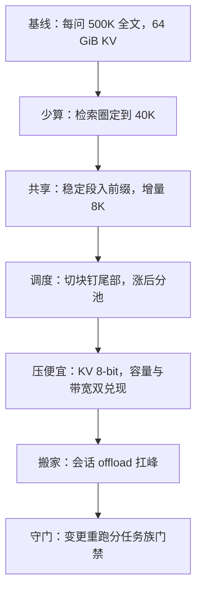

# 成本优化案例

成本优化按数量级排顺序：先让问题变小，再让常数变小，最后才搬东西。

<footer>—— 据 Pope et al., 2022 的会计口径与 Zhong et al., DistServe, OSDI 2024 的资源分离经验整理</footer>

[上一课](/llm/lc-eval-serving)把评测立成门禁。本课是课程的第一次综合：把前面八课的杠杆装进同一个案例，按顺序走一遍。案例设定：企业合同助手，十万份合同，日均数千问。基线配置是「每问把召回的 top-50 份全文推进窗口」——单问约 500K token，从[显存账](/llm/lc-memory-account)上就不成立。下面按杠杆排序走六步，每步先报账，再过[门禁](/llm/lc-eval-serving)。

## 问题

基线的账不用细算就出局：500K token 的单问 KV（FP16）是 64 GiB，比一张卡扣掉权重后的全部余量还大；即便装进多卡，TTFT 与排队也会把服务拖死。工程上的常见错误不是不优化，而是**乱序**优化：先上量化、先买卡、先切块，每一步都拿到两位数的改善，而数量级的项原封不动——半年后账单回到原点。缺的是一张排序表：哪一项改变问题的数量级，哪一项只改变常数。

## 方法

六步，按数量级排序。第一步**少算**：检索圈定（[混合服务课](/llm/lc-retrieval-hybrid-serving)）。先召回圈定 5 到 10 份，再对圈定材料通读：单问从 500K 降到 40K，一个数量级；多跳问题召回不足，接[多跳迭代](/llm/multi-hop-retrieval)，由门禁的任务族分数触发。第二步**共享**：库级前缀段加会话缓存（[分层课](/llm/lc-context-cache-tiers)、[多文档课](/llm/lc-multidoc-workload)）。40K 里约 32K 是库的稳定段，进共享前缀；命中后 prefill 只付 8K 增量，语料 KV 只付一份。第三步**调度**：[切块与 token 预算](/llm/lc-chunked-prefill)钉住交错延迟，流量涨后把前填[分池](/llm/pd-disaggregation)——账不变，尾部变了，p99 进合同。第四步**压便宜**：KV 8-bit（[预算课](/llm/kv-longcontext-budget)降级链第一档，[量化口径](/llm/kv-quant-int8-int4)）：每 token 64 KiB，容量翻倍、扫描减半，一张表两处兑现。第五步**搬家**：会话级 [offload](/llm/kv-offload) 到主机，峰值并发翻倍，恢复零点几秒级。第六步**守门**：每次变更重跑分任务族门禁——链条越长，未被告知的回归越多。

## 机制

排序的原理是数量级优先：第一步改变 $n$ 的数量级（约 10 倍），第二步改变复用结构（再数倍），后面四步各拿 2 倍上下。顺序颠倒的代价是真实的：不先圈定就上量化，是在优化线性常数、放过数量级项；不先共享就扩容，是按无共享的账买卡——采购按条数算、账按[积](/llm/lc-memory-account)算，差出的倍数全变成闲置算力。每步的账用同一张表记：单问显存·时间积、每百万 token 成本、各任务族门禁分数，三列对齐，哪一步的杠杆用尽一目了然。

同一条链的账：每问 500K 全文是 64 GiB KV（FP16）；圈定加共享后，8K 增量在 8-bit 下是 0.5 GiB，且大头是只付一次的共享段。两个数量级来自前两步，后四步各拿常数百分比——这是「先少算、再共享」永远排在「先量化」前面的算术原因。

## 边界

数字是量级演示，换库、换模型、换流量结构要重算——账的纪律比数可靠。案例未覆盖的项：嵌入与索引侧的成本（属检索栈）、跨区域传输、冷启动。链条不是单向楼梯：流量结构变了——从查数变成比对、从单人变成全员——第一步的圈定比例与第二步的树组织都要回头重调，六步是循环不是瀑布。最后，每一步都必须过门禁再放量：成本优化的每刀都砍在某组旋钮上，砍完不测，省下的是钱，赔上的是质量。

## 小结

- 六步顺序按数量级排：少算、共享、调度、压便宜、搬家、守门；前两步拿数量级，后四步拿常数。
- 乱序优化的代价可预测：先量化或先扩容，都在优化常数、放过数量级。
- 统一记账：显存·时间积、单位成本、门禁分数三列对齐，杠杆用尽可见。
- 链条是循环：流量结构变了，圈定比例与树组织回头重调。
- 出处：Pope et al., 2022（会计口径）；Zhong et al., DistServe, OSDI 2024（分池经验）；降级链口径同本仓库 KV 预算课。
