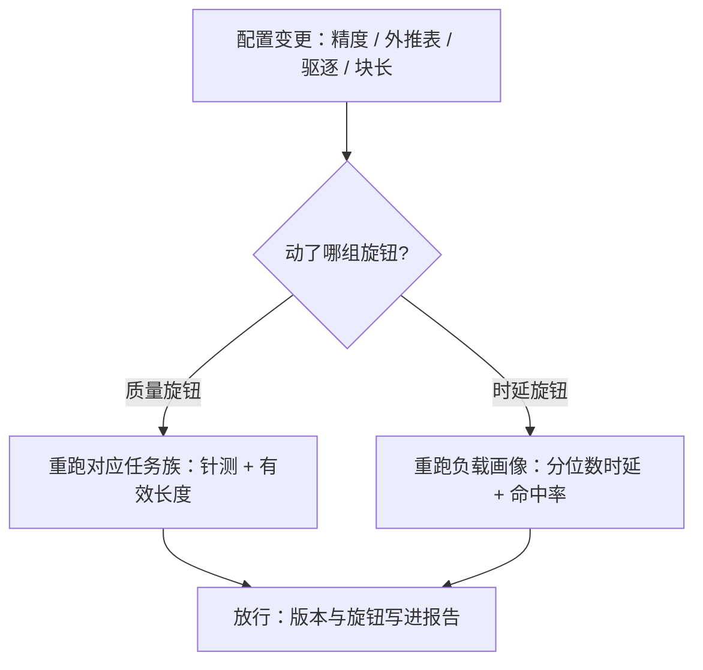

# 长上下文评测服务化

长上下文的分数不只属于模型，也属于 serving 的每一枚旋钮；不钉旋钮的评测，测的是一次偶然的部署。

<footer>—— 据 Hsieh et al., RULER, 2024 与 lm-evaluation-harness 的版本绑定口径整理</footer>

[上一课](/llm/lc-multidoc-workload)立起多文档的共享结构，「服务语义」单元的行为契约到此讲完。「工程化」单元从本课起，把这些契约变成可发布的门槛。质量测法已有三件套——[针测](/llm/niah)、[有效窗口曲线](/llm/long-context-eval)、[LongBench / RULER / ∞Bench](/llm/longbench-ruler)；[评测框架课](/llm/eval-harness)立过「分数绑定框架版本」。本课补长上下文特有的一条：分数还绑定服务配置，评测必须当成负载工程来做。

## 问题

同一份权重，在不同服务配置下是不同的被测对象。KV 量化降档、驱逐策略、外推表版本、采样参数，都能把分数移动到与模型代差同级的幅度；而块长、缓存、分离式部署不改分数，却把评测的时延与成本改变数倍。两组旋钮不分开钉，比较就无效。长上下文还让评测本身变贵：一张 16×16 的针测网格是 256 条 128K 的 prefill，当普通脚本跑，账会先于结论爆炸。最后是缓存的新干扰：跨题命中能把时延压低，也会让「实现差异」混进「模型差异」——两个引擎跑同一模型，一个开着自动前缀共享、一个关着，分数与耗时都不可比。

## 方法

评测服务化三个动作。协议钉两组旋钮：质量侧（KV 精度、驱逐策略、外推版本、采样与长度预算）写进报告，时延侧（块长、缓存命中口径、批大小、部署拓扑）写进负载说明——[评测方差课](/llm/eval-variance-seed)的随机维 $\xi$ 在这里多出服务维，报告格式沿[框架课](/llm/eval-harness)的「版本三元组」扩成四元组。门禁化：把有效长度曲线与针测热力图做成发版门禁，任何触碰质量旋钮的变更必须重跑对应任务族——按失效模式的局部性抽样：精度降档主要伤针测召回，外推换版主要伤远距离任务，全量重跑买不来归因，只会拖到没人等得起。评测当负载：用评测集的长度分布编预算（[显存账课](/llm/lc-memory-account)的账），网格与真实长任务按成本分层抽样；时延验收用分位数，与[流式课](/llm/lc-longoutput-streaming)的契约同一口径。缓存口径：质量评测关跨题缓存或钉隔离，模型比较才干净；时延评测反过来，必须开缓存测真实部署的命中率。

## 机制

质量旋钮为什么必须进协议：KV 量化与驱逐改变的是模型可见的证据集，外推表改变的是位置语义——它们不是「工程细节」，是推理时模型定义的一部分。分数一移动，归因就断：两个不钉旋钮的分数之间，你不知道差的是模型还是部署。门禁按任务族抽样的依据是失效的局部性：每种质量旋钮只伤一个任务族，抽对了既省钱又保留归因；抽样表本身要随旋钮类型版本化。在线影子评测补最后一块：排队效应、真实命中率、[长输出的分位尾部](/llm/lc-longoutput-streaming)，评测集测不了，只能用真实流量旁路测——离线门禁管「对不对」，影子测量管「疼不疼」。

评测自身的账：256 条 128K 提示约 3300 万 token 的 prefill，8B 模型约 $5\times10^{17}$ FLOPs——单卡按小时计，八卡节点按分钟计。这就是门禁必须按任务族抽样、评测集必须按长度分层的原因。

## 边界

各基准的构造与解释是三件套课的事，本课不重述；在线影子测量测不了长尾任务质量，离线门禁测不了排队——两者互补不可互替。评测温度与解码协议的纪律照[方差课](/llm/eval-variance-seed)，本课只加服务维。最后一条纪律：服务配置的任何「临时调优」若出现在评测里而没出现在报告里，评测作废——这条比任何统计方法都更常救场。

## 小结

- 长上下文分数绑定服务配置：质量旋钮改变被测对象，时延旋钮改变评测成本，两组分开钉。
- 报告从版本三元组扩成四元组：框架、任务、适配器之外，加服务配置。
- 门禁按失效局部性抽样：精度伤召回、外推伤远距离，抽对了省钱又保归因。
- 缓存双口径：质量评测关缓存保纯净，时延评测开缓存测真实命中。
- 出处：Hsieh et al., RULER（2024）；Zhang et al., ∞Bench（2024）；lm-evaluation-harness 的版本绑定口径。
