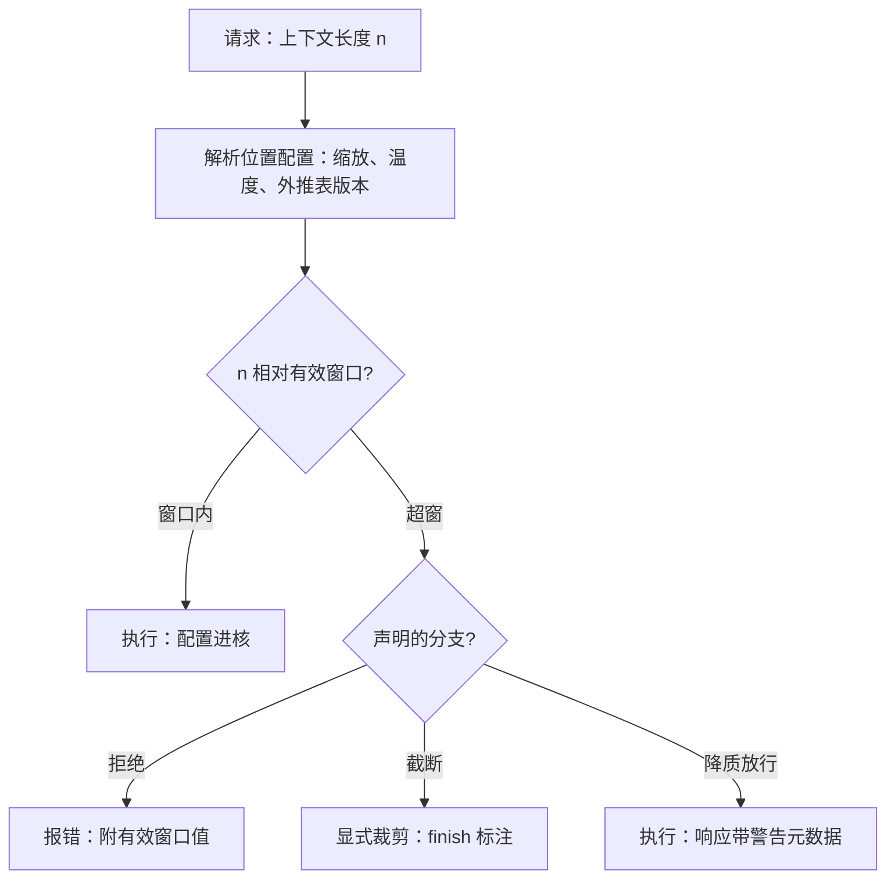
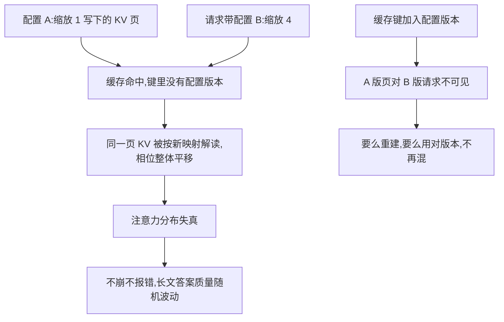

# 位置外推的服务语义

延窗方法改的是位置到相位的映射；映射一变，同一串 KV 的含义就变。所以外推不是模型开关，是服务契约。

<footer>—— 据 Su et al., RoPE（2021/2024）与 Peng et al., YaRN, 2023 整理</footer>

[上一课](/llm/lc-retrieval-hybrid-serving)把通读与检索装进同一个服务。本课处理窗口声明本身的语义：模型出厂的[位置方案](/llm/rope-frequency)是属性，运行时把窗口从 32K 拉到 128K 的外推配置是服务参数。[YaRN](/llm/yarn) 一族给了延窗的方法，[位置外推评测](/llm/long-context-eval)给了「有效窗口」的测法；本课把两者变成服务的 API 语义——配置归谁、超窗怎么办、缓存怎么跟着变。方法本身不重讲。

## 问题

「支持 128K」在 API 上至少有三种含义：能前向不崩、针测全绿、任务质量不掉——[评测课](/llm/long-context-eval)已证明三者不同。服务若只透传一个窗口数，调用方必然把第一种当第三种用，投诉发生在第 90K token 处。另一头是配置的运行时性：同一份权重，YaRN 表开与不开是两个模型；两套配置还可能混跑在同一引擎里。滑窗模型更把「窗口外」定义为丢弃而非放不下（[滑窗课](/llm/sliding-window-attention)、[汇点课](/llm/attention-sink)）。语义不清的服务会安静地做错三件事：复用旧配置写下的缓存、把降质输出当正常返回、把被窗口丢掉的字节报成「已处理」。

数字实例：一个 32K 训练窗的模型，YaRN 缩放因子设 4，名义窗口就是 $32\mathrm{K}\times4=128\mathrm{K}$——但「不崩」与「好用」隔着两档：无续训外推通常针测及格、任务质量在窗中部就开始掉；接少量目标长度续训才到第二档。API 文档里「支持 128K」必须写清是哪一档，否则调用方在第 90K token 处的投诉是必然事件。

## 方法

三条契约。其一，位置配置逐请求化：缩放因子、注意力温度校正、外推表作为请求参数进核，无配置则用训练默认；发布文档写明当前档位——无微调外推与目标长度上的少量续训（YaRN 的经验是续训更稳）是两个质量档，不能混称「支持」。其二，超窗行为三分支，由服务声明其一：拒绝（请求期报错，附当前有效窗口值）、截断（显式裁剪并给[结束语义](/llm/stop-sequences)里的 finish 标注）、降质放行（响应带警告元数据）。静默不在选项里。其三，缓存键加版本：位置配置版本必须进[前缀缓存键](/llm/prefix-caching)——外推表换版等于换模型；滑窗模型再加一条：淘汰语义（保汇点、保最近窗）作为缓存与驱逐的硬约束传下去。

## 机制

配置为什么必须进缓存键而不是只进请求：KV 是「前缀内容 × 位置映射」的确定函数，映射变了，同一页 KV 的相位整体平移。混合命中比全不命中更糟——它不报错，只是把 A 模型的 KV 喂给 B 模型，答案悄悄变差。这也是外推配置要版本化发布的原因：本课程工程化单元的评测门禁，其基线与线上配置必须同版，否则回归测试测的是另一个模型。位置家族之间还有「软硬」之别：RoPE 系有可调的缩放表，[ALiBi](/llm/alibi) 系的外推边界出厂即定——前者的窗口声明是协商项，后者接近硬约束，契约要按家族写。

易错点：YaRN 开与关是两个模型。缓存键漏掉位置配置版本时，命中照常发生、不崩、不报错——旧 KV 在新映射下读出的注意力分布整体失真，症状是「长文档答案质量随机波动」，极难归因到缓存。

直觉类比：KV 页像按某版地图画的坐标——位置映射就是坐标系。换外推配置等于换了一套经纬网，旧坐标直接抄到新地图上，点会落在错误的地方；最麻烦的是系统不会报「坐标不匹配」，只会安静地把你导航到错的位置。缓存键加版本号，就是给每张地图标注它的坐标系。

## 边界

本课不写外推方法本身（[频率与基数](/llm/rope-frequency)、YaRN、[LongRoPE](/llm/longrope) 已立），不写有效窗口的测法（评测课已立）；服务能承诺的是「按声明的档位与分支执行」，不能承诺延窗不掉点——那是续训档的事。混跑多配置的引擎还要防一类实现错：核的 per-request 参数与[图捕获](/llm/cuda-graph)的静态假设可能冲突，动态 shape 路径要单独验证后再放量。最后，服务计量的「已处理字节数」必须区分「进了窗口」与「被窗口丢掉」——滑窗模型上这两者不是同一个数。

常见误区：初学者容易以为「外推是个免费开关，拉一下窗口就变大，顶多快慢有别」。实际上缩放表改的是位置到相位的映射，权重从未见过新的相位范围——没续训就拉满，等于让一个只见过 32K 文档的模型硬读 128K：不崩，但检索、多跳、长文摘要的质量静默下滑。把延窗当质量中性的开关，是最常见的「已处理≠处理好了」。

## 小结

- 位置方案是模型属性，外推配置是服务参数；「支持 128K」必须声明档位与质量含义。
- 超窗三分支：拒绝、显式截断、降质放行带警告；静默不在选项里。
- 位置配置版本进缓存键；换表等于换模型，混用命中不报错但答案失真。
- 滑窗模型的窗口外是丢弃：淘汰要保汇点，「已处理」要区分进窗与丢窗。
- 出处：Su et al., RoPE（2021/2024）；Peng et al., YaRN（2023）；Xiao et al., Attention Sinks（2023）；测法口径见本仓库位置外推评测课。
