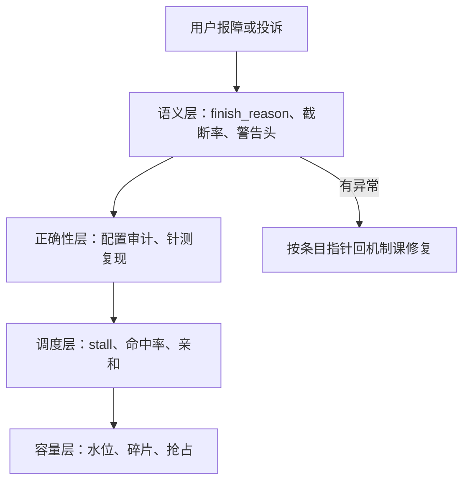

# 失败模式清单

长上下文服务的故障是跨层的复合故障；监控每一格都绿、用户侧是错的，是它的标准长相。

<footer>—— 据本课程各课的失败条目整理</footer>

[上一课](/llm/lc-cost-case)把优化杠杆走成链条。本课是第二门综合课，不立新机制，把前面各课散落的失败编成一张清单，按层排列：容量、调度、正确性、质量、语义。清单的用法不是背诵，是值班时的排查顺序——先查哪层，取决于哪层最便宜、最能证伪。

## 问题

单看任何一门课，失败都是「已知机制」；合到一起跑，长上下文服务的标准故障却是复合的：碎片引发抢占，抢占触发降级，降级没有标注，用户看到的是「模型变笨了」——四层各绿一格，体验全错。逐课回翻效率太低，值班需要一张按层索引、条目化、可勾选的清单。缺的还有排查顺序：从哪层查起，决定了一次故障是十五分钟的 grep 还是一次通宵的压测。

## 方法

每条按「症状—根因—指针」编目。容量层：满池 OOM 与抢占风暴，根因是准入按条数不按页数（[显存账课](/llm/lc-memory-account)）；池子没满却接不进长请求，根因是慢性碎片（[分页课](/llm/kv-paging-fragmentation)）；把「支持 128K」当常驻预留，是[预算课](/llm/kv-longcontext-budget)警告过的老错复发。调度层：ITL 出现秒级凹口，根因是队头长前填 stall（[切块基础课](/llm/chunked-prefill)）；TTFT 反而劣化，根因是切块过碎的带宽税（[深入课](/llm/lc-chunked-prefill)）；命中率全绿而单副本过载，根因是缓存羊群、路由失亲和（[router 课](/llm/sglang-router)）。正确性层：长文档答案质量随机波动，根因是缓存键漏位置配置版本（[外推课](/llm/lc-extrapolation-serving)）；滑窗模型窗口内崩，根因是汇点页被滚动驱逐（[汇点课](/llm/attention-sink)）；跨租户看见彼此的内容，根因是命中键漏权限（[多文档课](/llm/lc-multidoc-workload)）。质量层：把中间丢失当「模型不行」去换模型，先测排列（[针测课](/llm/niah)）；把 context rot 当检索召回问题去调 $k$（[context rot 课](/llm/context-rot)）；超有效窗口静默降质，是外推课三分支没落地。语义层：截断被当成完整回答进多轮历史，finish_reason 没分账（[停止语义课](/llm/stop-sequences)）；长输出中段降级无标注（[流式课](/llm/lc-longoutput-streaming)）；答案对、引用错，是位置元数据没传（[混合课](/llm/lc-retrieval-hybrid-serving)）。

## 机制

排查顺序按「便宜且可证伪」排，机制在成本：语义层查一次是 grep 日志，正确性层次之——离线针测与配置审计即可复现；调度与容量层最后——要压测才稳定复现。所以顺序是语义、正确性、调度、容量，图里从上往下。清单的第二个用途是把修法锚回机制：每条失败对应一门课的一笔账或一条契约，修复动作不是「加监控」，是回到那门课把账补全、把契约落地——监控只负责发现，清单负责把发现接回机制。复合故障按「最先可观测的那层」立案，但归因要跨层写完整，否则下次还在同一处断裂。

一条排查经验：先看 finish_reason 与截断率的分布，再看任何性能曲线——停止协议与降级语义的回归，往往比 TPOT 曲线早几天发出信号；等曲线动了，故障已经过了潜伏期。

## 边界

清单不是分类学：同一事故常跨两层，条目间没有互斥边界。清单也不完备：新配置——新的外推表、新的压缩刀、新的混合部署——会带来新条目；本课的编目法（症状、根因、指针、排查层）比条目本身耐用，新增失败按同一格式续写。最后，清单覆盖服务侧；模型侧的长文本能力缺陷（真实的推理失败，而非服务错误）不在本清单，先过[评测服务化](/llm/lc-eval-serving)的门禁再定性，是两类问题的分界线。

## 小结

- 长上下文故障是跨层复合故障：按容量、调度、正确性、质量、语义五层编目。
- 排查按「便宜且可证伪」：语义层先行（grep 可查），容量层殿后（压测可复现）。
- 每条失败锚回一门课的账或契约；修复是补账落地契约，不是加监控。
- 复合故障按最先可观测层立案，归因跨层写完整。
- 出处：据本课程各课条目整理；停止语义与降级标注口径同本仓库 stop sequences 课。
