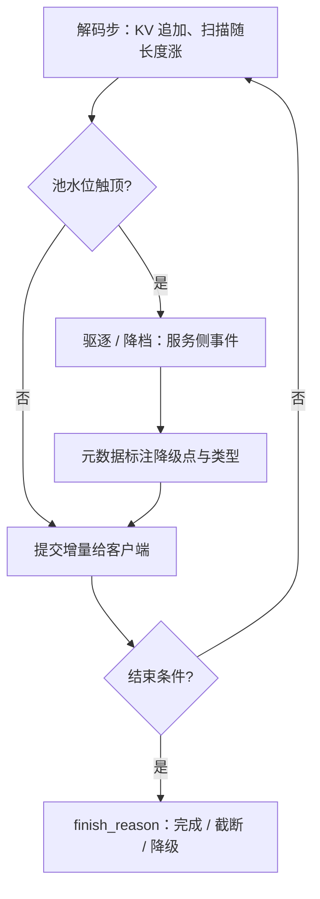

# 长输出的流式稳定

长输入把代价付在门口一次，长输出把代价摊进每一步；流式的稳定不是不掉，而是掉的时候客户端知道发生了什么。

<footer>—— 据 Pope et al., 2022 的带宽账与开放 API 流式结束语义的通行约定整理</footer>

[上一课](/llm/lc-extrapolation-serving)把窗口声明变成契约。输入侧的账在「显存与调度」单元记完；本课转输出侧：长思维链、长代码这些上万 token 的输出，把 KV 的增长搬进了生成段。[显存曲线课](/llm/long-context-memory-curve)警告过「思维链比长文档更易撞墙」；本课把这句警告落成流式服务的三条语义——分位数承诺、中途降级的可见性、断流续传。

## 问题

长输出的痛是复利的。输入的 TTFT 只付一次；输出的 KV 每步增长，每步的带宽账随已生成长度线性涨，且生成段没有公共前缀可摊——[预算课](/llm/kv-longcontext-budget)那句「生成段各付各的」，在 16K 输出处变成 2 GiB 的常驻与逐拍加深的扫描。更麻烦的是语义。上万步里哪怕单步 0.1% 的抖动概率，期望也有十几次 stall，均值 TPOT 完全掩盖；KV 触顶时的驱逐或降档发生在流中段，已生成文本与后续文本不同质；连接断开时，已提交的几千 token 要么能续、要么重付。只把输出建模成「一串 token 流」，这些事件全部无处安放——客户端把降质当模型变笨，把断流当服务死亡。

## 方法

三条流式语义。分位数承诺：长输出按 p95/p99 的[交错延迟](/llm/tpot-itl)验收而不是均值——步数多到尾部事件必然发生，契约要写「抖几次、抖多深」，而不是「平均多快」。降级可见性：驱逐、量化降档、外推超档这类中段事件写进响应元数据（降级点、降级类型），finish_reason 在[停止语义](/llm/stop-sequences)的 finish、eos、length 之外标注服务侧事件源——「流还在继续」与「还在同一配置上生成」是两个命题。续传：把已生成前缀写成可复用的会话前缀，重连等于一次[前缀缓存](/llm/kv-prefix-cache)命中，从提交点续流；未提交的挂起尾部按流式挂起规则处理，不重复、不丢失。

## 机制

长输出的降级为什么必须显式：生成是自回归的，中段驱逐或换精度改变的是后续所有 token 的条件分布——体验上「还流着」，统计上已经换了模型。显式标注把不可见的质量断裂变成可观测的事件流，客户端才有机会重试、降级或提示用户。投机解码把预算再复杂化一层：草稿 KV 有自己的峰值，接受长度随机（[接受长度调度](/llm/acceptance-length-sched)），预算要按接受长度的方差留回滚余量——[预算课](/llm/kv-longcontext-budget)边界里那句「投机放大长度方差」，在长输出上是常态而非例外。

16K 输出在 8B FP16 模型上自带 2 GiB KV（每 token 128 KiB），生成段逐拍上涨；单步 0.1% 的 stall 概率在一万六千步里期望 16 次抖动——按均值承诺 TPOT 的服务，在长输出上几乎必然违约。

## 边界

长输出的质量衰减——重复、跑题、退化——是解码与模型问题，本课只负责把它可观测，不负责修。续传语义不覆盖实例崩溃后的跨机 KV 迁移：同副本续走缓存命中，跨副本要重算或搬 KV，归[分层与放置](/llm/lc-context-cache-tiers)管。思考型输出的双通道流式（推理流与答案流分离）是产品协议，不改变本课的预算与降级语义——两个通道共用同一条生成段的账。

## 小结

- 长输出把 KV 增长搬进生成段：无共享可摊、带宽逐拍加深，预算按输出长度方差留余量。
- 流式承诺按分位数写：p95/p99 交错延迟是长输出的主指标，均值掩盖必然发生的尾部。
- 中段降级必须显式：元数据标注降级点与类型，finish_reason 增加服务侧事件源。
- 续传 = 已提交前缀的缓存命中 + 未提交尾部的流式挂起，不重复不丢失。
- 出处：Pope et al., 2022；Leviathan et al., ICML 2023（投机方差口径）；流式结束语义据开放 API 通行约定。
