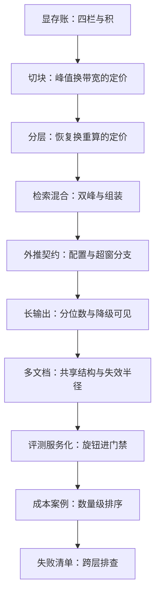
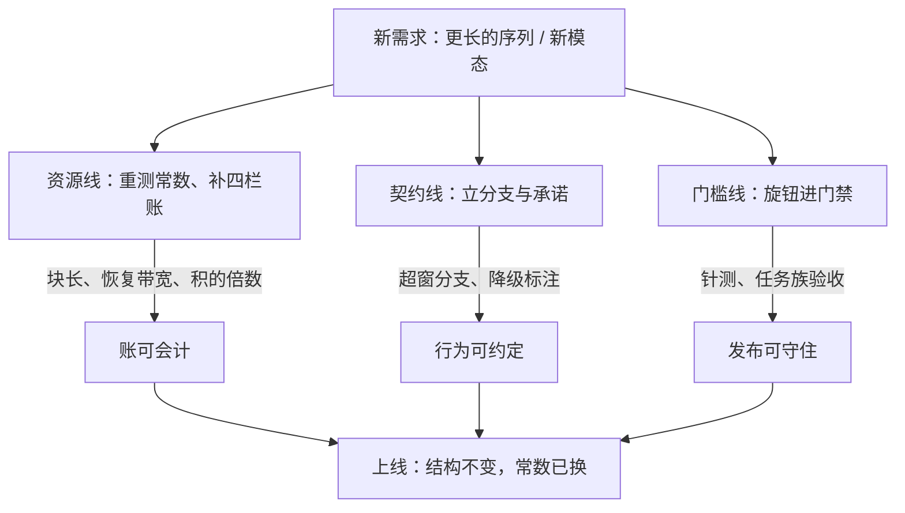

# 长上下文收束

窗口是模型的能力，账本是系统的能力；系统工程让「支持 128K」第一次成为可以兑现的句子。

<footer>—— 据本课程整理</footer>

[上一课](/llm/lc-failure-catalog)把失败编成跨层清单，最后一格留给了机制回指。至此账已算清、池已调度、契约已立、门禁已设、失败已编目——本课程到此收束。收束做两件事：把十一课收进几条线，把本课程放回大图，留给后课一个干净的接口。

## 问题

收束要防的是把课程读成技巧堆砌：切块、缓存、外推表、门禁，单看都是工程技巧，合起来才是一套方法。散着记，换一个模型、换一个长度档位就全部重来；收进结构，重算的只有常数。所以收束的问题不是复述，是提炼：十一课里哪些是不随长度与模型改变的结构，哪些只是本次部署的常数。

术语翻译：「旋钮进门禁」是说每个可调参数（旋钮）都必须配一个盯着它的验收测试（门禁）。门禁就是上线前必须通过的自动化考题集：旋钮改动后考题不过，改动就出不了门——参数从此不能悄悄地坏。

## 方法

三条线。资源线是「显存与调度」单元：[显存账](/llm/lc-memory-account)把字节的账算全，立下「按积不按条」的纪律；[chunked prefill 深入](/llm/lc-chunked-prefill)把峰值与带宽的兑换定价；[缓存分层](/llm/lc-context-cache-tiers)把重算与恢复定价。契约线是「服务语义」单元：[检索混合](/llm/lc-retrieval-hybrid-serving)、[外推配置](/llm/lc-extrapolation-serving)、[长输出流式](/llm/lc-longoutput-streaming)、[多文档共享](/llm/lc-multidoc-workload)，四课各把一类系统行为变成对调用方可声明的分支与承诺。门槛线是「工程化」单元：[评测服务化](/llm/lc-eval-serving)把旋钮钉进协议，[成本案例](/llm/lc-cost-case)把杠杆排成顺序，[失败清单](/llm/lc-failure-catalog)把故障编成排查法。三条线是同一句话的三种说法：长上下文不是「更长的窗口」，是把窗口的代价变成可会计、可调度、可约定的对象。

## 机制

放回大图。往回接：KV 管理与压缩的深钻线把刀铸好——[量化](/llm/kv-quant-int8-int4)、[驱逐](/llm/kv-eviction-heuristics)、[offload](/llm/kv-offload)各有专课；本课程回答刀往哪里用：进预算表、进降级链、进门禁。往回再接一层，主干把[三条显存曲线](/llm/long-context-memory-curve)与[服务成本模型](/llm/serving-cost-model)画全，本课程把曲线变成系统：曲线是物理，账本是决策。窗口继续增长时——多模态的长序列、代理轨迹的累积——课程里的常数全部重测：块长、恢复带宽、积的倍数；结构不变：四栏账、三条线、按积不按条、旋钮进门禁。这就是收束留下的接口：后课遇到「更长的东西」，先补账，再立契约，后设门禁。

一句自检：任何「长上下文方案」若说不清账记在哪几栏、契约有哪些分支、门禁测哪些任务族，它就还只是一个技巧——技巧在下一个长度档位就会失效，结构不会。

上面的链条回答「课程按什么顺序读」；换个问题——窗口继续涨、来了一个新需求时，三条线各自做什么、最后怎么合——是下面这张图的事。

常见误区：容易把三条线读成先后流程，以为算完账才立契约。实际上它们是同一个新需求的三份并行作业：账答「付得起吗」，契约答「做不到时怎么声明」，门禁答「凭什么信」——缺任何一份，方案都会在某个长度档位翻车。

## 边界

直觉类比：「结构不变、常数重测」可以类比搬家装修：户型（四栏账、三分支、门禁）是承重墙，搬进新家不用砸；家具尺寸（块长、带宽、积的倍数）每次搬家都要重新量。把技巧误当结构的人，换个模型就等于把整套房子重新装修一遍。

本课程是服务侧的收束：训练侧的延窗续训（[长上下文微调](/llm/long-context-finetune)）、内核侧的长序列核（[长序列内核](/llm/ak-longsequence-kernels)）、检索栈的内部（[切分课](/llm/rag-chunking)）各有其课，这里只做把三者接进服务的账与契约。课程案例的数字随模型与硬件过期；四栏、三分支、双口径这些结构不过期。深钻层在此收束一门课，不收束一个领域：长度还在涨，账本会一直写下去。

## 小结

- 三条线收束：资源线算清代价，契约线声明行为，门槛线守住发布。
- 核心句式：长上下文工程是把窗口的代价变成可会计、可调度、可约定的对象。
- 往回接 KV 压缩线与主干曲线：刀在彼处铸成，账在此处使用。
- 常数随长度与硬件重测，结构（四栏账、三分支、双口径、门禁）跨档位复用。
- 遇到「更长的东西」：先补账，再立契约，后设门禁。
- 出处：本课程各课口径汇总——Pope et al., 2022；Kwon et al., SOSP 2023；Agrawal et al., OSDI 2024；Zheng et al., NeurIPS 2024；Peng et al., 2023；Liu, Zaharia 与 Abbeel, Ring Attention（2023）；其余见各课小节。
