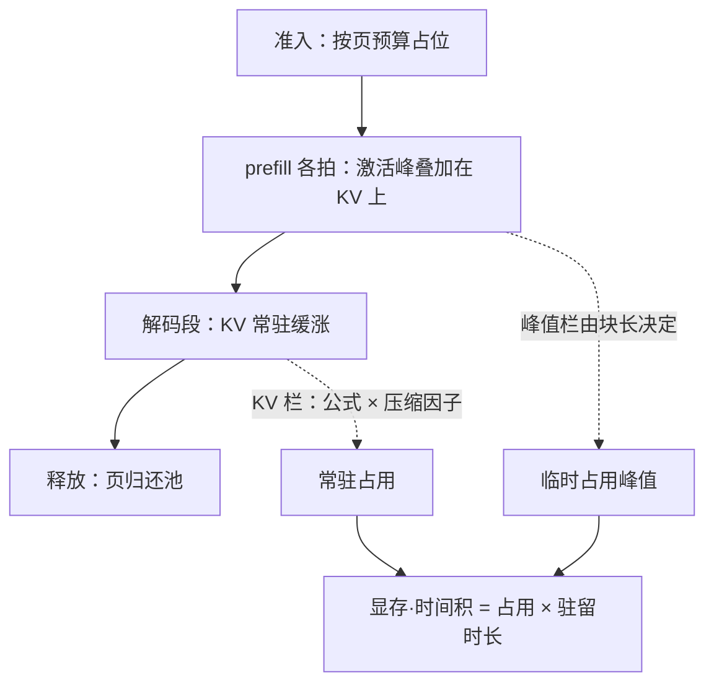

# 长上下文的显存账

「支持 128K」是模型的窗口声明；能不能在一张 80 GiB 的卡上同时接住三条这样的请求，是显存账本上的算术。

<footer>—— 据 Pope et al., 2022 的推理容量会计与 Kwon et al., vLLM, SOSP 2023 的页池水位口径整理</footer>

[上一课](/llm/dec-map)把解码控制与服务化收进一条交付线：受控生成怎么进核，停止、流式与后处理怎么接，质量与成本怎么定价。解码的合同立完，本课程转入窗口本身：上下文从 4K 走到 128K，服务端多出来的字节、拍数与失败模式，都得先有账本再谈优化。主干已把[三条显存曲线](/llm/long-context-memory-curve)画全，[长上下文的 KV 预算](/llm/kv-longcontext-budget)把 KV 一项编成了预算表。本课作为「显存与调度」单元的第一课，把一条长请求的**完整**账单立起来——账不止 KV 一项，而且账随时间变。后课的切块、分层与调度，默认这套会计已经成立。

## 问题

把显存想成「权重加 KV」两项，会在两头错。准入时乐观：prefill 要为整段提示付激活峰值，长提示这一拍的临时占用可能比稳态解码多出数 GiB——装得下 KV 不等于跑得完 prefill。运行时悲观：只按峰值记账，忽略分页与共享的弹性，把本可接下的请求拒在门外。更隐蔽的是按「条数」调度：一条 128K 请求占的页数是一条 2K 请求的 64 倍，调度器若把两者当成等价的「一个请求」，池子会在第六十条请求附近替你做决定——这正是[预算课](/llm/kv-longcontext-budget)的容量警告在调度侧的复现。缺口于是有二：账单的**栏目**要全，账单的**时间维**要立。

## 方法

一条长请求的账记四栏。常数栏：权重（量化后）、CUDA 上下文、通信缓冲，与 $n$ 无关，扣掉即得可用池。KV 栏：代入[容量公式](/llm/kv-cache-size-math)，再乘量化与压缩因子，口径照抄预算课，不重推。峰值栏：prefill 激活随块内 token 数线性涨（见[前填计算特征](/llm/prefill-compute)，切块后由块长决定），FlashAttention 使注意力统计不物化 $n\times n$，但激活与 logits 缓冲仍在满池水位上是压垮准入的最后一格。结构栏：[页内与池间碎片](/llm/kv-paging-fragmentation)，以及为抢占与增长预留的水位。

再把账放上时间轴。占用是分段函数：准入时按页预算占位；prefill 各拍把激活峰叠加在已写入的 KV 之上；解码段 KV 常驻并缓涨，直到释放。占用乘以驻留时长，得**显存·时间积**——它是这条请求的真实资源价。准入与排队应按积定价，而不是按条数。

## 机制

调度器的硬约束是块池水位，不是请求个数，这决定了记账单位是页而非条。混合负载里，一条满长请求能把可用并发从几十压到个位，队列里每个短请求都在替它付排队成本——按条数准入等于让 2K 请求补贴 128K 请求。显存·时间积同时是定价语义：API 按 token 计费看不见排队外部性，内部容量规划必须用积，否则扩容决策会系统性低估长请求的份额。峰值栏与 KV 栏可以互相兑换：把前填切小，峰值换下来，代价是反复读 KV 的带宽税——兑换率由块长决定，下一课细算。

算一笔积：2K 请求占 256 MiB、驻留一分钟，积约 15 GiB·s；128K 请求占 16 GiB（FP16，8B 模型每 token 128 KiB）、驻留十分钟，积 9600 GiB·s——640 倍。按条数它们等价，按积它们差出三个数量级的一半以上。

## 边界

本课只进容量侧：decode 每步扫 KV 的带宽账是[预算课](/llm/kv-longcontext-budget)的第二张表，这里不重复。峰值栏依赖实现——注意力统计是否物化、激活是否重算——给区间不给常数，换核要重测。启用 offload 后账记两处，HBM 与主机的口径由「上下文缓存的分层」一课展开。最后，账随模型、精度与压缩策略版本化：升级模型重记账，旧账不能沿用——这条纪律从主干一路贯到这里。

## 小结

- 长请求的显存账四栏：常数、KV、峰值、结构损耗；只记「权重加 KV」会在准入与运行两头错。
- 账随生命周期分段：prefill 付激活峰，解码段 KV 常驻，占用乘驻留时长才是资源价。
- 准入与定价的记账单位是页与显存·时间积，不是请求条数。
- 峰值与常驻可以互相兑换，兑换率由块长决定，是下一课的主题。
- 账本版本化：模型、精度、压缩策略一变，账重记。
- 出处：据 Pope et al., 2022；Kwon et al., SOSP 2023 的容量会计口径，与本仓库 KV 容量、预算、分页诸课整理。
