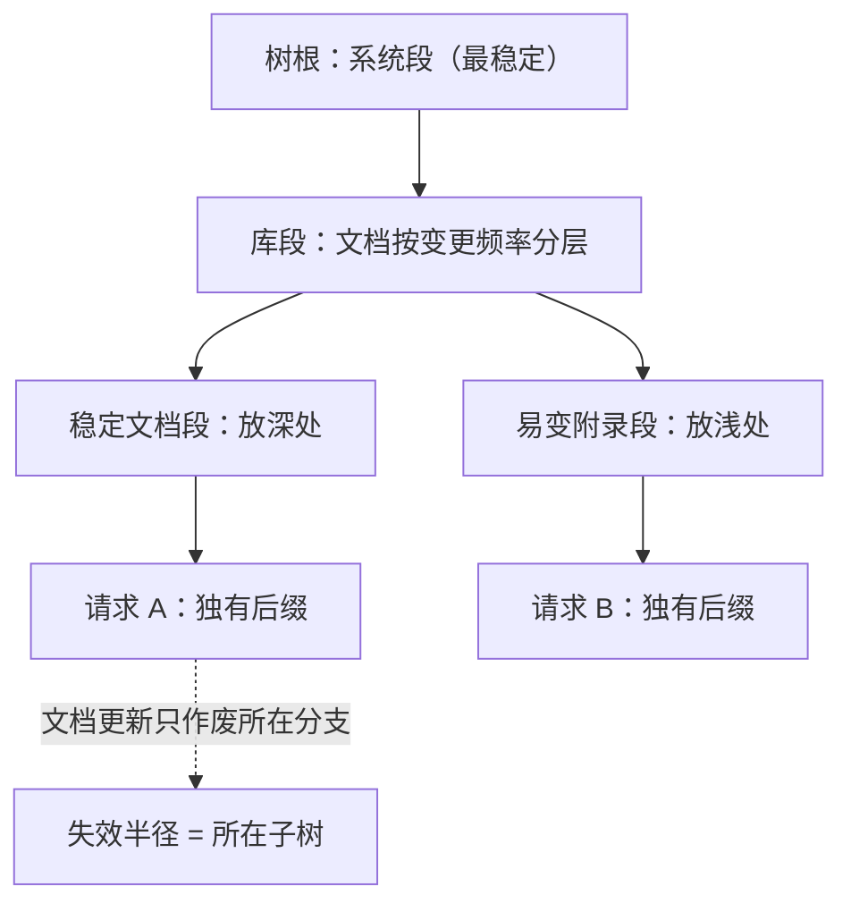

# 多文档负载

多文档负载的显存账不由文档数决定，由共享结构决定；前缀树划在哪，账就从三个数量级掉到一个。

<footer>—— 据 Juravsky et al., Hydragen, 2024 与 Zheng et al., SGLang / RadixAttention, NeurIPS 2024 整理</footer>

[上一课](/llm/lc-longoutput-streaming)立起长输出的流式语义。本课处理一类把前几课杠杆同时用满的负载：多文档。一库多问——同一合同库被上千人问上千次；一问多档——把二十份标书推进一个窗口交叉比对。形态不同，共享点相同：上下文里有一大段公共前缀。[前缀共享的键语义](/llm/kv-prefix-cache)与[缓存分层](/llm/lc-context-cache-tiers)已立；本课讲共享结构本身怎么组织、怎么失效、怎么批量兑现。

## 问题

无共享时多文档负载在算术上就不可行：100 个请求各带 100K 的同一语料，是约 1.28 TB 的 KV——没有池子接得住，而其中九成九是同一份数据的副本。组织成共享前缀后，账变成「一份语料加每问一小段后缀」，差出几十倍。但共享不是免费的，三个坑紧跟着来。其一在树的组织：划粗了，一条文档更新作废整棵子树；划细了，命中碎、元数据涨。其二在窗口内：一问多档把多文档拼进一个上下文，排列与干扰开始影响质量（[context rot](/llm/context-rot)）——拼序是质量参数，不是格式细节。其三在权限：共享前缀的命中若不带租户边界，A 部门的缓存会喂给 B 部门。

## 方法

三件事。库组织：语料按「系统段加稳定文档段」建树，版本进键（[分层课](/llm/lc-context-cache-tiers)的版本化）；失效按文档段落级传播，半径对齐到真正变了的前缀——变更频率分层放置，稳定的系统提示放深处，易变的附录放浅处。批处理杠杆：同库并发请求的共享前缀读取用 [Hydragen](/llm/hydragen) 一类分解——前缀 KV 一次读入、跨序列批量查询、log-sum-exp 精确合并，加速随 batch 与前缀长度涨；没有共享结构的负载吃不到这个杠杆，不要硬套。放置与权限：[亲和路由](/llm/sglang-router)把同库流量钉进同副本，命中键带租户与库版本；一问多档的拼序由[组装层](/llm/lc-retrieval-hybrid-serving)显式受控，文档边界元数据随上下文传给生成端，引用才能回指到份。

## 机制

共享前缀是多文档唯一的一阶杠杆，理由在 KV 的确定性：KV 是前缀的确定函数，同前缀同 KV，复制它纯属浪费——树、批处理、亲和路由都在兑现这一条。失效半径与命中长度的牵制是库组织的中心权衡，分段粒度是这条权衡唯一的定价旋钮；「按变更频率分层」比统一粒度好，因为它让最常变的段持有最短的半径，作废成本被压到最低。一问多档窗口内的质量衰减，服务侧能控制的是排列（关键档放两端）与边界元数据，控制不了衰减本身——这句边界要写进语义。

算一遍共享的账：每 token 128 KiB（8B FP16）下，100 请求各带 100K 语料是 1.28 TB；共享后语料付一次 12.8 GiB，每问 2K 后缀各付 256 MiB，合计约 38 GiB——差出 34 倍，全部来自「副本变共享」这一个动作。

## 边界

不写检索选档（[混合服务课](/llm/lc-retrieval-hybrid-serving)已立），不写窗口内衰减的机理（[context rot 课](/llm/context-rot)已立）。跨租户共享公共语料（同一份公开手册）与租户内共享是两种键策略：前者要防跨租户的计时侧信道——共享是性能语义，不是安全语义，安全边界仍由键隔离兜底。库很大而问题稀疏时，整库进树不如按需圈定：树的组织成本要由命中率偿还，稀疏负载下[检索圈定](/llm/lc-retrieval-hybrid-serving)更便宜。

## 小结

- 多文档负载的一阶杠杆是共享前缀：无共享 1.28 TB，共享后 38 GiB，账由共享结构决定。
- 库组织按变更频率分层：稳定段放深处，易变段放浅处，失效半径对齐到子树。
- 同库并发的批处理用共享前缀分解（Hydragen 式），无共享结构的负载不硬套。
- 一问多档的拼序与文档边界元数据是质量与引用的前提，由组装层受控。
- 权限与租户边界进缓存键；共享是性能语义，安全仍靠键隔离。
- 出处：Juravsky et al., Hydragen（arXiv:2402.05099）；Zheng et al., NeurIPS 2024；键与失效口径同本仓库前缀缓存诸课。
