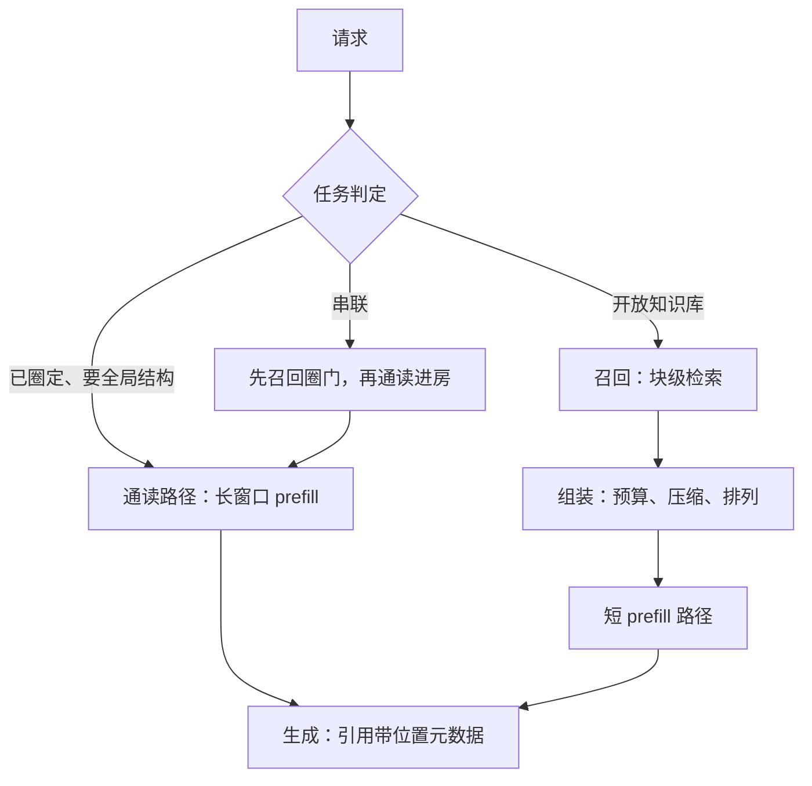

# 检索与长上下文混合服务

召回负责从十万篇里挑十篇，通读负责把十篇读穿；把两者的活派给同一个窗口，服务就得同时养两种负载。

<footer>—— 据 Lewis et al., RAG, NeurIPS 2020 与 Liu et al., Lost in the Middle, TACL 2024 整理</footer>

[上一课](/llm/lc-context-cache-tiers)把上下文缓存立成三层，结束的其实不只是缓存：资源怎么记账、前填怎么切块、缓存怎么分层，这个单元把长上下文的资源侧讲完了。「服务语义」单元从本课起，问的是另一件事——这些资源能力如何变成对调用方可约定的行为。第一个语义问题是负载的双峰：通读型把整份材料推进窗口，检索型只要一个短视图。[长上下文是否取代 RAG](/llm/long-context-vs-rag) 已给结论——互补；本课把「互补」落成同一个服务里的接缝。

## 问题

双峰负载让调度与缓存同时失灵。长度分布 p50 是 2K、尾部是 64K 的服务，按单峰假设调的水位两头不讨好：缓存树被通读条目撑爆，短请求陪长请求排队，第 1 课的「按积定价」在这里是准入的日常而非口号。语义上还有两笔更隐蔽的账。截断：检索管道丢一个块是协议行为——引用与权限随块走，调用方知道发生了什么；长窗口裁一段是破坏行为——用户以为模型读了全文。引用：通读窗口里位置就是字符下标，检索视图里位置是块号，答案里的引用必须指向正确的那个。两笔账不定义，错误会出现在「答案对、引用错」这种最难归因的地方。

## 方法

把组合落成三层服务配置。判定层：请求先分类——已圈定、需要全局结构的材料（合同比对、代码库走读）走通读；开放知识库走检索（[切分与召回](/llm/rag-chunking)）；两者可串联：召回圈门，通读进房。组装层：上下文组装器按 token 预算装填，全文视图与压缩视图（[检索式压缩](/llm/retrieval-based-compaction)）按任务选；排列显式受控——把最相关的放两端，是对[中间丢失](/llm/niah)的对策；多跳任务走迭代「检索—读—再查询」（[多跳课](/llm/multi-hop-retrieval)），而不是一次塞满。资源层：通读请求走长窗口路径，公共语料吃[分层缓存](/llm/lc-context-cache-tiers)；检索请求走短 prefill 路径；两类 SLO 分开报——通读看 TTFT，检索看含召回往返的端到端。

## 机制

组装器为什么必须是服务组件而不是客户端拼串：只有服务知道当前的有效窗口、池水位与缓存状态，才能把「放哪些、放多长、什么顺序」的决策与资源对齐；客户端拼串会把超窗截断变成静默丢内容，把排列退化成偶然。检索与通读的接缝处要传三样元数据：召回分数、块版本、位置映射——引用可回指靠的是第三样。这是「答案对、引用错」的根治处：生成端每句引用都能落回块号或下标，审计才有落点。

双峰的量级：p50 2K 的检索请求占 256 MiB KV，p50 64K 的通读请求占 8 GiB——一条通读等于 32 条检索。水位准入按页数与积计数，两类负载才能在同一池里共存而不互杀。

## 边界

不重判两种范式的优劣，结论已在[对照课](/llm/long-context-vs-rag)立过；不写向量库与嵌入的内部，[切分课](/llm/rag-chunking)已立。权限过滤属于检索侧的元数据纪律，本课只约定它进缓存键的接口。通读的质量上限——中间丢失与上下文腐烂——是模型行为，服务能控制的是排列与压缩，不能承诺「在窗口里就会被用上」；这句免责要写进服务文档，否则双峰负载的质量投诉会全部算到系统头上。

## 小结

- 混合负载是双峰：通读与检索的长度、SLO、缓存形态都不同，按单峰假设调度两头失灵。
- 语义两条：截断要有协议，引用要带位置元数据——「答案对、引用错」由此根治。
- 组合三层：任务判定选路径，组装器管预算与排列，资源层分开报 SLO。
- 组装器在服务侧：只有服务知道有效窗口与水位，客户端拼串会把截断变静默。
- 出处：Lewis et al., RAG（NeurIPS 2020）；Liu et al., Lost in the Middle（TACL 2024）；Xu 等 RECOMP 与 Jiang 等 LongLLMLingua 的压缩口径。
