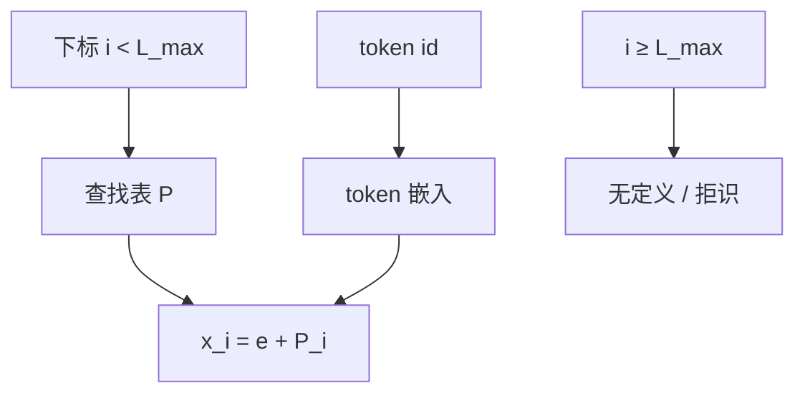

# 可学习位置嵌入

把每一个合法下标做成词表里的一行，位置就与 token 一样被梯度更新。

<footer>GPT、BERT 一类实现的默认绝对方案</footer>

GPT 与 BERT 把位置做成第二张词表：每个合法下标一行，梯度与 token 嵌入一起走。实现是一条查找，窗口是一个硬截断。它在固定 $L_{\max}$ 内往往比冻结的正弦更贴数据，也把「模型能处理多长」写成了表的行数。换窗口等于换词表，不是把公式外推到未见过的自变量。

## 问题

正弦 PE 把位置写成固定公式，模型不能改频率，也不能为「句首」「段首」这类功能位准备特殊向量。另一条绝对路线是**可学习位置嵌入**：开一张表 $P \in \mathbb{R}^{L_{\max} \times d}$，第 $i$ 行就是位置 $i$ 的向量，与 token 嵌入相加（或在 BERT 里再加 segment 嵌入）。$L_{\max}$ 是硬截断。训练长度、推理长度、实现里的 `max_position_embeddings`，三者通常被设成同一个数。

问题很具体：这张表在 $L_{\max}$ 以内是否够用，以及一旦产品要求更长上下文，表的契约如何破裂。它不回答相对位置，也不回答旋转；它只是绝对坐标最直的参数化。

GPT-2 的 1024、BERT 的 512，首先是这张表的行数，其次才是「模型能处理多长」。

### 位置当成第二种词表

Token 嵌入对离散符号做查找。位置嵌入对离散下标做查找。两者在实现上共用 `nn.Embedding`。差别是位置 ID 由运行时枚举，token ID 由分词器给出。把位置做成词表，等于声明：每个下标都是一个可独立学习的名字，名字之间没有公式关系。

## 方法

设序列长度为 $L \le L_{\max}$，

$$
x_i = e(w_i) + P_i,\qquad i = 0,\ldots,L-1.
$$

$P$ 随语言模型的其他参数一起用梯度更新。没有权重共享要求：$P_0$ 与 $P_1$ 可以学成无关向量。有时会加 dropout 在相加之后，或把位置表的范数与 token 表对齐。注意力、LayerNorm、残差都不改。

超出 $L_{\max}$ 的下标没有行。实现要么报错，要么取模、要么截断——后两种会把不同绝对位置映射到同一行，等于破坏坐标。正确的使用是拒绝超长输入，或改表。

### 训练目标如何塑造表

因果语言模型里，$P_i$ 只与「第 $i$ 个位置上出现过的预测问题」一起出现。句首位置会吸收 BOS、常出现的起势；靠近 $L_{\max}$ 的行样本少，学得差。这与正弦的平稳频谱不同：可学习表的质量沿下标不均匀，尾部行是长序列质量的隐患，即使从不外推。

编码器（BERT）的双向注意力让每个 $P_i$ 被整句的上下文更新，表更像「绝对槽位」而不是「生成时间」。同一张绝对表，在因果与双向上学到的几何不必相同。

## 机制

### 没有内置的相对几何

$P_{i+1} - P_i$ 不保证成规律。模型若需要「看前一个位置」，必须在许多绝对对 $(P_i, P_{i-1})$ 上拟合同一注意力模式。深度和数据足够时，这在 $L_{\max}$ 内可以发生，这也是可学习绝对 PE 在固定窗口评测上往往不差的原因。长度一变，所有成对关系换了下标，拟合失效。Press 等的外推实验里，可学习绝对表与正弦一样失败——失败得更干脆，因为新下标连向量都没有。

插值扩表（把 512 行插成 1024 行再微调）是换坐标系，不是外推。微调用新下标重新绑定注意力，旧长度上的行为也会被带走。

### 与正弦的训练差异

正弦冻结频谱，梯度只流过内容通道与注意力；位置几何是硬约束。可学习表让位置通道参与一切：它可以学成近似正弦，也可以学成「前几个位置特殊、后面几乎常数」，还可以把一部分语义（如总是出现在句末的标点）偷进 $P_i$。偷语义在分布内有益，换长度或换任务时变成干扰。这是绝对可学习方案特有的泄漏：位置行与内容统计纠缠。

参数量是 $L_{\max} \cdot d$，相对总参数通常可忽略，因此「省参数」不是从正弦改到可学习表的理由，也不是反过来的理由。选择依据是要不要公式偏置、要不要硬截断。

## 边界与工程取舍

固定窗口的编码器、分类器、长度从不变化的系统，可学习绝对表仍然是最少惊喜的选择：实现一条查找，不用调基数，不用旋转核。上下文窗口是产品功能的 Decoder-only LLM，这张表会成为改长度时的第一块绊脚石。业界转向 RoPE，首先是丢掉 $L_{\max}$ 行数这个硬契约，其次才是相对内积的几何。继续用可学习绝对表，等于预先承认窗口不会变——这个假设在 2018 年的 BERT 里成立，在 2024 年的开放上下文窗口里不成立。

扩窗的土办法包括：随机初始化新行并微调；正弦初始化再微调；对相邻行插值。它们都要求继续训练。没有微调的「直接外推」对可学习绝对表不成立。若有人声称只改 `max_position_embeddings` 就能变长，那是把未初始化的行送进了模型。

相对可学习 PE（Shaw，2018）查的是距离桶 $i-j$，表长与 $L_{\max}$ 脱钩。不要把「可学习」自动理解成「绝对表」。

另一条边界是与段嵌入、类型嵌入叠加。BERT 把 token + position + segment 相加。三个绝对查找互相抢维度，分析时无法把「位置」单独拿出来。这不影响训练，影响的是把 BERT 的位置表经验搬到 Decoder 时的可比性。Decoder-only 通常没有 segment 表，只剩位置行与 token 行相加，泄漏仍然存在，只是少了一个同谋。

## 小结

可学习位置嵌入用一张 $L_{\max} \times d$ 的绝对查找表代替公式，在训练长度内灵活、实现简单，并把最大长度写成硬边界。它与正弦 PE 同属绝对契约，因而继承 Press 等记录的外推失败；它与 Shaw（2018）的相对可学习表不是同一件事。当上下文长度需要改时，应换坐标系统（相对偏置或 RoPE），而不是指望把这张表插值成新的词表。表的行数一旦写进配置，就会被误当成模型能力，这一点在工程沟通里反复出错。
