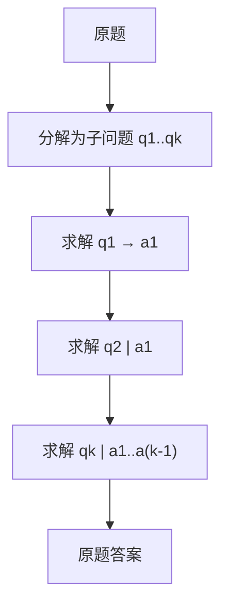

# Least-to-Most

先把复杂问题分解成一串更简单的子问题，再从最容易的开始依次求解，后一问可以使用前面已经得到的答案。

<footer>—— Zhou et al., Least-to-Most Prompting Enables Complex Reasoning in Large Language Models, ICLR 2023</footer>

[思维链](/llm/chain-of-thought)在一条连续的 $z$ 里同时做分解与计算。组合深度一增加，模型就要在同一次生成里既想清楚该拆成什么，又把每一步算对。Zhou 等人把这两件事拆开：先提示模型列出从易到难的子问题序列，再按该序列多次查询，每次只解当前子问题，并把已解答案写进下一次的上下文。这就是 Least-to-Most（从最少到最多 / 从易到难）提示。它针对的是组合泛化——训练或示范只见过短组合，测试却是更长的同一类组合——而不是一般的「让我们逐步想」。

## 问题

许多基准的难度来自 *深度* 而不是新概念。SCAN 式指令、最后字母拼接、多步数学应用题，短实例上 CoT 已经能做，长度一加就断。原因是单次生成要把整条组合计划记在正在写的前缀里，早期子目标的结果没有被当成独立的、已核对的事实钉住。后面的步骤在尚未稳定的中间句上继续写，组合误差相乘。

Least-to-Most 要回答的是：分解能否单独示范、求解能否条件于已给出的子答案，从而使模型在测试时组合出比示范更长的链。若分解与求解仍捆在同一次解码里，它相对 CoT 没有接口上的差别。关键是 *多次调用* 与 *子答案回填*。

### 组合深度不是新技能

设任务由同一套原语反复嵌套。示范长度 $\leq L$，测试长度 $>L$。标准 CoT 要求模型在分布外的深度上一次写对全部中间量。Least-to-Most 要求模型：(1) 把深度 $>L$ 的实例拆成深度更小的子问题；(2) 在每个子问题上表现得像在分布内。第二点通常更容易，因为子问题短；第一点需要示范「如何拆」，拆错则后续全错。因此分解示范的质量决定方法上限。

名字里的 least-to-most 指求解顺序：先解决更小的子问题。不是指提示越写越长就一定更好，也不是课程学习里的训练数据排序。它是推理期的分解—回填协议。

## 方法

两阶段，通常两套少样本。分解阶段：示范「复杂题 → 有序子问题列表」。列表应从依赖最弱、规模最小的问句开始，最后一项才是原题或最接近原题的问句。求解阶段：对列表中第 $t$ 个问句，上下文包含原题（可选）、子问题 $1..t$，以及已经得到的答案 $a_1,\ldots,a_{t-1}$，模型只输出 $a_t$。$a_t$ 由宿主解析后写入，下一轮不得让模型重抄或改写旧答案，除非显式做校验失败后的重解。

子问题必须是可单独回答的问句，而不是「步骤 1：开始思考」这种空标题。数学题上，子问题应是带具体数字的小问；符号任务上，应是更短的输入串。分解阶段可以用一次生成列出全部子问题，也可以边解边拆（先拆下一步）。前者省调用、后者适应中途发现拆错。Zhou 等人主路径接近先列出再依次解。动态再拆更像[规划与反应式](/llm/plan-vs-react)的混合，要另设停止条件。

### 子答案必须由宿主回填

与 ReAct 的观察一样：中间结果若让模型在同一次生成里「记得自己算过」，就没有钉住。宿主把 $a_{t-1}$ 写成明确的「问 / 答」对，再问 $q_t$，条件分布才能把 $a_{t-1}$ 当事实而不是当可改写的草稿。解析失败时不要把原始长文本整段塞进下一轮，那会把未规范化的噪声变成后续前提。能执行核对的子问题（算术、代码）应先执行再回填执行结果，这已经靠近 PAL，对数值稳定性通常优于纯自然语言 $a_t$。

分解列表的长度要有上限。模型会把简单题拆成十几步空转，或把难题拆成一步从而退回 CoT。提示里应示范「该拆到原语为止、不要拆动词」。线上用最大子问题数切断，切断后把未解部分当最后一问一次求完，并打标以便分析是分解过细还是过粗。

## 机制

Least-to-Most 改变的是条件化范围。求解 $q_t$ 时，模型不必同时计划 $q_{t+1}$，也不必在同一条 $z$ 里重算 $a_1$。已回填的答案相当于把组合的前缀变成上下文中的常数。这降低了单次生成的有效深度，使分布内的短求解被反复使用。分解阶段仍然是一次（对静态列表而言）可能很难的生成：它要在未见过的深度上产出合理的子问题序列。分解可以比求解更依赖大模型或更依赖示范。

相对 CoT：CoT 的中间量是自由文本步骤，没有强制的问答边界，也没有「只许用已公布的 $a_{<t}$」。相对 ToT：Least-to-Most 默认不在同一层上分叉，不评估多个候选子问题列表，除非再套搜索。相对 Self-Ask：两者都问后续问题，但 Self-Ask 的后续问往往是为补事实（谁、何时），Least-to-Most 的子问题是同一任务上的更小实例，顺序有难易与依赖约束。

先分解再执行很像规划器，但子问题仍是自然语言问句，不是带 schema 的工具 DAG。不要把 Least-to-Most 写成工作流引擎。它没有并行、没有类型检查，除非宿主额外加。

### 分解错误无法被后续逐步补上

若第一刀把依赖切错——先问了需要后问答案才能定义的量——回填协议会把空洞或错误的 $a_1$ 传下去，后续每步都在错的常数上计算。单链 CoT 至少还能在后文改口；Least-to-Most 默认把 $a_1$ 钉死。缓解：对分解列表做一次合法性检查（每个子问题是否可独立答、是否覆盖原题所需的量）；或在最后一问要求模型用全部 $a_{<k}$ 复核原题，发现矛盾则整表重拆。复核是额外调用，但对组合任务往往比盲目加长 $k$ 值得。

## 边界与工程取舍

该方法适合原语稳定、难度主要来自嵌套次数的任务。开放域多跳若「更小的问题」其实是另一件事实检索，应走 [Self-Ask](/llm/self-ask) 或检索，而不是假装在做同一技能的更短习题。分解示范会强烈绑定领域：SCAN 的拆法搬不到 GSM8K。多任务系统要么为每类任务准备分解示范，要么接受零样本分解的不稳。

调用次数随 $k$ 线性增加，延迟同样。能一次 CoT 做对的短题不要强制 Least-to-Most。子答案若含隐私或中间推理，日志与对用户展示要分开。不要和课程学习、从易到难的 *训练* 顺序混为一谈：原文是提示与多次推理，不更新权重。

「从易到难」在人类教学里常指题库排序。这里的易是 *同一实例内部* 的子问题。把数据集先按难度训练不是 Least-to-Most prompting。

## 小结

- Least-to-Most 先分解出有序子问题，再多次求解并把子答案回填进后续上下文。
- 它针对组合深度外推：短求解重复使用，长组合靠分解承担。
- 子答案必须由宿主钉住；分解错了会沿回填协议传播，且比单链更难改口。
- 相对 CoT 是多次调用加问答边界；相对 ToT 默认不分叉；相对 Self-Ask 子问题是更小的同类实例。
- 分解示范强绑定领域；调用次数随子问题数线性涨。
- 出处：Zhou et al., *Least-to-Most Prompting Enables Complex Reasoning in Large Language Models*, ICLR 2023。
