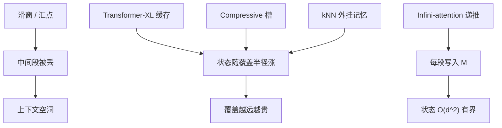

# Leave No Context Behind

    
标题里的承诺是：上下文不被滑窗丢掉，每一段都会进入压缩记忆；无限输入配上有界状态，而不是再开一条随长度上涨的 KV 日志。

    <footer>—— Munkhdalai, Faruqui & Gopal，Leave No Context Behind，Google，arXiv:2404.07143，2024</footer>

2024 年 Google 这篇预印本的正式标题是 *Leave No Context Behind: Efficient Infinite Context Transformers with Infini-attention*。注意力算子本身写在 [Infini-Attention 原文](/llm/infini-attn-paper)；本篇读的是标题所立的研究命题：**无限上下文 Transformer** 要满足什么，现有方法在哪一环「把上下文留在了后面」，以及原文用 1B / 8B 继续预训练给出了哪些存在性证据。口号容易被读成无损信道；论文实际交付的是「写入规则不丢段、状态有界、局部 softmax 仍在」这一组工程约束。

## 问题

长上下文路线在 2023–2024 年已经分叉。一条把窗口硬拉到 128K、1M，KV 与计算仍随 $t$ 涨，靠 FlashAttention、GQA、分块内核把常数压下去。另一条承认状态必须有界：滑窗、注意力汇点、StreamingLLM 只保留最近一段加少数锚点，**中间 token 被显式丢掉**。Compressive Transformer 把旧激活压进固定槽位，槽数仍随要覆盖多远而涨；Transformer-XL 缓存上一层的片段，覆盖半径等于缓存条数乘段长。Memorizing Transformer 用 kNN 外挂检索，索引随 $t$ 涨。

「Leave no context behind」针对的正是第二条路上的**丢段**。滑窗与汇点在实现上最干净，但书中间某一段若从未进入状态，后文无法再读它——除非它碰巧被压进那几个锚点。无限上下文若允许中间空洞，就不是无限，只是局部加少数全局点。问题变成：有没有一种递推，使每一段都对未来可见，同时状态尺寸不随 $t$ 线性膨胀？

### 丢段是设计选择，不是实现疏忽

StreamingLLM 证明：许多预训练注意力会把质量堆在起始 token 上，于是可以丢掉中间 KV 仍保持流畅。这是「语言模型不需要中间」的经验，不是「中间信息已被保存」。对 passkey、合同条款、书中伏笔，中间恰恰是要留的。原文把这类方法放在对立面：它们优化的是有界缓存下的生成稳定性，优化目标里没有「每一段都写入」。Compressive Transformer 接近「不丢段」，但压缩槽随覆盖距离变长，无限时仍会碰到槽耗尽。需要的是槽数与 $t$ 脱钩的压缩。

有界状态加上永不丢段，在信息论上只能是有损。$d\times d$ 矩阵的比特数是常数，无限 token 的熵不是。标题描述的是更新图没有丢弃边，不是信道容量无限。把论文读成「1M token 无损可逆」，是把口号当成定理。

## 方法

原文的答案是段级递推的 Infini-attention：当前段做因果 softmax，全部过去进压缩记忆 $M$，门控混合，然后用本段键值更新 $M$。段与段之间只传递 $(M,z)$，不传递 KV。这在接口上像 Transformer-XL 的片段缓存，对象却从「上一层的激活条」换成了「与 $d$ 有关的关联矩阵」。继续预训练成为可行路径：从已有 8K 级 LLM 出发，把注意力换成 Infini-attention，在更长数据上接着训，让门与记忆适应新的读写。

### 继续预训练而不是从零发明记忆网络

1B 与 8B 量级的实验走的是持续预训练加下游任务，而不是随机初始化一个无限记忆 Transformer。这样做的动机很具体：局部 softmax 的短程语言建模已经由基座负责，新模块只需学会何时读 $M$、如何把长书与 passkey 写进 $M$。若从零训，必须同时学句法与记忆，预算会回到完整预训练。代价是：基座若从未见过段级递推，位置编码与段边界需要对齐；门若初始化成关闭记忆，长程信号一开始很弱，需要足够步数才打得开。

### 评测协议：唯一针与长书

原文用来支撑「无限」的，主要是超长 passkey 检索（报道到百万 token 量级）以及书籍级摘要（如 PG-19 一类长输入）。Passkey 几乎是对「写入有没有中断」的探针：针在键空间里足够独特，$M$ 里不容易被淹没，绿分不证明密集干扰下仍可分。长书摘要更接近标题：中间章节必须留下痕迹，否则摘要会系统性漏情节。二者都不是多跳针测或仓库级代码。复现应对齐段长、是否用 delta 规则、继续预训练的 token 数；把报道长度理解成产品开关，比较的就不是这篇论文。

## 机制

「不丢上下文」在更新图上的含义是：不存在一条「段 $s$ 计算完即删除、永不进入未来状态」的边。每一段的 $K,V$ 都会经 $\sigma(K)^\top V$ 或 delta 残差加进 $M$。未来任意段的查询都可以对 $M$ 做线性读取。可见性是**经压缩后的全局可见**，不是对原始 token 的随机访问。这与 Longformer 的全局点不同：全局点仍指向具体 token；这里没有可索引的过去 token，只有矩阵里的叠加。

与丢段方法的机制对照可以写清楚。滑窗的归纳偏置是马尔可夫：再远的依赖必须已经写进近期表示。汇点把起始位置当成始终在场的锚，中间仍缺。Infini-attention 的归纳偏置是关联记忆：远依赖能留下的，是能被核特征寻址的方向。因此同一标题下，passkey 成功与「相似段落中找第三句」失败可以共存——前者满足寻址假设，后者在 $M$ 里碰撞。Delta 规则提高后者的几率，仍受 $d^2$ 容量限制。

### 压缩比与「无限」的实验含义

原文给出相对基线 Transformer 约 114 倍的记忆压缩，来自「存 $M$ 而不存全长 KV」的比值，依赖段长与宽度。无限在实验里等于「测试长度远大于训练窗口，且状态尺寸不变」。它不是计算复杂度为零：段内仍 $O(N^2)$，总长 $T$ 上前向仍与 $T$ 线性。线性已经允许在固定显存里把 $T$ 拉到设备算力的上限；这与「二次注意力硬吃 1M」不是同一档资源。把 1M passkey 写成「模型理解了百万上下文」，超出了探针所能见证的内容。

验收应至少两套针：几乎唯一的 passkey，以及埋在重复句式里的事实。前者只证明更新链没断；后者才逼近「leave no context」在有损记忆上还剩多少可分信息。两套都绿，才能说该任务族上压缩记忆可用。

## 边界与工程取舍

论文不提供可复现的万亿 token 配方，也不把 Google 内部数据配比写全。存在性证据绑定在继续预训练、段长、门控与 delta 的具体选择上。服务侧必须把 $(M,z)$ 当成新的状态类型：中断后续写若丢掉 $M$，无限立刻退回滑窗。这与普通 KV 缓存的序列化不兼容。若产品需要逐字引用，应外接检索；矩阵记忆匹配的是摘要、唯一针、以及「读过即可」的全局草图。

标题还容易与「上下文窗口扩展」混为一谈。YaRN、位置插值拉的是 RoPE 模型的可寻址下标，KV 仍随 $t$ 涨。Infini-attention 拉的是状态对象的数学形式。二者可以叠：段内用扩展过的 RoPE softmax，段间用 $M$。不要用其中一条的评测表给另一条背书。也不要把 StreamingLLM 的流畅度增益当成「中间上下文其实不重要」——那是另一篇论文的任务分布。

与 RMT、Landmark、Activation Beacon 的差别在接口。那些方法仍在 softmax 里放置可见的压缩 token；Infini 的 $M$ 对后续 token 不是普通键。调试与可视化的工具链要从注意力图换成门值与 $M$ 的谱。口号级引用若只写「Google 的无限上下文」，应落到这一接口差异上。

### 何时不该用这组约束

需要精确拷贝远处罕见标识符、需要多层多跳、需要把过去某一 token 当普通 KV 取回时，有界关联记忆不是合适的主结构。需要在冻结权重上即插即用时，也不该宣称本篇方法。匹配的场景是：愿意为记忆通路花钱继续预训练，任务容忍有损全局草图，并且接受段内窗口仍二次。满足这些，标题里的约束才是设计目标而不是营销。

## 小结

- Leave No Context Behind 要的是：每段都写入、状态有界、局部 softmax 仍在，而不是无损无限日志。
- 对立面是滑窗与汇点的丢段，以及 XL / 压缩槽 / kNN 随覆盖距离涨的状态。
- 证据主场是超长 passkey 与长书摘要；密集干扰与多跳不在同一探针上。
- 继续预训练让算子接到已有 LLM；服务必须持久化 $(M,z)$。
- 有界加不丢段必然有损；$d^2$ 容量是硬上限。
- 出处：Munkhdalai, Faruqui & Gopal，*Leave No Context Behind: Efficient Infinite Context Transformers with Infini-attention*，arXiv:2404.07143，2024。
