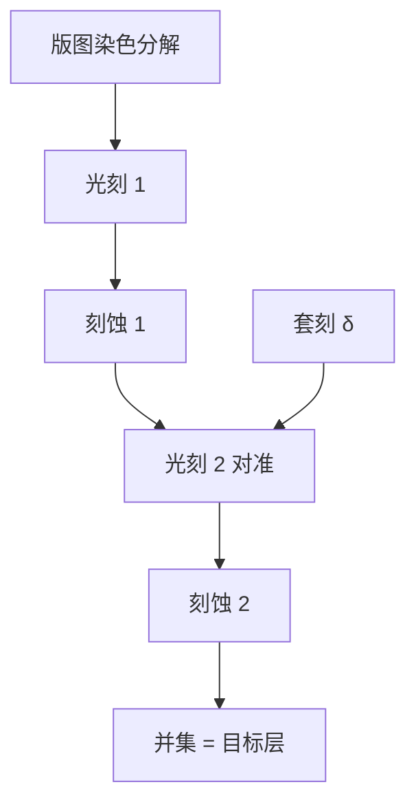

# LELE 多次曝光套刻

双重图形把 $k_1$ 压到单次曝光极限以下时，必须把套刻与 CD 一起管到很紧，否则分解后的节距在晶圆上复原不了。

<footer>—— 归纳自 ASML 对 NXT 浸没平台与 double patterning 的公开论述</footer>

浸没 ArF 单次曝光的实用半节距大约 38–40 nm。更密的二维金属、通孔和切线，若仍用 193 nm，就要把一层设计拆成两次或多次「光刻 + 刻蚀」。LELE（Litho–Etch–Litho–Etch）是其中最直白的分解：第一次曝光并刻蚀硬掩模或衬底，再涂胶做第二次曝光与刻蚀，两次图形的并集才是目标层。相邻特征往往来自不同掩模，它们的相对位置就是[套刻](/llm/litho-overlay)。LELE 的一阶代价不是多一次快门，而是套刻直接进入节距与 CD。

## 问题

单次曝光 $k_1$ 不能低于 0.25。目标节距 $p$ 若小于约 75–80 nm，一张掩模无法在 $\mathrm{NA}=1.35$ 下同时印出所有相邻线。分解算法把图形染色成两张（或三张）掩模，每张的最小节距回到可印窗口。LELE 的物理实现是两次完整的[涂胶–曝光–显影–刻蚀](/llm/litho-process-flow)，中间留下第一次刻蚀的形貌。第二次光刻在已有台阶上涂胶，反射、胶厚与调平都变了。

与 [SADP](/llm/sadp-saqp) 不同：LELE 的两套线条之间没有 spacer 的自对准，相对位移 $\delta$ 会把局部节距变成 $p/2\pm\delta$。通孔 LELE 则是洞与洞的并集，套刻误差造成桥接或断开。问题是：在设备 overlay、掩模与工艺变形的预算内，二维自由图形能否用 LELE 拼回来。

### 染色与分解不是光学魔术

电子设计自动化把冲突边着色。不可 2-染色的布局必须改设计规则，或上 LELELE（三次）。分解还要满足每张掩模自己的最小间距、SRAF 位置与 OPC。一张「看起来疏」的分解掩模仍可能有难以印的二维拐角。LELE 解决的是节距，不是任意多边形的空中像。

Litho–Freeze–Litho–Etch（LFLE）等变体把第一次胶冻住再二次曝光，减少一次中间刻蚀，但化学与缺陷另一套。本篇对象是经典 LELE：两次刻蚀转印。不要把所有 double patterning 都叫 LELE。

## 方法

流程：硬掩模沉积 → 第一次光刻（可含 OAI/PSM/OPC）→ 第一次刻蚀 → 去胶 → 再涂胶 → 第二次对准到第一层或到公共参考 → 第二次曝光 → 第二次刻蚀 → 再往下转印。对准策略必须定义第二次相对第一次的标记层级。ASML 强调双重图形要求更紧的 overlay 与 CD：NXT 双台与编码器定位写在同一语境里，因为 LELE 把设备套刻从「层间通孔」推广到「同层相邻线」。

三次分解（LELELE）用于更密或更难染色的孔层，掩模数与周期继续加。每一次额外的 litho–etch 都叠加独立的套刻矢量。产线用套刻计量与 CD-SEM 分别监控「染色之间」与「染色之内」。

### 套刻如何写成节距误差

理想双重线的目标是均匀节距 $p$。两次曝光的相对位移 $\delta$ 使相邻间隔变成 $p/2+\delta$ 与 $p/2-\delta$（在一维示意图里）。CD 若再有剂量误差，电导与击穿窗口同时受击。这与分辨率公式正交：即使每次曝光的 $k_1$ 很舒适，$\delta$ 太大仍出废品。因此 LELE 的规格书语言是 overlay 纳米数，而不是再报一个更小的 $k_1$。

## 机制

光学上每次曝光只「看见」自己那张掩模的空间频率，所以可以回到较高 $k_1$。信息在刻蚀硬掩模上累积。第二次空中像会受第一次台阶的反射与散焦调制，必须进衬底感知的 OPC，或用足够厚的平坦化。套刻的高频分量（场内扫描同步、镜头畸变残差）会变成芯片内的节距行走，电性表现为局部电阻离散。

产能机制是乘法。同一层两次过扫描机，还两次过刻蚀机与轨道。临界金属若有多层 LELE，DUV 机时需求按层数放大。这是[浸没多重图形成本](/llm/duv-multipattern-cost)的主项之一。双工件台提高单次过机 wph，但不能把两次过机变成一次。

LELE 对二维图形友好：切角、通孔阵列、不规则金属都可以染色。SADP 更偏一维栅。选型首先看拓扑，再看套刻能力，而不是看谁的宣传半节距更小。

### 与 SADP 的套刻语义不同

SADP 的成对线由同一 mandrel 的两侧 spacer 定义，对之间的半节距不吃 LELE 那种 $\delta$。LELE 的每一对相邻线都吃 $\delta$。反过来，SADP 的线宽由薄膜厚度定义，切线与区块边界仍要另一次光刻，那一次仍是套刻问题。两种技术常在同一节点共存：鳍或某层金属走 SADP，切线或通孔走 LELE。

## 边界与工程取舍

LELE 的设计规则包括可染色性与套刻驱动的最小间隔。不能把「两次曝光所以密度加倍」写成无条件。掩模成本接近翻倍（还含 OPC 计算），周期时间拉长。EUV 单次曝光插入后，部分原 LELE 层改为一次 EUV，正是为了砍掉同层套刻与双倍过机；ASML 把浸没机与 EUV 的 cross-matching overlay 公开到 2.5 nm 量级（NXT:2000i/2050i 产品页），因为混跑时 DUV LELE 与 EUV 层仍要对准。

本篇不给出 7 nm 或 5 nm 的良率。套刻规格是否够，取决于该层设计规则与电性窗口，只能看具体工艺包。公开设备 overlay 不是晶圆厂良率。

不要把 LELE 的「双重」理解成曝光剂量加两次就在同一胶上印两套图形。同一胶上两次曝光而无中间刻蚀，是另一类 double exposure，套刻与潜像叠加的物理不同。

## 小结

- LELE 把一层拆成两次光刻–刻蚀，每张掩模回到可印节距，并集形成目标图形。
- 相邻特征来自不同掩模时，套刻 $\delta$ 直接变成节距/CD 误差。
- 第二次光刻在第一次形貌上，OPC 与涂胶都要衬底感知。
- 产能与掩模成本按次数近似相乘，双台只能加速单次过机。
- 二维拓扑适合 LELE；一维密栅更常交给 SADP。
- 不把设备 overlay 数字换算成节点良率。
- 出处：Mack 对多重图形与 $k_1$ 极限的讨论；ASML NXT 浸没产品与双重图形/overlay 公开材料。
