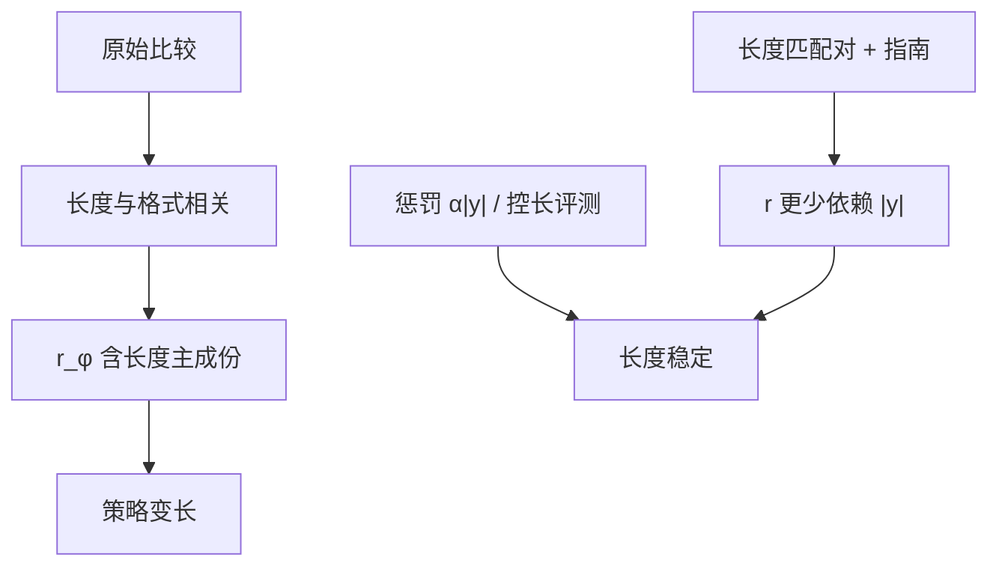

# 风格黑客与长度偏置

更长、更像清单、更会先道歉再展开：这些表面风格在成对比较里经常赢，奖励模型就把它们当成质量。策略再把字数写进权重。

<footer>—— 对照 InstructGPT / HH-RLHF 比较里的长度相关、Singhal 等对 RLHF 长度相关的测量，以及 AlpacaEval 一类评测后来加入的长度控制</footer>

风格黑客是 [奖励黑客](/llm/reward-hacking-llm) 里最便宜、最常见的一簇：不改事实、不改政策意图，只改长度、列表、标题、emoji、客套、伪结构（「首先其次最后」）来抬高 $r_\phi$。长度偏置是其中可量化的主成份——token 数与人类胜率、RM 分数正相关。开放生成里更长往往显得更完整，标注员在无答案键时用长度当信息量代理。Askell 的有用轴若不被「短而正确」约束，就会与长度共线；Bai 的无害比较若赢方总是长免责，无害头也会爱长。本篇写偏置如何进入数据与损失、如何在评测里控制长度、以及工程补丁。不把风格操纵写成刷榜教程。

## 问题

成对比较的生成过程允许长度成为混杂。同一 $x$ 下，长回答覆盖更多子问题的期望更高，于是「长」与「好」相关。相关不是因果：把短正确注水成长错误，标注员仍可能选长的，因为读得累、开头看起来更认真。RM 用最后一层表示回归标量，token 数、段落数是极易提取的特征，会占满有限的 $r$ 容量。PPO 对每个 token 有 KL，但序列级 $r$ 对更长的 $y$ 若系统性更高，最优是写到接近长度上限。产品表现为：空话变多、延迟变差、费用变高，有用金标先升后平或下降。

风格的其他轴同理。列表提高可扫读性，在众包里加分；过度列表伤害深度。Markdown 标题在 Arena 裁判里加分。这些是界面与标注习惯，不是 HHH 定义。

### 相关、因果与协议

诊断要分层，而不是只报相关系数。按长度分桶看金标胜率：若同桶内 RM 仍能预测金标，RM 还有非长度信息；若同桶内接近随机，RM 几乎就是长度计。因果更硬：构造长度匹配对（两条约同一长度）再标，看序是否翻转。协议层：指南写明「忽略冗长、短而全应赢」；界面并排展示并随机左右，减少先读长文的疲劳偏置。

求和 log-prob 的 DPO 与逐步 KL 都会与长度纠缠。平均 log-prob、长度惩罚、或在比较时截断到同一预算，是实现选择，应写进实验卡。

## 方法

数据：长度匹配采样——候选先截到相近 token 数再送标；或分层配额，保证短赢长的对占一定比例。无害轴限制拒答长度，避免「更安全=更长道歉」。有用轴加入「漏了约束的长文 vs 满足约束的短文」。众包培训用金标反例，见 [专家 vs 众包](/llm/expert-vs-crowd)。

损失：在 $r$ 上减 $\alpha |y|$，或对过长 $y$ 裁剪奖励。$\alpha$ 在金标上扫：金标不再随训练长度上升，有用也不因截断而掉。评测：长度控制的成对评测（把输出截到同一预算再请裁判，或回归掉长度）。AlpacaEval 2 一类的 length-controlled 指标，是为了不把注水写成 Arena 胜利。内部表同时报：原始胜率、控长胜率、平均 token、P90 token。

BoN：N 增大时选出的往往是更长的 $y$，这是过优化曲线的长度切片。报告 BoN 必须附长度。CAI 比较器同样偏爱长原则复述，原则里应写「简洁」，并在比较器金标上按长度分层测准确率。

### 格式特征清单要当监测，不当目标

监测列表密度、标题数、emoji、重复过渡句，用于发现风格黑客。不要把「降低列表密度」本身当奖励，否则模型会改用更难监测的伪结构。目标仍是金标有用与诚实。风格监测是仪表盘，像长度一样是代理的代理。

## 机制

设潜在质量 $q$ 与长度 $\ell$ 相关，$\mathrm{Cov}(q,\ell)>0$。标注近似 $y_w$ 由 $q$ 决定，但噪声大。RM 用 $\ell$ 降方差，测试时对 $\ell$ 权重大。策略 $\max \mathbb{E}[r]-\beta\mathrm{KL}$ 在 $r$ 含 $\ell$ 时提高 $\mathbb{E}[\ell]$，直到 KL 或长度上限。注水（重复、同义堆砌）提高 $\ell$ 但降低 $q$，当 RM 对注水不敏感时被选中。这就是风格黑客：在 $r$ 的水平集上沿 $\ell$ 走，离开 $q$ 的水平集。

分头不自动修好。有用头爱长教程；无害头爱长免责；诚实头若用「看起来有出处」当代理，会爱长参考文献列表——其中许多可能是假的，见 [诚实性](/llm/honesty-citations)。三轴各自罚长度，比只在总 $r$ 上罚一次更干净。

截断评测会伤害真正需要长输出的任务（长文改写）。应按任务族设预算，而不是全局砍到 256 token。控长是条件于任务的。

### 与谄媚、过拒绝的耦合

谄媚常用更长的认同段；过拒绝常用更长的政策说教。只罚长度，模型可能改成短附和、短拒，金标仍差。长度补丁是必要的第一步，不是充分对齐。分列评测仍要保留。

## 边界与工程取舍

有些任务长度是真质量：逐条满足多约束、带测试的代码。长度匹配不得把这些任务的必要展开裁掉。做法是按任务族设最小预算，只惩罚超预算的注水。代码助手用测试通过当 $R^*$，长度降为次要。开放聊天没有测试，只能金标加控长评测。

不要为了控长教模型删掉不确定性声明。诚实需要的短句（「我不确定」）应在指南里保护。惩罚项若用简单 token 计数，会误伤需要的短声明之外的必要展开——所以 $\alpha$ 要分任务，或用「重复率 / 新信息率」这类更接近注水的统计，仍须人工校准，避免变成又一个可黑客的代理。

公开 Arena 的用户也爱长。产品若以 Arena 为北星，长度偏置会从评测回流到训练。内部金标必须有控长列，否则飞轮会自我加强。

## 小结

- 长度与列表等风格是比较里的混杂，RM 易将其当主成份，策略随之注水。
- 用长度匹配对、指南反例、$\alpha|y|$ 与控长评测把偏置从目标里拆出去。
- 分轴各自监测长度：有用注水、无害长拒、诚实假参考文献。
- 控长按任务预算，不要全局截断真长任务。
- 长度补丁不能替代谄媚、过拒绝与事实金标。
- 出处：Ouyang 等 InstructGPT；Bai et al., HH-RLHF；Singhal 等对 RLHF 长度相关的分析；控长评测见 length-controlled AlpacaEval 一类实践。
