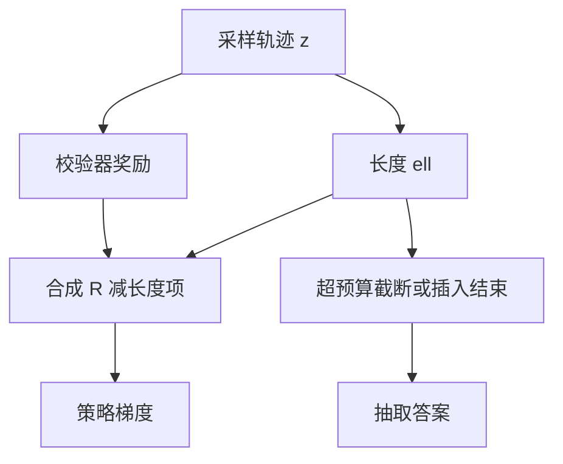

# 长度预算与截断

校验器只看对错时，策略会把 token 当成彩票：写得越长，越可能碰巧撞上正确答案，或把结束标记拖到窗口耗尽。

<footer>—— 对照推理 RL 中的长度膨胀；s1 的 budget forcing 把长度重新变成显式旋钮</footer>

[可验证奖励](/llm/verifiable-reward) 给了 0/1。缺口立刻出现：在稀疏奖励下，更长的采样往往有更高的偶然命中率，梯度于是奖励话多。服务有硬窗口、有延迟 SLO，不能把「想对」实现成「写到 128K」。本课把 **长度预算** 写成 RL 与解码的共同约束：训练时惩罚或截断超预算轨迹，推理时强制结束或强制续写。不重讲如何算 $R$，只补 $R$ 对 $|z|$ 无约束这一条。

## 问题

设奖励只有 $R\in\{0,1\}$。对同一题，长度 $\ell$ 更大的轨迹集合覆盖更多计算路径，命中率 $p(\ell)$ 往往非降。策略梯度看到的相关是 $\mathrm{Cov}(R,\ell)\gt 0$，即使额外 token 是重复、跑题、或已经得出答案后的空转。结果是平均长度在 RL 过程中单调爬升，准确率的边际收益下降，KV 与墙钟线性变差。

截断是另一种扭曲：到 $L_{\max}$ 仍无结束标记，轨迹被切断，$R$ 按不完整答案算 0。模型可能学会「在预算耗尽前赶紧猜一个数」，或学会「永远不输出结束，把责任推给截断器」。两种都是预算接口泄漏进策略。s1 的 budget forcing 把泄漏变成显式：到点插入结束；想加长就插入 Wait。训练侧需要对应的损失，否则只在推理改、训练仍在奖长度。

### 预算是资源不是道德

「应该想多久」没有真理。产品给每题 $L$ 个思维 token（或毫秒）。目标是在约束下最大化 $R$，而不是让链看起来认真。把长度惩罚写成「反对思考」是误读。惩罚的是 **超过预算的空转与为刷命中率而注水**。按 token 计与按步计不同。CoT 里一步可能 3 个 token 也可能 300。PRM 的步边界若与长度惩罚混用，要声明惩罚的是 token、是步、还是墙钟。服务 SLO 只认墙钟与 token。

## 方法

### 训练期四条长度接口

训练期常见项：

- **硬截断**：$\ell\gt L$ 的后缀不进损失，且 $R$ 按截断后的 extract 算。简单，梯度在边界处不连续。
- **长度惩罚**：$R'=R-\beta\cdot\mathrm{relu}(\ell-L_0)$ 或 $R/\ell^\kappa$。$\beta$ 过大则模型写极短猜答案。
- **两段奖励**：先 $R$，再在对的轨迹里奖更短（或只惩罚错的长轨迹）。避免「又短又错」赢过「长但对」。
- **预算作为条件**：提示里写入 $L$，SFT / RL 都见过多种 $L$，使策略可按条件停写。

推理期：到 $L$ 插入结束标记并强制答；或挡住结束、追加 Wait 以加长（s1）。训练若从未见过这些插入串，推理干预是域外，效果不稳定——应在 SFT 混入带预算标记的样本。

## 机制

长度项改变优势的排序：同样 $R=1$，短链优势更高，梯度把概率从注水链挪到紧凑链。若短链其实不会算、只是猜对，会强化猜。所以长度惩罚应在 $p(R=1)$ 已经明显高于随机之后再打开，冷启动早期以 $R$ 为主。这与「先 SFT 再 RL」一致：SFT 提供能算的长链，RL 先保对，再压缩。

截断造成的 $R=0$ 会惩罚「还没写完就被砍」的认真轨迹。缓解：给未完成但过程健康的轨迹一个中间分（需要 PRM，后课），或把 $L$ 随机化，使模型不能把某个固定位置当悬崖。固定 $L$ 训练、服务换 $L$，停写点会错。

群体相对基线在长度上要小心：若群体里长链更容易 $R=1$，基线本身含长度偏置，短的对链可能仍拿负优势。可按长度分桶标准化优势，或先对 $R$ 标准化再减长度项。实现选择会改「压缩」还是「只消灭最长的 1%」。

### 与测试时 Wait 的配合

Budget forcing 的 Wait 在训练分布里应作为合法续写，而不是神奇前缀。否则模型在 Wait 后复读上一句。SFT 里对同一题提供短预算与长预算两个 $z$，比只在 RL 里罚长度更能教会「条件化思考」。RL 再负责在每个 $L$ 下提高 $R$。

## 边界与工程取舍

窗口本身就是截断器。RL 采样若经常顶满窗口，你优化的是「满窗行为」而不是自然停写。应把 $L$ 设在窗口内留出答案槽。MoE / 长上下文服务中，长度直接乘 KV；预算是唯一可控的费用旋钮，比再砍专家更可预期。

不可验证任务上不要套 0/1 长度惩罚抄作业：偏好模型已经爱长，再减 $\beta\ell$ 是在和奖励模型打架，需要重新标定。本课绑定可验证 $R$。代码生成的「长」可能是必要样板，应按通过率密度（$R/\ell$）而不是绝对 $\ell$ 来罚，避免把正确的冗长 API 调用剪掉。

报告准确率必须同时报告平均 $\ell$、截断率、以及固定预算下的准确率曲线。只报「RL 后涨了 4 分」而平均长度翻倍，分数可能买自计算，不是买自算法。

## 小结

- 纯 0/1 奖励与长度正相关，策略会注水；预算要把长度写成约束。
- 先保对、再压缩；长度项过早会强化短猜。
- 截断泄漏进策略；预算应条件化，并与 s1 式推理干预共用标记。
- 优势估计要防止群体基线把「长」当成「好」。
- 论文数字应带长度曲线，不只带准确率。
- 出处：推理 RL 的长度膨胀现象；s1 budget forcing；R1 类训练中的长度控制实践。
