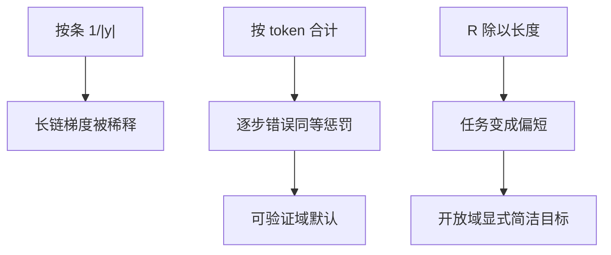

# 长度归一化偏差

把损失或奖励除以长度，看起来在公平对待长短样本，其实在改任务：短错误与长正确的相对权重被重写。

<footer>—— 对照 Dr. GRPO 对长度偏差的分析；DAPO 用 token 级损失而不是按条平均；GSPO 把比率收到序列级</footer>

[上一课](/llm/reward-whitening)钉住奖励的仿射尺度。长度仍以另一种方式进目标：按序列平均 log-prob、按 $|y|$ 除奖励、或 GRPO 先对每条做 token 平均再对组平均。缺口是：**这些「归一化」都在引入长度偏差，不是中性的数值稳定。** 本课写清楚三种除法各改了什么。不重推 clip。

## 问题

[PPO](/llm/ppo-llm) 按 token 计损失时，长完成贡献更多项。若再对每条除以 $|y_i|$，则每个长样本的 token 变轻：高质量长链学不够，低质重复长链也罚不透。DAPO 把这一点写成朴素 GRPO 的缺陷，改成分母为组内 token 总数。反过来，若奖励本身随长度涨（RM 爱长），不除长度则策略写到上限。两条偏差方向相反，不能靠同一次除法同时修。

Dr. GRPO 还指出组内标准化与长度纠缠：更长的错误完成可能有不同的 $r$ 方差。GSPO 认为 token 级比率与序列级奖励粒度不一致。本课不展开 GSPO 公式，只把「除以长度」当作必须声明的测度。

### 三种除法

1. 损失按样本平均（每条 $1/|y_i|$）：长度越长，逐步错误越不痛。
2. 损失按 token 平均（分母 $\sum |y_i|$）：每个 token 一票。
3. 奖励除以 $|y|$：直接改 $R$，短正确更香，长证明吃亏。

选 3 等于把「简洁」写进任务；选 1 常是实现偷懒。评测若按题准确率，训练测度应接近 2，而不是按条。

DPO 对回答求和还是平均 log-prob，同样改长度偏置。本课的逻辑也适用于 [DPO](/llm/dpo)，只是没有优势。

## 方法

默认（推理 RL、可验证对错）：token 级损失，序列 $R$ 不除长度，长度用显式惩罚或后课过长过滤控制。开放偏好：若金标控长胜率下降，再在 $R$ 上减 $\alpha |y|$，α 在控长评测上扫。报告同时给出准确率与平均长度，避免把注水写成进步。

不要在白化、组内 std、长度除法上叠三层隐式缩放。下一课熵塌缩会与「长而重复」一起出现，那是本课测度选错的常见症状。

## 机制

策略梯度的期望是在轨迹测度下。按条平均等于每条轨迹一票，不管多长；按 token 等于按生成时间一票。校验器奖励是轨迹级事件，严格对应「每条一票」；但更新是 token 参数，逐步错误需要 token 票。DAPO 的选择是：事件仍是轨迹 $R$，梯度测度用 token——不自洽但实用。GSPO 选择把重要性比率也改成轨迹级，自洽另一头。知道自己站在哪头，比抄默认超参重要。

长度惩罚与「除以长度」同向但非线性不同。软超长塑形（DAPO）只罚尾部，不伤害中等长度的正确证明。

## 边界与工程取舍

产品延迟按 token 计费时，训练测度忽略长度，上线必爆费用。应把费用写成多目标轴，而不是默默除 $|y|$。数学竞赛要长证明，除长度会打压 R1 类行为。下一课看熵：重复长链既是长度问题也是探索问题。

## 小结

- 按条除长度稀释长链学习；按 token 合计是 DAPO 的默认测度。
- 奖励除以 $|y|$ 是改任务，必须有控长金标。
- 长度偏差与 RM 爱长是相反的两股力，一次除法修不了两头。
- 与白化、组 std 不要叠加重缩放。
- 出处：Yu 等 DAPO token 级损失；Liu 等 Dr. GRPO；Zheng 等 GSPO 的粒度论点。
