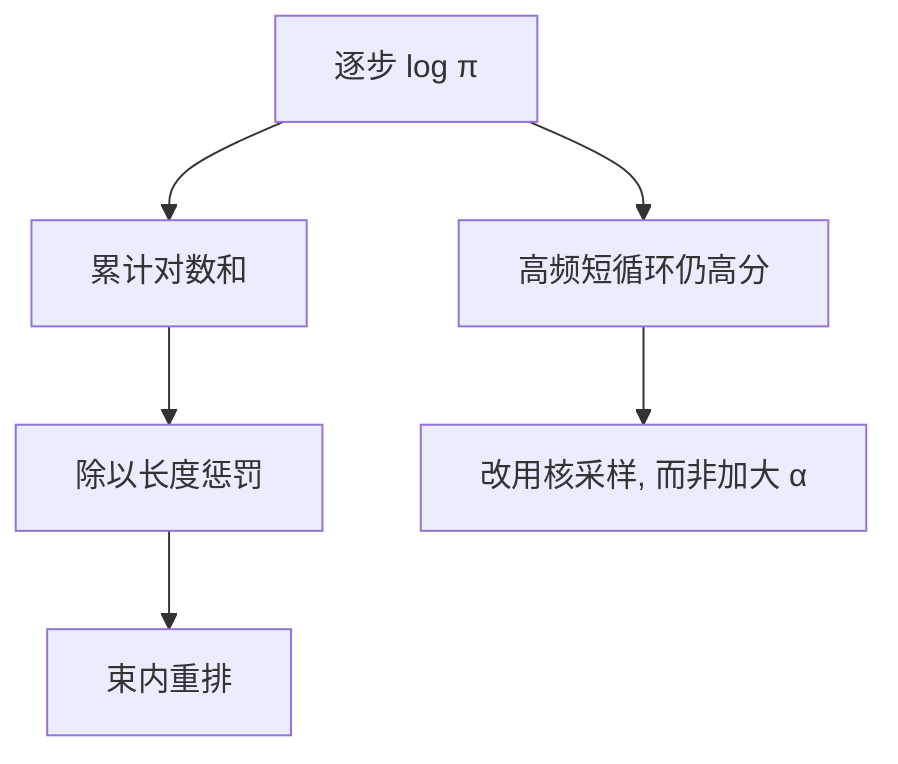

# 长度惩罚与退化

极大似然解码会把文本推向重复与套话；长度归一化能改束的排序，却治不好核里已经塌掉的分布。

<footer>—— Holtzman et al., The Curious Case of Neural Text Degeneration, ICLR 2020；长度归一化见 Wu et al., Google's NMT, 2016</footer>

[上一课](/llm/reasoning-faithfulness)把「写出来的思维链是否等于模型内部用过的那条」定成忠实性问题。本课打开「解码进阶」：权重已经冻住，用户看见的字符串仍由搜索目标决定。忠实性约束的是解释；长度惩罚与退化约束的是 *那条被当成最优的序列* 会不会其实是短循环。后课默认长度偏置与 Holtzman 式退化已经成立，不再从「自回归有一份分类头」讲起。采样旋钮见 [温度 / top-p](/llm/sampling-temperature-topp)，束与采样的目标函数对照见 [Beam vs Sampling](/llm/beam-vs-sample)。

## 问题

束搜索近似 $\arg\max_y \sum_t \log\pi(y_t\mid y_{\lt t})$。更长的 $y$ 对数和更负，实现若不归一化，束会爱提前结束；若简单除以长度，又会偏向注水的长句。Wu 等人在神经机器翻译里用长度惩罚（length penalty）把得分写成

$$
\mathrm{score}(y)=\frac{\log\pi(y\mid x)}{(5+\lvert y\rvert)^\alpha/(5+1)^\alpha},
$$

$\alpha$ 是经验指数。翻译里这能把过短假设拉回来。开放生成里同一套公式解决不了另一件事：高概率短循环（「是的是的是的」）的 *平均* 对数概率仍然很高，罚长度只会让循环更长或更短，不会让它变成具体内容。

Holtzman 等人把这种可观测的重复、万能套话叫做神经文本退化（degeneration）。根因是搜索在追求 MAP，而语言模型在安全的高频续写上堆了大量质量。上一课的忠实性假设「有一条真正用过的链」；若解码已经锁进循环，链本身就不是推理，忠实性无从谈起。缺口是：在不改 $\pi$ 的前提下，搜索目标如何避免把退化当成最优。

$T\to 0$ 的采样与 $B=1$ 的束重合，一样会退化。长度惩罚是束的排序器，不是采样器。不要把 $\alpha$ 当成温度的替代品。

## 方法

先分清两套旋钮。长度惩罚只在 *已经生成的完整或部分假设* 上重排，不改变下一步的支撑集。presence / frequency penalty 按已出现 token 减 logit，改的是逐步分布，能打断短循环，也会伤害必须重复的标识符与 JSON 键。n-gram 阻断是硬约束，下一课之后才展开。开放闲聊应先用核采样，而不是先把束的 $\alpha$ 调到 2 再抱怨套话。

翻译、摘要这类「有参照长度」的任务，长度惩罚仍然有用：假设长度应贴近源或预算。对话与思维链没有参照长度，$\alpha$ 变成另一只看不见的手，把「停得早」或「写得长」写进产品行为。推理模型拉长思维链时，长度惩罚会与「想得够不够」打架——该用显式长度预算，不要借用 GNMT 的 $\alpha$。

## 机制

MAP 与人写的分布不对齐。人写的续写在核里是多峰的；束把质量收成一条最「安全」的脊。长度惩罚改变的是脊上不同长度点的相对高度，不把脊掰回多峰。因此：有参照的 MT 上，$\alpha$ 修正的是搜索的长度偏置；开放生成上，真正有效的是改变支撑集（nucleus）或改变目标（采样 + 核对）。退化的典型实验对照是：贪心 / 大束出现重复，核采样在同样 $\pi$ 上重复率下降——Holtzman 的主结果，不是某一聊天产品的默认温度。

服务端若把 length_penalty 与 repetition_penalty 同时打开，归因会失败。一次只动一类：排序器或逐步惩罚。日志里应记下 $\alpha$、是否对 EOS 额外加分，以及有没有覆盖核采样。

## 边界与工程取舍

不要把 GNMT 的 $\alpha=0.6$ 抄进聊天默认。不要在 JSON / 代码路径上对标识符做频率惩罚。思维链评测若用带长度惩罚的束，报告的是 MAP 附近的套话链，不是 [自洽](/llm/self-consistency) 假设的多样路径。评测解码必须与产品一致。

出处以 Holtzman et al. ICLR 2020 与 Wu et al. 2016 的长度归一化为准。不要给某一 API 的 `length_penalty` 默认值编造论文。

## 小结

- 长度惩罚修正束的长度偏置，不修复开放生成的 MAP 退化。
- 退化来自高频短循环在平均对数概率上仍然赢，加大 $\alpha$ 只是让循环换长度。
- 开放生成应改支撑集或改目标（采样、核对），而不是只调 GNMT 公式。
- 频率惩罚与长度惩罚正交；一次调一类。
- 推理长度预算不要借用翻译的 $\alpha$。
- 后课默认你会区分「排序器」与「采样器」。
- 出处：Holtzman et al., ICLR 2020；Wu et al., *Google's Neural Machine Translation System*, 2016。
