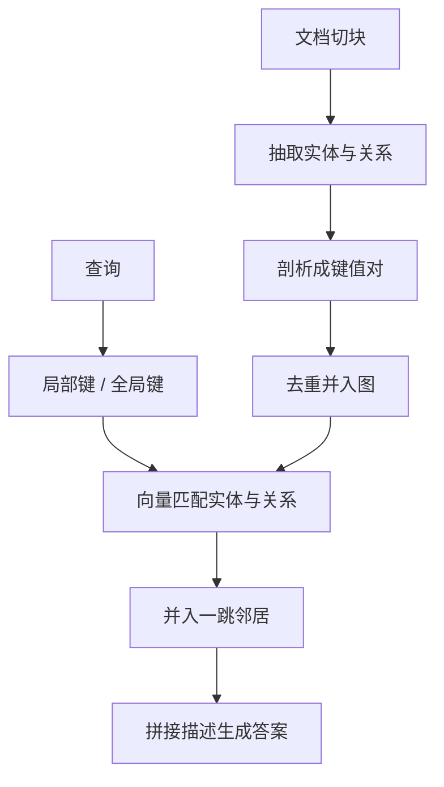

# LightRAG

    
我们把图结构写进文本索引与检索，并用双层检索同时覆盖实体级细节与主题级概览。

    <footer>—— Guo et al., LightRAG: Simple and Fast Retrieval-Augmented Generation, arXiv:2410.05779</footer>

图增强 RAG 能把实体关系从扁平切片里捞出来，但社区遍历一类做法在查询高峰下又贵又难增量。Guo、Xia、Yu、Ao 与黄超（通讯）提出 LightRAG：切片后用大模型抽实体与关系，做成图；节点与边再写成键值对，用向量库做关键词匹配；查询同时走低层（实体）与高层（主题），再把一跳邻居拼进上下文。增量文档只抽自己的子图再并入，不必重建全库。仓库在 HKUDS/LightRAG，预印本 arXiv:2410.05779，后收入 EMNLP 2025 Findings。相对 [HippoRAG](/llm/hipporag) 的 PageRank 扩散，这里检索核是向量匹配加局部子图，强调快与可更新。

## 问题

朴素 RAG 把库切成块、按嵌入近邻取回。问「电动车如何同时影响城市空气与公交基础设施」，系统容易分别取到电动车、空气、公交三堆切片，却拼不出「减排如何改变公交规划」这条依赖。查询改写、假设文档（HyDE）仍在块空间里打转，全局主题没有一等表示。

GraphRAG 用社区报告捕捉全局，高层次感更好，但检索要遍历社区，增量往往意味着重跑社区检测与摘要。三个工程约束同时成立才有用：索引要能抽出跨块依赖；在线检索要低成本；新文档要能并进现图而不打乱旧边。LightRAG 把这三条写成同一套图加向量的索引。

### 具体问句与抽象问句不是同一层

「谁写了《傲慢与偏见》」应对准节点与边；「人工智能如何影响现代教育」应对准跨实体的主题键。只用实体检索，抽象问句会碎；只用社区摘要，具体事实会糊。双层不是两个独立系统，而是同一次查询抽出局部关键词与全局关键词，分别打到实体索引和关系索引。

评测问句由大模型按 GraphRAG 的用户—任务—问题流程生成，每库 125 条，侧重高层次感，不是 Natural Questions 那种短事实。Legal 上对 NaiveRAG 八成胜率，不能直接外推到单跳实体问答。Mix 上与 GraphRAG 的 Overall 接近互有胜负，不要写成全面碾压。

## 方法

图索引分三步。$\mathrm{Recog}$：把原文切块，提示大模型识别实体（人名、日期、地点、事件等）与关系。$\mathrm{Prof}$：为每个节点和每条边生成键值对。实体键是名称，值是从原文摘出的描述；关系可以有多个键，由模型根据两端实体的全局主题增强。$\mathrm{Dedupe}$：跨块合并同名实体与相同关系，缩小图。形式写成分块识别的并集再去重：$\hat{\mathcal{D}}=(\hat{\mathcal{V}},\hat{\mathcal{E}})=\mathrm{Dedupe}\circ\mathrm{Prof}(\mathcal{V},\mathcal{E})$。

增量更新对新文档 $D'$ 跑同一套 $\varphi$，得到 $(\hat{\mathcal{V}}',\hat{\mathcal{E}}')$，再与旧图做节点集与边集的并。目标有两条：新边不拆旧连通；计算量与新文档长度成正比，而不是与全库成正比。复杂度上，索引阶段大模型调用次数约为总 token 数除以块大小，没有额外的社区摘要环。

### 双层检索如何落到向量库

查询 $q$ 先被写成局部关键词 $k^{(l)}$ 与全局关键词 $k^{(g)}$。向量库把局部键匹配到候选实体，把全局键匹配到带主题键的关系。为了高阶相关，再收集命中节点与命中边的一跳邻居。生成时把这些实体与关系的描述值、以及原文摘录拼给通用大模型。检索对象是实体与关系，不是块，也不是 GraphRAG 的社区报告。实验默认 GPT-4o-mini，块长 $1200$，gleaning 与 GraphRAG 对照时都设为 $1$，向量库用 nano 向量库。

## 机制

图提供多跳子图上的全局信息，键值对提供可向量检索的短键。两者绑在一起，才不必在查询时做社区遍历。消融表明去掉高层或去掉低层都会伤：相对 NaiveRAG 的 Overall 胜率，完整模型在 Agriculture 为 $66.70\%$；去高层后 $64.67\%$，去低层后 $64.98\%$。多样性指标上双层的贡献更明显，Legal 上完整模型相对 NaiveRAG 的 Diversity 胜率到 $89.02\%$。

对照表用 GPT-4o-mini 做多维两两比较：全面性、多样性、赋能、总体，并交换答案顺序以减轻位置偏差。Legal（百万级 token、公司法律）上 LightRAG 对 NaiveRAG / RQ-RAG / HyDE 的 Overall 胜率约 $72\%$–$82\%$；对 GraphRAG 约 $54.30\%$ 对 $45.70\%$。Agriculture 与 CS 同样是图方法领先块方法，LightRAG 对 GraphRAG 的 Overall 分别为 $56.38\%$ 与 $54.02\%$。Mix 文集更杂，GraphRAG 的 Overall 略高（$51.86\%$ 对 $48.14\%$），但 Diversity 仍是 LightRAG 高。大库、需要综观的问句上，图索引的优势随 token 规模变大。

胜率是 LLM 裁判，不是 F1。裁判模型与生成模型同属 GPT-4o-mini 家族时，存在风格自偏好风险。原文用交换顺序做了部分校正，但仍不能当成地面真值。复现应固定提示、温度与裁判版本。

### 增量比重建更重要的场景

知识库按周追加合同、案例、论文时，GraphRAG 式社区重算的延迟会变成产品约束。LightRAG 的增量只处理新块，旧描述与旧边保留。它不保证新文档与旧实体的冲突被语义级解决——去重按识别出的同名合并，错误合并会污染描述。描述是摘要值，不是 HippoRAG 那种可供 PageRank 的干净三元组集合。

## 边界与工程取舍

抽取与剖析每块都要调大模型，索引 token 成本仍高；省的是查询侧的社区遍历与全库重建。图质量绑定提示与去重启发式，开源仓库后来加了不少工程（缓存、重建单实体），论文正文的算法是上述三函数。评测域是 UltraDomain 的教材：农业、计算机、法律、混合人文，不是开放域网页检索。

与 HippoRAG 的分工：HippoRAG 用 PPR 在查询时做联想补全，适合多跳事实；LightRAG 用双层关键词加邻居，适合主题综观，并强调增量。两者都依赖 LLM 抽图，都不要写成「免费的图」。不要把社区报告、PageRank、双层关键词画成同一个模块。

作者单位为香港大学与北京邮电大学。引用写 Guo, Xia, Yu, Ao, Huang，*LightRAG: Simple and Fast Retrieval-Augmented Generation*，arXiv:2410.05779。GraphRAG 对照是 Edge 等 2024；NaiveRAG 按 Gao 等综述里的切块+向量基线理解。

## 小结

- LightRAG 把实体—关系图与键值向量绑在同一套索引上，查询走低层实体与高层主题。
- 增量是子图并入，不是重跑全库社区检测；索引 LLM 次数随新 token 线性增加。
- 在 UltraDomain 大库高层次感问句上，相对块 RAG 与多数情况下的 GraphRAG 有胜率优势，多样性尤其明显。
- Mix 上 Overall 并不全面领先 GraphRAG；裁判是 LLM，不是标准 QA 指标。
- 检索核是关键词向量匹配加一跳邻居，不是 Personalized PageRank。
- 出处：Guo et al.，*LightRAG*，arXiv:2410.05779（EMNLP 2025 Findings）；实现以 HKUDS/LightRAG 为准。
