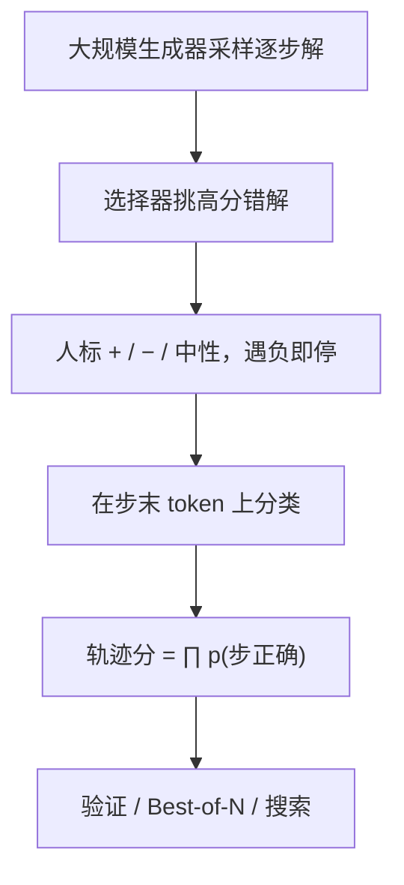

# Process Reward Models Lightman

    
逐步标注正确、错误或中性，训练一个模型去预测每一步是否合法；整条解答的分数取各步正确概率的乘积。

    <footer>—— Lightman 等，Let's Verify Step by Step，ICLR 2024</footer>

过程奖励模型（Process Reward Model, PRM）在这篇文献里不是泛称，而是 Lightman、Kosaraju、Burda、Edwards、Baker、Lee、Leike、Schulman、Sutskever、Cobbe 在 MATH 上具体训出来的那个分类器：输入题目与前缀步骤，输出该步为正 / 负 / 中性的似然。数据是 PRM800K。验证器实验、Best-of-N 曲线见姊妹篇 [Let's Verify Step by Step](/llm/verify-step)；概念与切分协议见 [过程监督](/llm/process-supervision)。本篇钉 PRM 本身：标签定义、训练、归约、主动学习。

## 问题

[结果监督](/llm/outcome-supervision) 只给终点对错。MATH 上大量「推理坏了、数字碰巧对」与「前九步对、最后抄错」。要训练可靠的奖励，监督必须对准**人可以局部判定**的步骤。Uesato 等人 2022 已在 GSM8K 上比较过程与结果反馈；Lightman 要把对象换成更难的 MATH、把生成器换成更强的大规模模型，并公开八十万步级标签。

局部判定依赖三件事：步骤边界、三级标签、以及「标到第一处错误即停」的预算策略。边界一变，同一段文字的 $T$ 和对错位置都变。三级里的中性不是偷懒：过渡句、尚可但无进展的建议、难以一眼验证的计算，强迫二分类会把脚手架打成负例。标注者没有标准解答（避免锁死路径），但看得到最终数字（帮助消解误解）。这些都是协议，不是模型结构。

### 为何不把 ORM 训在同一批逐步数据上

PRM800K 经主动学习，严重偏向「看起来像对、答案却错」的解。只用这批数据训 ORM 会扭曲终点分布。作者给 ORM 的「尽力」设定是每题 100 条均匀样本，集合与 PRM800K 不相交、大约大一个数量级。因此主文的 ORM vs PRM 不是样本量对齐的消融，而是「两种监督各自做到当时最好」的对照。小规模、对齐数据的比较在论文第 4 节，用来隔离混淆因素。

PRM800K 训练集含约 800K 步级标签、75K 条解答、12K 道题；其中混入 4.5K 道 MATH 测试题以免过拟合协议泄漏。主评测因此只在剩余 500 题上进行，与后来常说的 MATH-500 是同一切片。

## 方法

生成器先经 MathMix 数学相关轻量继续预训练，再在 MATH 上微调，专门为标注采样逐步解答。标注分两阶段。阶段一在每一步提供多个候选续步，约占标签的 5%，重复多、流程笨。阶段二预生成整解，用当时最好的 PRM 把「高分但答案错」的样本送给人，标到第一个负步停止；共约 10 代，代际之间重训选择器。过滤质控与未完成项之后，公开集约 80 万步标签。完整未过滤约 108 万步 / 10 万条样本，仓库一并给出。

PRM 在步骤最后一个 token 上预测类别，标准语言模型交叉熵，无需特殊结构。推理时对整解一次前向即可得到逐步分数。轨迹分默认定义为「每一步都正确」的概率，实现为各步「正类」（中性算正）概率的**乘积**。附录比较了乘积 vs 最小、中性算正 vs 算负：Best-of-1860 上 78.2% / 77.6% / 77.4% / 77.8%，乘积+中性算正最好，差别不大。乘积对长解略惩罚。

主动学习：用小 PRM 对每题 1000 个样本打分，再选 $N$ 条——约 80% 为最能骗过选择器的错解答，20% 为其余最能骗人的（对错都有）。相对均匀标注，过程监督的数据效率约 $2.6\times$（用拟合直线斜率估计）。迭代重训选择器在他们手里不稳定，没有得到额外好处。

### 大 PRM 给学生当老师

作者表明：大规模 PRM 可以近似人类，给更小的奖励模型当自动标签，从而做大规模数据消融而不把每一条都送给人。这是过程监督的第二条成本曲线：人标种子 → 大 PRM → 合成标签 → 小 PRM。可靠性绑定「老师」的校准，不是免费的无限数据。

## 机制

### 逐步分类如何变成轨迹分

设第 $t$ 步正类概率为 $q_t$。乘积 $\prod_t q_t$ 对应「每步独立地仍正确」的朴素联合；最小 $\min_t q_t$ 是最弱环节。MATH 解题里一步代数错误通常污染后续，两种归约都接近「一票否决」，所以附录里分数接近。开放域若允许局部瑕疵，最小会过严。中性算正，等于把「无进展但合法」当可通过，避免 PRM 学会打压必要叙述。

PRM 在步界上打分，生成器必须按同一边界吐步骤。复制权重却换切分，等于换任务。这与聊天模板同类：切分是契约。

### 主动学习改变的是标签的信息量

均匀样本里大量步骤显然对或显然胡扯，人的时间浪费在低信息区域。把「模型也觉得对、答案却错」的解送去标，正是 ORM 会给假阳性、人能指出第一处破绽的地方。80/20 混合避免训练集变成纯错解、分类器塌成「凡是长的都错」。$2.6\times$ 是这条曲线相对均匀标注的斜率比，不是任意任务的定律。

## 边界与工程取舍

人标贵，MATH 领域有最终数字可参照；没有局部真假的任务（文风、开放咨询）标不了 PRM。生成器与 PRM 若同数据同初始化，会共享盲点——作者因此把 PRM 当**独立验证器**，而不是生成器自评。自动用终点对错去标中间步（后来的 Math-Shepherd 一类）更便宜，但把「这步之后总能蒙对」漏进逐步价值，与人标 PRM 不是同一对象。

不要把 PRM 写成 DPO。DPO 更新生成器的成对似然；PRM 是单独的评分器，可以不更新生成器、只在测试时选候选。DeepSeek-R1 明确说主路径不用 PRM；R1 的过程是策略自己长出来的文本，没有这套人标分类器。

78.2% 是 PRM 当验证器、Best-of-1860、MATH-500 子集上的数，不是生成器 pass@1。引用 PRM 能力时必须写清「验证哪一个生成器、N 多大」。生成器本身是 GPT-4 级大规模模型，小模型套同一套标签不会自动得到同一曲线。

### 何时不必训 Lightman 式 PRM

终点检查器很硬（代码单测、符号计算），结果监督够用。没有步骤协议、标注者不一致，先定切分再谈模型。只能部署一个模型、不能跑验证器，把过程信号写进 RL 奖励，而不是再训一张 PRM。需要公开可复现的逐步数据时，直接用 PRM800K，不要口头「按 Lightman 标」却换了指南。

## 小结

- Lightman 的 PRM 在步末预测正 / 负 / 中性，轨迹分默认为各步正类概率之积（中性算正）。
- PRM800K：约 80 万步级人标，主动学习偏向高分错解，评测用 MATH-500。
- 主动学习约 $2.6\times$ 提高过程监督的数据效率；迭代重训选择器未成功。
- ORM 对照用了更大、不相交的均匀样本，主结果不是等数据量消融。
- PRM 是独立验证器，切分协议与生成器必须对齐。
- 出处：Lightman 等，*Let's Verify Step by Step*，ICLR 2024，arXiv:2305.20050；数据：openai/prm800k。
