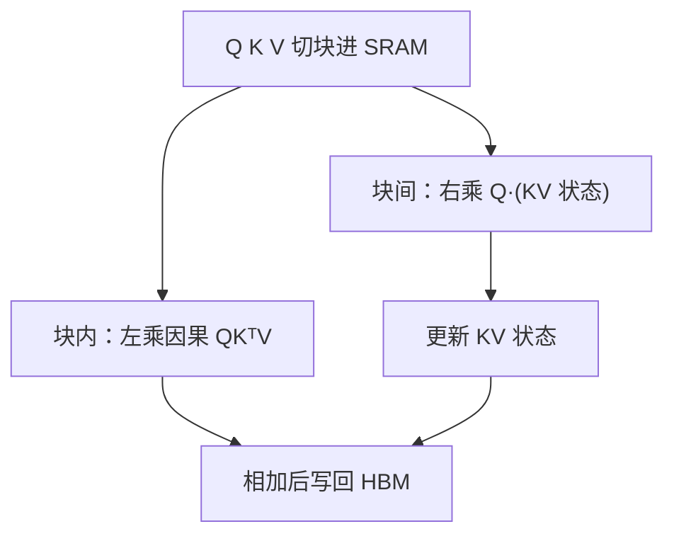

# Lightning Attention

    
因果情形下的 cumsum 挡住了线性注意力的理论速度；把块内交给左乘、块间交给右乘，训练吞吐才能不随长度塌下去。

    <footer>—— Qin, Sun, Li, Shen, Sun, Zhong, Lightning Attention-2, 2024</footer>

[Linear Attention](/llm/linear-attention) 写出核化与结合律：[Katharopoulos 原文](/llm/katharopoulos-linear) 证明因果形式是 RNN。墙钟上，因果线性核常被前缀和拖住，理论 $O(nd^2)$ 到不了恒定步时。[MiniMax-Text-01](/llm/minimax-text01) 把 Lightning Attention 用到百万上下文，那是产品级混合架构；本篇写 Qin 等人的核本身：Lightning Attention-2 如何用分块消掉因果 cumsum，以及 Lightning Attention-1 只解决了 IO、还没解决复杂度。

## 问题

线性注意力把 $\mathrm{softmax}(QK^\top)V$ 换成可结合的 $\phi(Q)(\phi(K)^\top V)$。非因果时右乘先把 $K^\top V$ 收成 $d\times d$，再左乘 $Q$，长度方向线性。因果时每个位置的状态是前缀，朴素右乘需要 cumsum，难以整段落成 Tensor Core 上的大 GEMM。Lightning Attention-1（Qin 等人在 TransNormerLLM 里的 IO 感知实现）学习 FlashAttention 的切块：把 $Q,K,V$ 搬进 SRAM 再算，访存友好，但块内仍走左乘，整体仍近 $O(n^2 d)$，长度一长 TGS 就掉。

FlashAttention-2 把 softmax 注意力的墙钟打得很满，长度增加时 TGS 仍下降。线性方法若不能给出「固定显存下吞吐几乎不随 $n$ 变」的曲线，就无法兑现「无限长」的广告。问题是算法的：如何在因果约束下既保留块间的右乘，又在块内用硬件喜欢的左乘。

「无限长」在原文里立刻加了硬件限定：显存仍限制激活与优化器状态。恒定的是*给定显存预算下的逐步训练速度*，不是真的能在一张卡上放任意 $n$。

### TransNormer 的 NormAttention 是宿主

Qin 等人 2022 年的 TransNormer 用

$$
O=\mathrm{Norm}((QK^\top)V)=\mathrm{Norm}(Q(K^\top V))
$$

去掉 softmax 与缩放，归一放在后面。Lightning 核服务的是这类线性（或带衰减的线性）形式，不是把 FA 的 softmax 变得线性。MiniMax 后来每隔七层插一层 softmax，是因为纯线性检索弱；那是架构分工，核论文的主指标是速度随长度是否平坦。

## 方法

### 块内左乘、块间右乘

把序列切成大小 $B$ 的块。第 $i$ 块的输出拆成：块内因果注意力（左乘 $Q_iK_i^\top$ 再乘 $V_i$，块小，二次可接受）加上块间贡献（用已经累积的 $KV$ 状态右乘 $Q_i$）。块结束后用本块的 $K_i,V_i$ 更新状态。衰减 $\lambda$ 可以乘进状态，对应 RetNet / Lightning 里数据无关的遗忘。前向与反向都做同样的切块，中间 $KV$ 留在 SRAM 里累加，减少 HBM 往返。实现用 Triton。

相对 Lightning-1，复杂度在 $n\gg B$ 时由块间线性项主导；相对朴素 cumsum，没有一条沿全长的串行前缀依赖挡着 GEMM。作者在 400M / 1B / 3B 上画 TGS：Lightning-2 几乎不随序列变长而掉，FA2 与 Lightning-1 明显下降。

### 与分块线性注意力的关系

Hua 等人、Sun 等人、Yang 等人的 chunkwise 线性注意力是同一思想家族：块间传状态、块内用并行形式。Lightning-2 的表述强调 IO 与因果 cumsum，宿主是 TransNormer 的 NormAttention；GLA / Mamba-2 的分块还要消化数据依赖衰减或 SSD 结构。读核时不要把 MiniMax 的混合比例写进 Qin 的算法节。

## 机制

### 为什么因果会逼出 cumsum

非因果的 $K^\top V$ 是一个全局矩阵，所有查询共享。因果要求位置 $t$ 只能看见 $s\le t$，等价于对每个 $t$ 有不同的前缀和。直接物化前缀是 $O(n)$ 个 $d\times d$ 矩阵，要么串行，要么用扫描但把状态写到 HBM。分块把「前缀」粗化成块级状态：块间是扫描，块内用下三角稠密注意力替代细粒度前缀。$B$ 取 64/128 一类 tile 时，块内二次被 SRAM 吃掉，块间扫描步数是 $n/B$。

衰减使远块贡献指数下降，数值上接近局部，但计算仍扫过所有块状态。这与 softmax 滑窗不同：滑窗物理上不读窗外 KV；线性衰减是读压缩过的状态。检索能力弱于 softmax，是 [线性 RNN 与注意力分工](/llm/linear-rnn-vs-attention) 里那条界，不是核写错了。

图 1 的对照是 LLaMA+FA2 对 TransNormerLLM+Lightning。架构不完全相同，平坦曲线证明的是*该线性核*的长度缩放，不能直接读成「换核即可让 LLaMA 质量不变、速度恒定」。

### 从核到 MiniMax 的距离

*Various Lengths, Constant Speed*（Qin 等人，arXiv:2405.17381）把 Lightning Attention 配上 TransNormerLLM：SimpleRMSNorm、LRPE 等。MiniMax-01 再把它放进 4560 亿 MoE、七层线性加一层 softmax。百万上下文是系统工程（混合层、并行、数据）而不只是 Triton 核。本篇只要求记住：没有块间右乘，线性注意力在因果训练里会先输给 FA 的墙钟，理论复杂度帮不上忙。

## 边界与工程取舍

Lightning 不恢复 softmax 的尖峰拷贝。纯线性栈在针测与精确检索上通常要混层。衰减 $\lambda$ 若全局固定，长程要么全忘要么全糊；数据依赖门控是 GLA / Mamba-2 / Gated DeltaNet 的主题。块大小 $B$ 必须对齐 SRAM 与 Tensor Core；$B$ 太大，块内二次又回来；$B$ 太小，启动开销压过线性项。

不要与 FlashAttention 比「谁更准」——一个有 softmax，一个没有。比的是给定线性（或 NormAttention）公式时，墙钟是否随 $n$ 平坦。也不要把 Lightning-2 写成对 softmax 的近似；它是线性核的 IO 算法。PyTorch 生态里更常见的线性训练栈是 Flash Linear Attention 库的分块核；选型看宿主架构，不是看名字谁更像闪电。

反向必须与前向同一套分块，否则因果线性的梯度会偷偷物化大矩阵。融合失败时，表现会退回 Lightning-1：访存好，复杂度仍近二次。

与 FlashAttention 的切块同构、对象不同：FA 在块内做在线 softmax 与统计量合并；Lightning-2 在块内做无 softmax 的左乘，块间做状态右乘。把 FA 的核直接套到线性公式上，会得到 Lightning-1 那种「切块但仍近二次」的东西。读代码时看块间是否维护 $KV$ 状态，是区分两代 Lightning 的最快方法。

恒定速度假设 $d$ 固定、核占满计算。极短序列上启动开销会让线性核慢于 FA。报 TGS 要给长度范围，不要只截长端的平坦段。

## 小结

- Lightning Attention-2 用块内左乘、块间右乘，去掉因果线性注意力对全长 cumsum 的依赖。
- Lightning-1 已是 IO 感知切块，但复杂度仍近二次；-2 才让 TGS 随长度近似恒定。
- 宿主是 TransNormer 一类去掉 softmax 的线性/归一注意力，不是 FA 的替换核。
- MiniMax-01 的百万上下文建立在这套核与混合 softmax 层之上，细节见产品文。
- 检索精度仍受线性核限制；平坦吞吐不是免费的质量。
- 块大小、衰减与是否混层，决定从核论文到可用语言模型的距离。
- 出处：Qin et al.，*Lightning Attention-2*，arXiv:2401.04658；*Various Lengths, Constant Speed*，arXiv:2405.17381。
