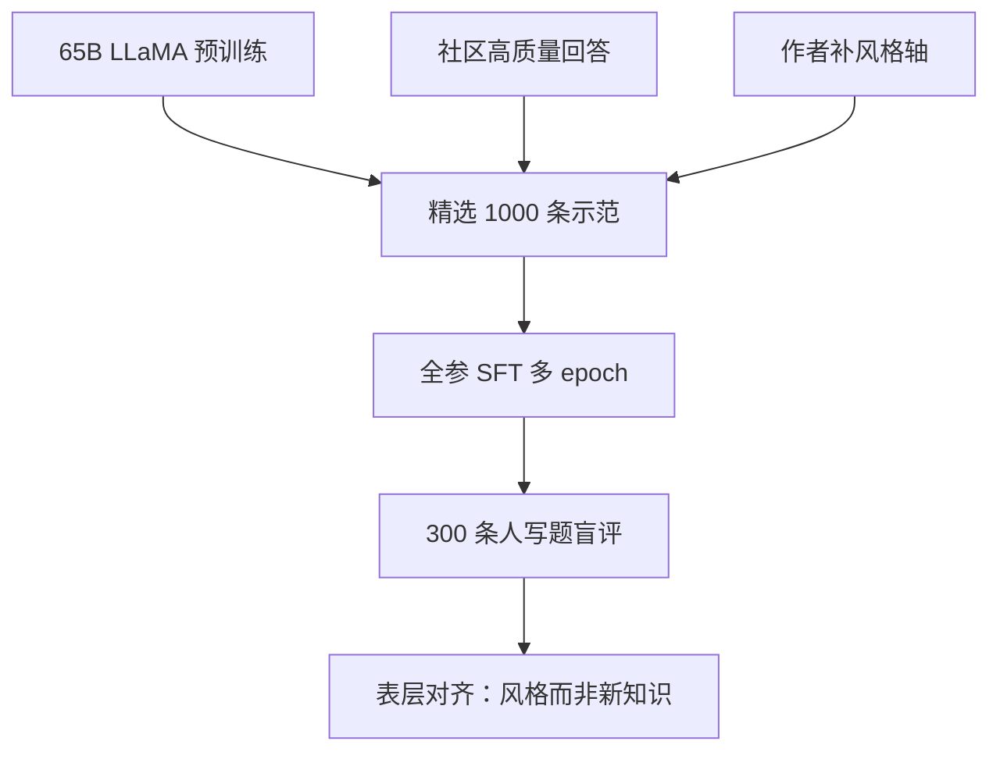

# LIMA

在已经很强的预训练模型上，一千条精心挑选的示范就足以学会助手风格；对齐主要改的是格式与口吻，而不是在后训练里重新注入知识。

<footer>—— Zhou et al., LIMA: Less Is More for Alignment, 2023</footer>

Zhou、Liu 等人 2023 年的 LIMA（Less Is More for Alignment）把指令微调的数量崇拜反过来做实验。当时开源默认是 SuperNI、Self-Instruct、ShareGPT 量级的数万到数十万条，其中大量是合成或嘈杂的。作者用 65B LLaMA，只在 1000 条人工挑选的提示-回答上做标准监督微调，然后在 300 条人写测试提示上做盲评。结果是：LIMA 经常打平或胜过更大、数据更多的指令模型，并在相当比例的样本上达到与 GPT-4 相当或被偏好的完成。论文据此提出表层对齐假说（superficial alignment hypothesis）：能力几乎全在预训练里，后训练教的是与用户交互的风格。本篇写这 1000 条怎么选、假说成立的条件，以及它不支持的那些过度引申。

## 问题

若对齐真的要重新教世界知识与推理，一千条示范远远不够，必须堆任务覆盖。若对齐主要是把已经会的能力接到「提示后接助手完成」这一格式上，那么示范的质量、多样性和风格一致性，会比条数更敏感。两种图景对数据预算的含义完全相反。Zhou 等人选择在同一强基座上，把 SFT 数据减到可以逐条人工审核的规模，看开放生成是否仍然像助手。这不是在弱小模型上证明「数据不重要」，而是在 65B 级 LLaMA 上测格式学习的样本效率。

对照必须包含「更多但更脏」。论文比较了扩大 StackExchange 抽样但不严选、以及当时的 Alpaca / DaVinci-003 指令模型。若 2000 条未筛选不如 1000 条精选，数量叙事就直接被打穿——至少在他们的开放生成人评协议下。主指标是人类偏好与「优秀 / 合格 / 失败」分级，不是 MMLU：后者测知识，按假说不应被 1000 条 SFT 大幅改写。

### 表层指的是接口，不是指能力肤浅

假说里的 superficial 容易被读成贬义。作者的意思是：后训练不必、也很难在 1000 条里注入新的世界模型；它改的是条件分布在对话接口上的表现——如何开头、如何结束、如何拒答、如何在不确定时措辞。预训练已经在网页里见过教程、论坛答案、客服腔。SFT 是在这些模式里选一种，并抑制续写网页的那种模式。说「表层」是说改动发生在接口层，不是说模型只会套话。

假说以「基座已经具备相应能力」为前提。把 LIMA 抄到 7B 弱基座或没见过代码的模型上，再抱怨一千条教不会编程，是换了题目。论文用的是 65B LLaMA。

## 方法

训练集约 750 条来自社区（StackExchange、wikiHow、Reddit 等）经质量与风格筛选，约 250 条由作者撰写，用于补上社区里少见的风格轴：安全拒答、创意写作、少量多轮。筛选看的是：回答是否自足、是否教人而不是刷分、是否避免嘲讽与过度链接、是否覆盖问答 / 教程 / 建议等不同体裁。总量卡在 1000，是为了让「少」成为一个可复现的数字，不是因为 1001 条会坏掉。

优化是全参 SFT，学习率低于预训练，epoch 数明显多于通常的单次过数据——一千条必须反复看，才能把格式写进权重。这与「少即是多」不矛盾：少的是独特示范，不是优化步数。测试集 300 条提示单独收集，训练不见。人评比较 LIMA 与 GPT-4、Claude、Bard、DaVinci-003 等：报告中 LIMA 在约 43% 的样本上等价或优于 GPT-4，相对 Bard 这一比例更高。同时报告约一半完成被标为优秀或合格。数字随评委和提示集变，主张是量级：精选千条可以进入与闭源助手同场的讨论，而不是已经替代 GPT-4。

### 多样性是质量的一部分

1000 条若全是同一腔的论坛短答，模型会把助手学成那一种腔。作者刻意混体裁，并加少量安全与创意，是为了让风格轴张成一个可用的基底。消融里，加更多同质数据不如保持筛选标准。这与 Self-Instruct 的「先铺开再过滤」相反：LIMA 在进入训练前就用人类审美把覆盖和上限一起定死。缺的覆盖（工具、长推理链、多语言）不会因为精选而出现，只会在测试里表现为失败模式。

## 机制

SFT 最大化示范回答的似然，等于把质量从基座的网页续写挪到「选定的助手完成」。因为条数少、写得好，模型没有足够的容量浪费在记忆互相矛盾的套话上，也不容易学到合成数据里的谄媚和免责声明过载。多 epoch 让格式特征（列表、小标题、先结论后解释）变成高频模式。知识类回答仍然来自预训练记忆：示范只提供「这种题该怎么组织」，偶尔提供事实，覆盖面不足以成为新知识库。若测试题需要示范里从未出现的推理结构，模型要么靠预训练泛化，要么失败——论文观察到失败往往是过短、过自信或误解约束，而不是突然变成随机乱码。

与 RLHF 的对比是机制性的。InstructGPT 用比较学习在「已经会写的回答」之间排序，能压掉 SFT 没示范过的有害完成，也能学到更细的偏好。LIMA 只有示范，没有比较，因此对分布外的有害请求、对需要在两个合理答案里选政策的情况，更弱。作者不声称千条 SFT 替代 RLHF；他们声称千条可以替代「数万条脏 SFT」。RL 仍然可以接在 LIMA 式模型后面，只是起点已经是助手而不是基座。

人评开放生成偏流畅和排版。精选示范恰好优化这两项。应用约束满足、引用忠实、代码可运行做切片，否则会把「好看」读成「对齐完成」。论文自己的失败分析里包含误解题意，应一起读。

### 与合成扩表不是零和

Self-Instruct 扩动词覆盖，Evol-Instruct 加难度，LIMA 定风格上限。合成表在弱筛选时会稀释 LIMA 学到的腔；在强筛选后少量并入，可以补社区没有的题型。论文消融倾向「脏的更多更差」，没有否定「干净的合成难例」。产品配方里常见的是：LIMA 量级的人写定调，再加经过滤的合成覆盖，而不是把 1000 当成宗教数字。

## 边界与工程取舍

假说在能力不足的基座上不成立：没有的知识，风格再好也是流畅的错。安全与拒答只靠 250 条量级的作者样本，覆盖不住红队。多轮、工具、长文档、数学竞赛，都不在 1000 条的有效支撑里。评测 300 条开放提示也不能代表生产流量。把 LIMA 写成「对齐已解决、不必 RLHF」超出原文。原文甚至需要 65B 和能逐条审核的标注预算——「少」省的是条数，不是专家时间；每条的单价更高。

优化上，千条多 epoch 容易过拟合到作者口吻：标点、段落长度、某些套话。这在盲评里可能加分，在品牌或地区口味不同时减分。应留持有提示看是否开始复读训练题。与全量预训练数据相比，1000 条对原能力的破坏通常小于脏 SFT 百万条，但仍不是零；需要用知识探针确认没有把事实头挤掉。

「Less Is More」成立的比较对象是未筛选的更多。相对精心设计的十万条、再加 RLHF 的产品模型，LIMA 没有宣称更多。读标题时要把比较集带上，否则会变成反数据原教旨。

## 小结

- LIMA 在 65B LLaMA 上用 1000 条精选示范做 SFT，开放生成人评可进入与闭源助手同场的量级。
- 表层对齐假说：后训练主要教接口风格，知识与能力来自预训练。
- 质量与体裁多样性优于同质扩表；更脏的 2000 条可以不如精选 1000 条。
- 不替代 RLHF、红队与难例覆盖；也不是弱基座的数据节食方案。
- 「少」省的是条数，不是每条上的专家劳动。
- 与 Self-Instruct / Evol-Instruct 可叠加：一个定调，两个扩覆盖与难度。
- 出处：Zhou et al., *LIMA: Less Is More for Alignment*, 2023。
