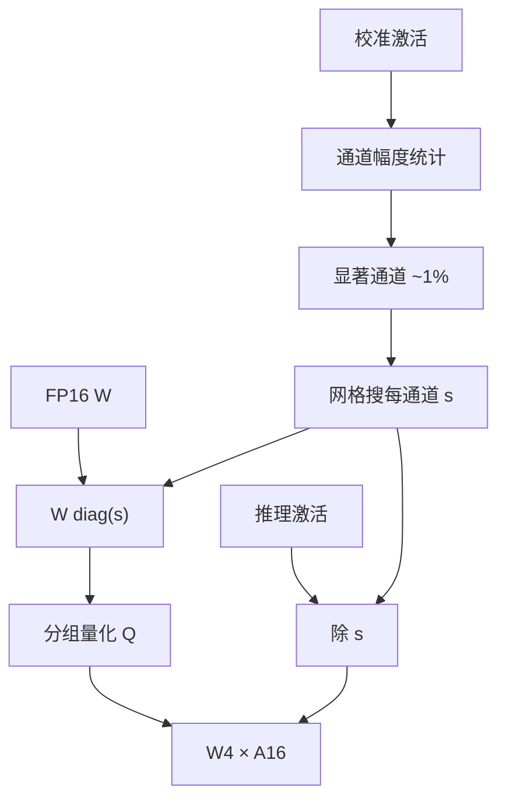

# AWQ 原文

    
我们并不去保护「权重大」的通道，而是保护那些乘上长期巨大激活之后会主导输出的通道；把它们先放大再取整，舍入相对变小，不必用 Hessian 去拟合校准句。

    <footer>—— Lin、Tang、Han 等，AWQ: Activation-aware Weight Quantization，MLSys 2024</footer>

Ji Lin、Jiaming Tang、Haotian Tang、Shang Yang、Wei-Ming Chen、Wei-Chen Wang、Guangxuan Xiao、Xingyu Dang、Chuang Gan 与 Song Han 的 MLSys 2024 论文（arXiv:2306.00978）把 4-bit 权重量化从「校准集上的层输出最小二乘」换成 **激活感知的通道保护**。算法落地见 [AWQ](/llm/awq)。本篇按原文写：他们测了什么模型、为何把「不重构」写成贡献、TinyChat 的加速合同绑在哪类硬件上，以及指令微调与视觉–语言投影为什么被放进主表而不是附录。

## 问题

Round-to-nearest 把同一组里的大小权重塞进同一尺度。大权重相对误差小，但输出误差是 $(w-\hat{w})x$：小权重若乘的是巨大激活，照样能主导。当时 GPTQ 已经能在 OPT-175B 上把权重量到 3–4 bit，层输出 MSE 在校准句上很好。原文提出的裂缝是另一条：补偿可能把权重改到对校准语料最优、对指令分布或视觉 token 不优；端侧还希望量化快、不必对每个下游任务重跑二阶过程。

作者同时面对部署约束。目标位宽是 **W4A16**，不是 W8A8：decode 与端侧小 batch 的墙在权重加载，激活保持半精度仍然划算。混合精度把显著通道留在 FP16，精度好，但稀疏通道布局让 GPU 核变慢，端侧更难写。需要的是：仍走稠密 4-bit 网格，却把误差预算偏向显著列。

### 显著通道来自激活，不是来自 $|W|$

权重大小是静态的；显著是 $w$ 与 $x$ 的搭配。只看 $|W|$ 的 RTN 或只看权重量级的稀疏，会漏掉「权重普通、激活极大」的列，也会过度保护「权重大、激活长期接近零」的死通道。原文用校准激活的通道幅度定义显著子集，默认约 **1%**。校准仍然需要，但用途是统计，不是逐列拟合。这是标题里 activation-aware 的本意，也是和 GPTQ 的评测合同分叉处。

不要把 AWQ 的通道缩放写成 [SmoothQuant](/llm/smoothquant)。SmoothQuant 把激活异常值的难度迁到权重上，为的是两边都能 INT8；AWQ 把显著权重抬高，为的是权重量化误差更小，激活在推理时仍是高精度，只是先除 $s$。公式都是对角缩放，目的相反。原文对照见 [SmoothQuant 原文](/llm/xiao-smoothquant)。

## 方法

对一层 $Y=WX$，先在校准集上估每个输入通道的激活幅度，标出显著子集。再搜每通道正数 $s_j$，使得

$$
Q\bigl(W\,\mathrm{diag}(s)\bigr)\,\mathrm{diag}(s)^{-1} X \approx WX,
$$

其中 $Q$ 是分组均匀量化。$s$ 把显著列拉大，量化阶梯相对这些列更细；非显著列被压低，它们本就不该占用阶梯。搜索被收成与幅度相关的低维网格（论文常用 $s=\hat{s}^{\alpha}$ 一类形式扫 $\alpha$），远小于 GPTQ 的 Hessian 更新。确定 $s$ 后把缩放写进权重再量化；推理时对激活做对应的除法，或把 $s^{-1}$ 融进前一层输出 / LayerNorm。

原文实现强调 on-device：4-bit 权重减小包体积与内存带宽，decode 加速来自少搬字节。他们配套了 TinyChat 推理引擎，在桌面与移动 GPU 上报告相对 FP16 约 **3×** 量级的生成加速（随模型与是否有 4-bit 核变）。没有对应核就只有压缩没有加速——论文把算法与核放在同一叙事里，引用时必须拆开：困惑度表是 PTQ 算法，墙钟表是 TinyChat 实现。

### 不重构，是故意的

GPTQ 的补偿会改尚未量化的权重，使校准输出 MSE 下降，也使权重离开原预训练点更远。AWQ 只做对角等价变换再 RTN，权重的相对结构保持得更多。代价是校准集上的 MSE 可能不如 GPTQ 抠得死；收益是指令遵循、视觉 token 一类分布偏移时更不容易「校准过的那种句子还行、别的不会」。若任务固定且校准就是任务数据，GPTQ 仍可能 PPL 更好。原文把 Vicuna 一类指令模型、LLaVA / MiniGPT-4 一类多模态投影放进主实验，就是为了给这条「故意不重构」签字，而不是用 WikiText 困惑度单列宣称全面超过 Hessian 方法。

## 机制

对角缩放不改变浮点网络的函数：

$$
\bigl(W\mathrm{diag}(s)\bigr)\bigl(\mathrm{diag}(s)^{-1}x\bigr)=Wx.
$$

量化算子 $Q$ 不与对角交换：先放大再量化，大通道的舍入单位相对该通道的动态范围变小。这与「给显著通道更多比特」同类，但比特数仍是 4，只是尺度分配变了。1% 显著的经验来自激活异常值的稀疏性：保护头部通道，对输出误差的收益最大；再扩大显著集，$s$ 的自由度变多，搜索变难，收益递减。

端侧机制与服务端 W4A16 相同：decode 扫权重。AWQ 额外适合「一个量化包打多个下游」的分发，因为没有把包拟合到某一校准语料的二阶补偿。多模态里视觉特征的通道统计可以并进校准，这是论文相对 GPTQ 强调的场景，不是 AWQ 数学上只能用于视觉。

显著通道的 1% 是论文默认，不是物理常数。激活异常更重的模型可以多保护一些；很匀的层几乎退回 RTN。要把比例写成超参，并在验证集上扫，不要抄 LLaMA-7B 的默认去打所有结构。

### Vicuna 与多模态是正文对照，不是附录

WikiText / C4 困惑度衡量的是校准域附近的语言建模。原文认为 GPTQ 一类重构在这些指标上可以很好，却在 chatbot 与视觉 token 上露出过拟合。因此 MT-Bench、指令遵循、VQA 被当成与 PPL 并列的合同，而不是「额外展示」。引用「AWQ 优于 GPTQ」时必须写明任务：若读者只关心固定域 PPL，这句话可能反转。工程复述见 [AWQ](/llm/awq)；本篇只钉论文自己划的赛道。

## 边界与工程取舍

### TinyChat 的加速不能抄到任意服务栈

论文墙钟绑定当时的 4-bit 核、分组大小与端侧 GPU。vLLM、LMDeploy、TensorRT-LLM 后来的 AWQ 路径在尺度存放、是否融合 Norm、是否和 GPTQ 混合上并不相同。把 TinyChat 的 3× 写进数据中心 decode SLA，或把 Hugging Face 上某份 AWQ 权重的 PPL 写成 Lin 等人表格，都不符合原文。分组大小与核布局必须和推理引擎一致。

AWQ 仍是权重量化。大 batch 的 prefill 若算力墙在 INT8 Tensor Core，W8A8 的 SmoothQuant 可能吞吐更高。小模型、短上下文上，反量化开销能吃掉 4-bit 的带宽收益。`lm_head`、嵌入有时留高精度，否则词表投影先糊。校准可以比 GPTQ 更少、更通用，但完全空校准不行；领域极偏的模型仍应用领域文本估幅度。

社区后来存在 GPTQ 后再做 AWQ 式缩放、或反过来的混合配方。那是工程组合，质量要单独测；不要把混合配方的数字写进 MLSys 表格。相对 GGUF k-quant：AWQ 通常产出 GPU 友好的分组 INT4 布局，保护异常值的方式是搜 $s$，不是超块尺度，文件与核都不能互换。

出处：Lin et al.，*AWQ: Activation-aware Weight Quantization for LLM Compression and Acceleration*，MLSys 2024（arXiv:2306.00978）。作者实验室常称 MIT-HAN Lab。后续 AutoAWQ 实现细节以发行说明为准，不要回溯进这篇会议论文。

## 小结

- MLSys 2024 提出激活感知的通道缩放，再对权重做分组 4-bit 量化，目标是 W4A16 与端侧带宽。
- 校准只估幅度并搜 $s$，刻意不做 GPTQ 式 Hessian 重构，以便指令与多模态分布偏移时更稳。
- 对角变换在浮点等价，量化后不再等价；收益来自误差预算重新分配。
- TinyChat 的约 3× 加速绑定当时 4-bit 核，与 PTQ 困惑度表必须分列引用。
- 出处：Lin et al.，MLSys 2024。
