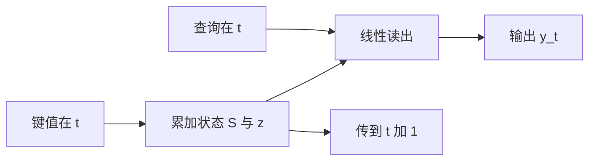

# Linear Attention

若把核特征写进查询与键，注意力可以先把键值收成状态，再与查询相乘；自回归于是退回一种循环。

<footer>—— Angelos Katharopoulos 等, Transformers are RNNs, 2020</footer>

Softmax 注意力要对每个查询扫全部键，才得到归一化权重，代价 $\Theta(n^2 d)$。Katharopoulos 等人 2020 年指出：若用核特征 $\phi$ 代替 softmax，使 $\mathrm{sim}(q,k)=\phi(q)^\top\phi(k)$，则可以先结合 $\phi(k)$ 与 $v$，把对 $n$ 的依赖变成对特征维的线性。因果情形下，累积状态逐步更新，Transformer 层看起来像 RNN，却仍由注意力公式派生。这与 [Performer](/llm/performer-favor) 的随机特征逼近 softmax 是同一条「核化」河的上游：本篇用确定特征把二次降为线性，下一篇再讨论如何逼近真正的 softmax 核。稀疏图路线见 [BigBird / Longformer](/llm/sparse-attention-patterns)，那是选边而不是换核。

## 问题

标准注意力

$$
\mathrm{Att}(Q,K,V)=\mathrm{softmax}\!\left(\frac{QK^\top}{\sqrt{d}}\right)V
$$

先物化 $n\times n$ 的相似度，再对行归一化。归一化让权重成为单纯形上的尖峰，这是检索与复制的来源，也锁死了二次。若任务可以接受更平滑的相似度，就不必经过这张大矩阵。目标是：保持「用查询去读一组键值」的接口，但把复杂度写成 $\Theta(n d^2)$ 或 $\Theta(n d)$，并在因果生成时只维护常数量的状态，而不是长度为 $n$ 的 KV 列表。

挑战在于特征 $\phi$ 选不好会塌。$\phi$ 太弱，模型分不清近邻与无关位置；$\phi$ 维太高，线性项 $d_\phi^2$ 把收益吃掉。另外，去掉 softmax 后没有「竞争」，多键可以同时以大正值贡献，输出容易被范数大的键主导，训练要重新调尺度。

## 方法

### 核特征与结合律

令 $q'=\phi(q),k'=\phi(k)$。未归一化的注意力变成 $\sum_j q'^\top k'_j\, v_j$。把标量 $q'^\top k'_j$ 挪开：

$$
\sum_j (q'^\top k'_j)\,v_j=\Big(q'^\top\Big)\Big(\sum_j k'_j v_j^\top\Big)
$$

右侧先算 $S=\sum_j k'_j v_j^\top$，尺寸 $d_\phi\times d_v$，与 $n$ 无关，再左乘 $q'$。若还要模拟 softmax 的分母，另累加 $z=\sum_j k'_j$，输出 $q'^\top S / (q'^\top z)$。整段序列扫描一次即可。Katharopoulos 采用 $\phi(x)=\mathrm{elu}(x)+1$，保证非负，分母不易翻号。

结合律是唯一的代数来源。只要相似度能写成 $\phi(q)^\top\phi(k)$，求和就能换序。softmax 的 $\exp(q^\top k)$ 一般不能写成有限维确定特征的内积，所以朴素线性注意力不是 softmax 的精确改写，而是换了一种核。

### 因果情形下的 RNN 形式

因果要求位置 $t$ 只用 $j\le t$。把前缀和写成状态：

$$
S_t=S_{t-1}+\phi(k_t)v_t^\top,\quad z_t=z_{t-1}+\phi(k_t)
$$

$$
y_t=\frac{\phi(q_t)^\top S_t}{\phi(q_t)^\top z_t}
$$

这与 RNN 相同：每步 $O(d_\phi d_v)$ 更新，状态大小与 $t$ 无关。训练仍可并行：用前缀和或扫描算全部 $S_t$，不必逐步循环。这是线性注意力相对传统 RNN 的训练优势——并行扫描代替 BPTT 的长链。生成时则真正逐步，KV 缓存被常数量矩阵取代。

### 与 softmax 的表达差距

Softmax 可以把几乎全部质量分给单一键，完成精确拷贝。线性核的权重 $\phi(q)^\top\phi(k)$ 是平滑内积，尖峰取决于 $\phi$ 是否能把无关键推到近零。ELU+1 特征偏软，长程检索、针测通常明显弱于 softmax。加深加宽可以补一部分，但经验上「抄一段原文」仍是短板。这也是为何后续出现 Performer：不是放弃线性，而是把 $\phi$ 改成对 softmax 核的无偏（或低偏）随机特征。

归一化项 $q'^\top z$ 在长序列上会涨，输出尺度漂移。常见补丁是再对 $y$ 做 LayerNorm、对 $\phi$ 做 $\ell_2$ 归一，或引入门控（后来的线性 RNN / RetNet 一系把门控当成一等公民）。本篇停留在 2020 年的核注意力本身，不把后续混合架构算进「Linear Attention」定义里。

## 机制

计算图从「$n\times n$ 矩阵 × $n\times d$」变成「$n$ 次外积累加 + $n$ 次矩阵–向量」。算术强度更高，也更适合把状态放在寄存器里。数值上，外积累加是低秩更新，$S_t$ 的条件数随 $t$ 变坏，长序列要用更高精度累加，或分块重正交。因果并行扫描的梯度经过所有前缀，对学习率与裁剪敏感，但比二次注意力的显存小一个数量级。

注意力头仍可多头：每头一套 $S^{(h)}$。与 [MQA](/llm/mqa) 不同，这里省的不是 KV 头数，而是序列维。两者正交：线性注意力照样可以共享 KV 投影，但收益要从新屋顶线评估，因为瓶颈可能已从带宽变成 $d_\phi\times d_v$ 的状态更新。状态矩阵 $S$ 的秩被外积累加一步步抬高，却没有 softmax 那种竞争性的稀疏化。长上下文后期，$S$ 更像一团糊在一起的充分统计量。这就是拷贝失败的机制：查询读到的是混合物，不是某一行键值。

训练并行扫描时，前缀和可以分块：块内串行更新 $S$，块间再拼接。这与 FlashAttention 的分块归约形似，但中间量是 $d_\phi\times d_v$ 的矩阵而不是一组 m 统计量。块边界必须把 $S,z$ 以高精度写出，否则下一块的读出会漂。因果掩码在这里不是下三角矩阵，而是「只累加到 $t$」的扫描语义，写错成双向前缀和会泄漏未来。

## 边界与工程取舍

不要在必须精确检索的产品路径上单独使用 ELU 线性注意力顶替 softmax。它更适合作为混合层里的便宜长程通道，或对局部已由卷积/滑窗覆盖的信号做平滑汇总。特征维 $d_\phi$ 是新的旋钮：$d_\phi\ll d$ 才有加速，$d_\phi$ 接近 $n$ 时线性优势消失。内核生态弱于 FlashAttention，朴素 PyTorch 实现容易比分块 softmax 还慢——复杂度优势必须落到融合核上才算数。

与 SSM / Mamba 的分工见相邻组：线性注意力的状态来自核特征外积，SSM 的状态来自结构化递归；二者都是常量化记忆，但数值与硬件栈不同。取舍时先写清失败任务（拷贝、针测），再决定是换 $\phi$（走向 Performer），还是放弃核化、改回稀疏 softmax。「线性」描述的是对 $n$ 的渐近，不是保证更快。短序列上 $n^2 d$ 已经被 Flash 压得很低，再上一个未融合的 $n d^2$ 核只会更慢。长度与内核成熟度是启用条件。

## 小结

- 核特征把相似度写成内积后，可先收键值再读查询，复杂度对 $n$ 线性。
- 因果形式是对状态 $S_t,z_t$ 的扫描，生成时常数状态，训练可并行前缀和。
- ELU+1 等确定特征不逼近 softmax，尖峰弱，精确拷贝是短板。
- 分母累积与 $S_t$ 条件数是长序列数值问题，需要归一与高精度累加。
- 实际加速取决于融合核与足够大的 $n$，短上下文常常不值得换。
- 要逼近 softmax 核，下一步是 FAVOR+，而不是把 $d_\phi$ 盲目加大。
- 出处：Katharopoulos et al., *Transformers are RNNs: Fast Autoregressive Transformers with Linear Attention*, ICML 2020。
