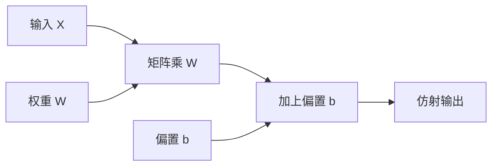

# 线性层与偏置

过原点的线性映射不能表示平移；加上与输入无关的偏置，仿射层才能把超平面从原点挪开。

<footer>—— 据 Goodfellow, Bengio &amp; Courville, Deep Learning, 2016 整理</footer>

[梯度消失与爆炸](/llm/vanish-explode-grad)收束了反向单元。本课起进入前馈网络，不重推连乘。缺口是：矩阵乘课写下 $y=Wx$，所有决策面过原点。分类与回归都需要平移。方法是仿射：$y=Wx+b$。激活、初始化、残差都默认层已经是仿射的。本课只补 $b$ 这一项，不把 MLP 堆完。

## 问题

$y=Wx$ 对 $x\mapsto\lambda x$ 齐次：输入全零，输出全零。若真实规律是「特征小于阈值才激活」，阈值不在原点，纯线性层必须靠前面某一层把原点「搬」到数据上，而这通常搬不干净。缺口不是再增加 $d_{\mathrm{out}}$，而是每个输出通道加一个与 $x$ 无关的标量 $b_i$。

形状上 $b\in\mathbb{R}^{d_{\mathrm{out}}}$，对 $(B,n,d_{\mathrm{out}})$ 广播相加——第一课的规则在这里落地。参数量多 $d_{\mathrm{out}}$，相对 $d_{\mathrm{in}}d_{\mathrm{out}}$ 通常可忽略，但几何上不能忽略：$b$ 决定超平面的偏移。注意力里的投影有时省略 $b$，那是实现选择，含义仍是「过原点」；本课把带 $b$ 的仿射当默认。

### 偏置不是正则项里的「又一组权重」

权重衰减课提过：偏置有时不衰减。原因：$b$ 的尺度与「函数复杂度」关系弱，罚 $b$ 等于强迫决策面靠近原点，和罚 $W$ 不是同一归纳偏置。把 $b$ 与 $W$ 绑在同一 $\lambda$ 下，可能让模型用更大的 $\|W\|$ 去补偿被压小的偏移。不是必须分开，但分开是常见且合理的。不要把 $b$ 理解成 Dropout 那种随机正则。

实现上常把 $b$ 融进 GEMM：给 $x$ 增一维常数 $1$，$W$ 增一列。数学上等同仿射。框架的 Linear 默认有 bias=True。读论文时要看清投影是否带 bias。

## 方法

$Y=XW^\top+b$，反向在线性层规则上增加 $\mathrm{d}b=\sum_{\mathrm{batch,seq}}\mathrm{d}Y$，即对所有共享该偏置的位置求和。$b$ 的梯度没有「输入」相乘，尺度只由上游 $\mathrm{d}Y$ 决定，有时比 $\mathrm{d}W$ 更大或更小，诊断时应分开看。初始化 $b$ 常为 $0$，把开始时的平移交给数据来学；非零 $b$ 用于输出层的类先验，本课不展开。

## 机制

仿射层把线性代数里的仿射空间还给网络：先线性变换，再平移。堆叠多个仿射而不加非线性，复合仍是一个仿射，参数白费——这是下一课激活的动机，本课先把「一层」定义完整。残差里的 $h+f(h)$ 要求 $f(h)$ 与 $h$ 同形；若 $f$ 是仿射，$b$ 提供与 $h$ 无关的常值支路，可能改变残差的均值，LayerNorm 稍后会再管均值。这里只需承认：$b$ 会进入残差流的直流分量。

输出层的 $b$ 常常比隐藏层更值得看：它直接加在 logits 上，平移不变的 softmax 会吃掉与类无关的公共偏置，但类之间的相对 $b$ 仍改变先验。把输出偏置初值设成 $\log$ 类频率，可减少早期「平均预测离数据太远」造成的无谓梯度。隐藏层则很少需要这种先验。

没有 $b$ 时，某些对称数据上的函数类仍够用；有 $b$ 时，优化少做一次「用权重去造平移」。默认加上，省略时要说理由。

## 边界

本课不讲激活，不讲为何随机初始化 $W$。下一课[激活：ReLU 与饱和](/llm/activation-relu-saturation)才让堆叠不再退化成一层仿射。后课默认：线性层指仿射 $Wx+b$；若某投影去掉 $b$，会显式写出。LayerNorm 的 $\beta$ 是另一处偏移，不要与本课的 $b$ 混成同一个参数。

## 小结

- 仿射层 $y=Wx+b$ 才能平移决策面；纯线性过原点。
- $b$ 按批与序列广播，反向对那些轴求和。
- 权重衰减常常不罚 $b$，避免把偏移一并压回原点。
- 多层仿射无激活仍是一层仿射，非线性是下一课的缺口。
- 出处：Goodfellow et al., Deep Learning, 2016。
