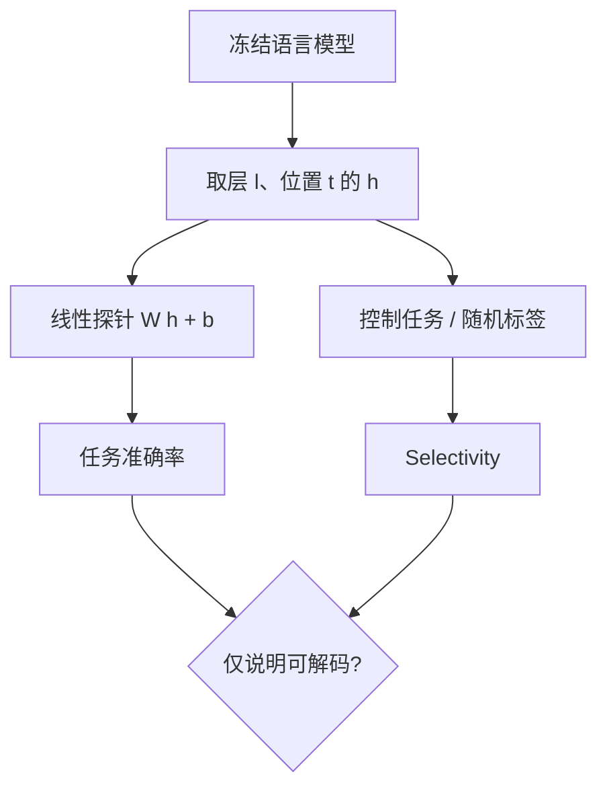

# Probing 线性探针

我们把线性分类器接到中间层上，询问这些层是否已经编码了某个目标性质——探针能线性读出，说明信息以近线性的形式存在。

<footer>—— Alain & Bengio, Understanding Intermediate Layers Using Linear Classifier Probes, arXiv:1610.01644, 2016</footer>

探针（probing）是一种诊断：冻结被解释的网络，在选定表示上训练一个简单读出头，看某类信息能否被读出。线性探针把读出头限制为仿射分类器或回归器，容量刻意很低。若线性头都能预测句法、时态、事实属性，说明这些性质已经以近线性的方式写在表示里。Alain 与 Bengio 最初用它观察深度分类网的中间层；后来 Hewitt、Manning、Belinkov 等人把它变成 NLP 表示分析的标准动作。它回答「有没有」，不回答「模型有没有用」。

## 问题

表示是高维向量，人无法直接读。下游任务准确率把编码、解码、任务头缠在一起，说不清失败发生在哪一段。探针把问题拆开：给定 $h$，是否存在简单函数 $f$ 使 $f(h)$ 预测属性 $y$。若 $f$ 很强，几乎总能拟合，诊断没有分辨力。线性限制是为了让「读得出」接近「方向已经在」。

失败模式对称。探针准确率高，可能是表示真有该性质，也可能是探针记住了词面捷径。准确率低，可能是信息在非线性流形上，也可能根本不在。因此探针实验必须配控制：随机标签、词袋基线、选择控制（selectivity），以及与因果干预的对照。

### 结构探针与分类探针

Hewitt 与 Manning 在 NAACL 2019 的结构探针里不预测离散标签，而是学一个线性变换，使变换后的平方距离近似句法树上的距离。这仍是线性读出，对象换成几何。分类探针预测词性、实体类型、事实对错；结构探针预测树距、深度。两者都在问线性可解码性，但评价协议不同，不能拿分类准确率去否定树距相关。

Belinkov 在 *Probing Classifiers: Promises, Shortcomings, and Advances*（Computational Linguistics, 2022）里系统批评了「准确率即解释」。探针是上界式证据：信息可以被读，不证明原模型的后续层在读。把探针当成电路证明，是类别错误。

## 方法

固定检查点，抽一层、一个位置（或平均池化）的激活 $h\in\mathbb{R}^{d}$，数据集 $\{(h_i,y_i)\}$。线性探针学

$$
\hat{y} = \mathrm{softmax}(Wh + b)
$$

或二分类的 logistic。正则必须强：权重衰减、早停，避免在 $d$ 很大时记住训练集。评测用与预训练、探针训练都分离的集合。层间扫描可以画出「该属性最早线性可分出现在哪一层」。

控制任务（control task）把标签按词型随机化，探针若仍很高，说明容量在记词面，而不是在读结构。Selectivity 定义为语言学任务准确率减去控制任务准确率。Hewitt 与 Liang 的工作让这一控制成为习惯。随机初始化的同结构网络上再跑一遍探针，用来估计「任意高维向量 + 线性头」的基线。

### 与 logit lens、因果探针的关系

Logit lens 是一种不另训 $W$ 的探针：读出矩阵就是 $W_U$。线性探针允许任意标签空间，不必是词表。因果探针则进一步要求：沿探针方向做消融或修补，下游行为应变化。Park 等人后来在线性表示假设里证明，适当的内积下，线性探针方向与干预方向可以统一；那是对探针结果的几何升级，不是探针协议本身。

实践上常先用线性探针做普查（哪一层有性别、有树距、有真实性），再把高分方向送去激活修补或转向向量。探针便宜，适合当过滤器。

## 机制

线性可分意味着存在超平面把 $y$ 的取值切开。在残差流里，这通常被解释成「概念沿某一方向编码」。叠加（superposition）允许许多概念共用维度，探针仍可能读出，只要在当前数据分布上投影可分。分布一变，同一超平面可以失效——所以探针泛化到新领域比训练集准确率更有价值。

### 位置与聚合如何改变结论

在语言模型里，$h$ 取自哪个 token 决定探针在问什么。取当前词，问的是词级属性；取句末，问的是句级属性；取主语位置，问的是关于该实体的事实。平均池化会把位置特异的信息稀释，也可能制造出原模型从未在单点使用的聚合特征。报告探针结果必须写明层、位置、是否池化。否则「BERT 第 7 层有句法」无法复现。

非线性探针（MLP 读出）几乎总能抬高准确率，同时毁掉解释。若目的是证明信息存在，非线性头给出的是更松的上界；若目的是证明线性表示，只能用线性头。两者不要画在同一张「探针性能」图上冒充同一度量。

信息存在的层，不必是信息被使用的层。早期层线性可分的词性，可能只是词嵌入已有的统计；模型真正用词性做消歧，可能发生在中层注意力。探针曲线上升的拐点，是「可解码」的拐点，不是「被计算使用」的拐点。

## 边界与工程取舍

探针不能单独承担机制主张。它最适合：比较层、比较模型、比较训练阶段（例如 grokking 前后某方向是否出现）。它不适合：宣称找到了电路、宣称模型「知道」某事实。事实可能被探针从共现里读出，而生成时从不使用。

数据集偏差会伪装成表示质量。若标签与词频、长度、语言绑定，探针学的是这些表面变量。应报告与表面基线的差，而不是绝对准确率。对生成模型，还应检查探针方向与 $W_U$ 行向量的对齐：若完全对齐某个词，探针可能只是在读词表方向，而不是独立概念。

在指令微调或 RLHF 之后重跑探针，标签分布会变。拒答、格式化、安全策略会改写同一层的可分性。比较预训练与对齐后的探针，必须控制提示模板，否则看到的是提示分布漂移，不是表示几何变化。

## 小结

- 线性探针用低容量读出头询问：某属性是否已近线性地写在选定表示里。
- 高准确率是信息存在的上界证据，不是模型使用该信息的证明。
- 必须配控制任务、随机模型基线，并写清层与 token 位置。
- 结构探针把线性读出用到几何（树距），与分类探针同族不同协议。
- 探针适合普查与过滤，机制结论要交给干预实验。
- 出处：Alain & Bengio, arXiv:1610.01644, 2016；Hewitt & Manning, NAACL 2019；Belinkov, *Computational Linguistics*, 2022。
