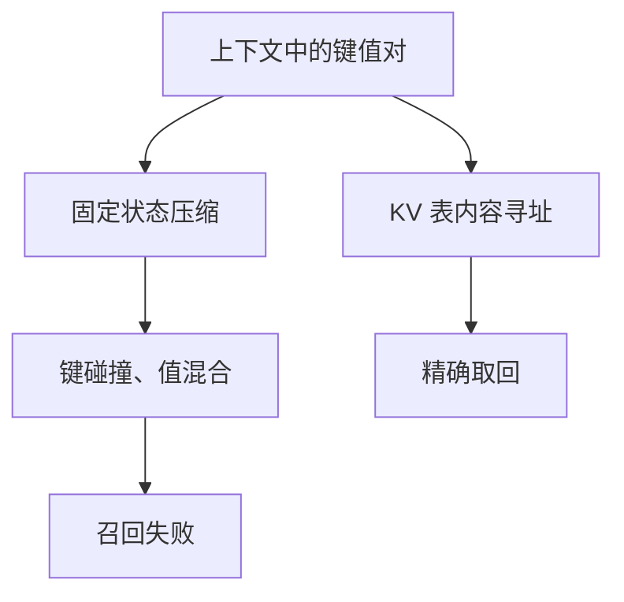

# 线性模型的召回瓶颈

固定大小状态是有损压缩；在需要精确拷贝远距 token 的基准上，纯线性混合会系统性失败，除非插入真正的内容寻址。

<footer>—— Arora et al., Simple Linear Attention Language Models Balance the Recall-Throughput Tradeoff, 2024；亦见其对 Zoology 式受控检索任务的分析</footer>

[上一课](/llm/hybrid-layer-ratio)断言 $r=0$ 不行，没有把「不行」写成可测的缺口。本课补召回瓶颈：在联想检索、MQAR 一类任务上，[线性注意力](/llm/linear-attention)、[选择性扫描](/llm/selective-scan)、[长卷积](/llm/long-convolution) 相对 softmax 的失败模式。下一课把瓶颈量化到状态维 $N$ 对上下文 $n$ 的关系。本课先定性：失败的是**精确身份**，不是困惑度曲线好看就够。

## 问题

语言建模困惑度可以被局部统计带得很低，掩盖「一百步前那个随机键对应的值」有没有被记住。受控任务把键值对塞进上下文，要求模型在末尾按键取回值。Softmax 注意力在表还塞得下时几乎完美。线性状态必须把整张表压进 $N$ 维或 $d\times d$ 矩阵。缺口是承认：**吞吐基准不能替代召回基准**，混合架构的 $r$ 应由召回曲线决定下限。

Arora 等人用这类任务比较基于线性注意力的模型与注意力，并讨论用少量注意力或改进的线性机制换吞吐。本课取诊断，不把 BASED 型号当词条。

「召回」在这里是上下文内精确取回，不是检索增强生成的语料库召回，也不是医学召回率那个词。

## 方法

构造长度为 $n$ 的序列：若干 $(k_i,v_i)$ 散布其中，查询 $k^*$ 出现在末尾，标签是对应 $v^*$。变化：键是否重复、是否需要同时记住多对、干扰项密度、距离分布。测准确率对 $n$、对状态维、对是否含一层 softmax。把同一数据上的 LM 困惑度并列，观察两者解耦。

诊断线性失败：若加大 $N$ 或矩阵状态维，召回上升，则是容量问题；若加大到接近 $nd$ 仍差，则是更新规则问题（加性糊掉、无竞争）。Delta / 少量注意力通常对第一类有帮助，对「任意稀疏同时多对」仍要内容寻址。

### 和注意力汇、长度缩放

召回失败有时被误诊为 sink 或温度。把长度缩放、门控调到最优仍失败，且全注意力基线成功，才能归因于压缩。本课实验顺序：先保证 softmax 基线通过，再换线性层。

## 机制

SSD 对偶已经说明线性模型对应低结构的注意力矩阵，秩受 $N$ 限制。多对精确绑定需要近乎对角、位置特异的权重，满秩才稳。压缩后键碰撞，读出是若干值的线性混合，准确率按碰撞率下降。选择与门控降低噪声写入，改善有效信噪，但**不增加秩的数量级**。

困惑度对碰撞不敏感：多数 token 不需要那对精确绑定。这就是为何只看 LM loss 会选出过小的 $r$。

代码补全、多跳问答、长文档指代，是召回瓶颈在真实数据上的投影。受控任务用来定下限，不是用来刷榜。

## 边界

受控任务可以做得对注意力过于友好（键随机、值短），从而低估线性模型在有结构键上的表现。反过来，若任务可被统计捷径解决，会高估线性。应用结论时要对齐任务结构。下一课给出 $N$ 对 $n$ 的粗规则，避免只停留在「线性不行」的口号。混合比课的 $r>0$ 在本课拿到证据。

## 小结

- 固定状态把上下文压成有损摘要，精确远距取回会系统性失败。
- 困惑度掩盖该失败；须用受控召回任务与注意力基线对照。
- 加大状态、delta、选择能改善容量与信噪，不把秩提到满 KV 表。
- 混合架构的注意力层是为这条瓶颈预留的内容寻址。
- 出处：Arora et al., 2024。
