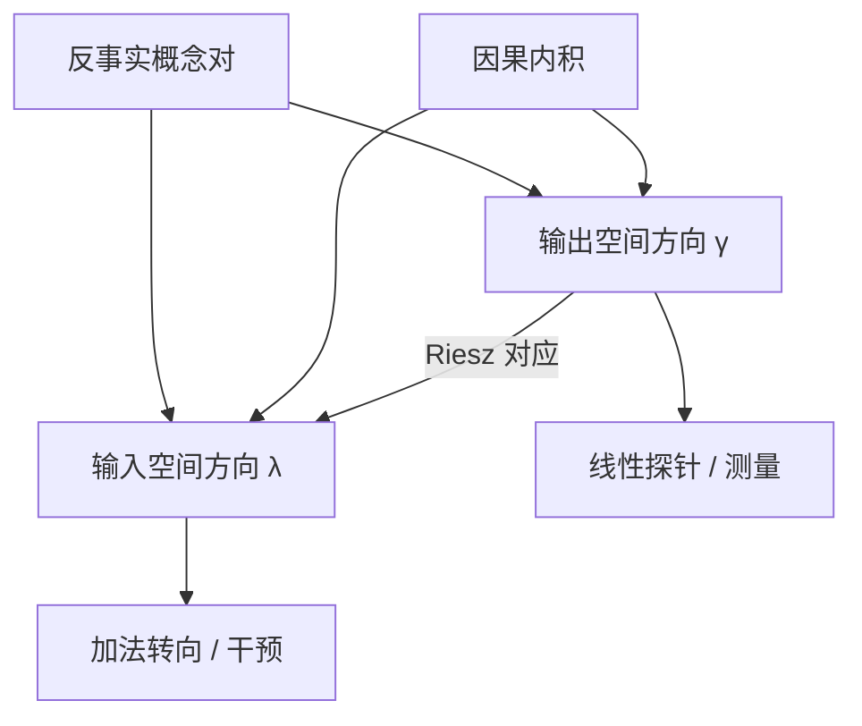

# 线性表示假设

非正式地说，线性表示假设认为高层概念在表示空间里沿某些方向线性编码。

<footer>—— Park, Choe & Veitch, The Linear Representation Hypothesis and the Geometry of Large Language Models, ICML 2024</footer>

词向量算术（king − man + woman ≈ queen）早就暗示：语义关系可以是方向。语言模型的残差流把这一直觉从静态词表扩到上下文表示。线性表示假设（linear representation hypothesis, LRH）主张，许多高层概念——性别、时态、真实性、拒答——表现为空间中的方向，因而能被线性探针读出，也能被加法干预改写。Park、Choe 与 Veitch 在 ICML 2024 把这句口号写成反事实语言下的定义，并指出：没有选对的内积，余弦相似度和投影都可能没有语义。本篇写两种形式化、与探针/转向的对应、以及叠加对该假设的限制。

## 问题

「线性」在文献里至少混用三种意思。一是探针可分：存在超平面切开正负例。二是干预可加：沿 $v$ 移动会单调改变概念。三是类比算术：概念差向量可迁移。这三者在任意内积下并不自动等价。欧氏点积把高方差维度当成「更近」，而这些维度可能只是词频。于是出现一种尴尬：探针很准，转向却带动无关概念；或词表空间里的差向量，加到上下文残差上并不工作。

Park 等人要回答两个问题：线性表示究竟指什么；表示空间里该用哪种几何。他们用反事实：若只有概念 $W$ 从 $w^-$ 变到 $w^+$，表示应沿固定方向移动。对输出（词）空间与输入（上下文）空间分别定义，再证明它们对应探针与转向。

### 可分不等于可干预

分类边界的法向量是读出方向；干预需要的是写入方向。在不正交的基下，读出与写入不是同一个向量。这解释了为何随便拿探针权重去加残差，效果不稳定。LRH 的有内容版本必须同时指定测量与干预，以及二者之间的对应。

Mikolov 的词类比是 LRH 的史前史，对象是静态嵌入。上下文残差里同一概念会随层变化，末层还要过解嵌。把 word2vec 的差向量直接当 LLM 转向向量，等于假设嵌入空间与残差空间共享几何——通常不成立。

## 方法

输出空间的线性表示：概念 $W$ 对应词表表示上的方向 $\bar{\gamma}_W$，使得反事实词对的差与 $\bar{\gamma}_W$ 对齐。这与线性探针相连——探针在读这个方向上的投影。输入空间的线性表示：概念对应上下文残差上的方向 $\bar{\lambda}_W$，加法干预沿 $\bar{\lambda}_W$ 滑动概念，而不改变因果上可分的其他概念。这与转向相连。

关键构造是因果内积：在这套内积下，因果可分的概念被表示为正交向量。Park 等人证明，用这套内积可以通过 Riesz 对应把输出方向映成输入方向，于是词对差可以生成转向向量。估计上，他们用解嵌矩阵的协方差来近似该内积，并在 LLaMA-2 上验证：按因果内积构造的向量，比裸欧氏差更少泄漏到无关概念。

### 反事实对的操作定义

实践中很少有完美反事实。近似是成对词或成对句子，尽量只在目标属性上不同。对质量决定估计出的方向。性别、时态这类有最小对的概念最适合检验 LRH；「有害性」几乎必然与话题纠缠，正交性只会近似成立。实验部分应报告：目标概念的可控制性，以及声称可分的对照概念是否保持不动。

## 机制

若下一层计算近似线性，方向编码可以在残差里传播：注意力与 MLP 的一阶效应是矩阵乘，投影可以保存。非线性（ReLU、注意力 softmax）会扭曲，但在工作点附近仍常有可用的一阶方向。这与叠加理论相容：Elhage 等人的玩具模型显示，稀疏概念可以以几乎正交的超完备方式塞进低维，线性读出仍然可能，干预却会碰到干扰。

### 统一探针与转向

在因果内积下，测量表示与干预表示是对偶的。探针准确率高，意味着存在读出方向；用对偶映到干预方向，加法应改变该概念。这给工程一个处方：不要把 $W_{\mathrm{probe}}$ 直接当 $v_{\mathrm{steer}}$，先按估计的内积做一次转换。LLaMA-2 实验表明这一转换是值得的——欧氏几何下「正交」的概念，在因果内积下才真正分开。

内积选错时，余弦相似在解释性论文里没有字面意义。报告特征之间「相似」，应说明用的是欧氏、因果、还是白化后的点积。否则读者无法判断那条边是语义还是方差伪影。

LRH 不要求所有概念都线性。它要求：当我们声称某个概念可解释、可控制时，应能指出方向，并在选定几何下做测量与干预。失败案例（高度非线性的绑定、必须用多方向子空间才能表达的关系）应被当成假设的边界，而不是忽略。

## 边界与工程取舍

叠加、多义层、以及「概念」本身切得太随便，都会让单方向模型破产。有的属性更像子空间或凸锥，而不是一条线；强制压成 $v$ 会在 $\alpha$ 大时崩。层选择仍然经验：中层常比嵌入层更符合 LRH，因为计算已经发生、解嵌尚未把几何拧到词表频率上。

把 LRH 当本体论（「模型真的用方向思考」）过强；当方法论（「先试线性读写，失败再上非线性工具」）则很有效。SAE 特征、归因图、转向向量，都在赌某种线性结构。赌赢时解释便宜；赌输时不要硬编故事。

因果可分是相对于干预集而言的。若你从未干预「语体」，就不能声称情感方向与语体正交。正交性声明必须带干预清单，否则只是训练集上的不相关。

## 小结

- 线性表示假设认为高层概念沿方向编码；正式化需要反事实，而不是一句「能被线性分类」。
- 测量方向与干预方向在一般内积下不是同一个向量；因果内积把二者统一。
- 探针对应输出空间的线性可读，转向对应输入空间的线性可写。
- 欧氏余弦可能被词频主导；几何选择是实质问题，不是绘图口味。
- 叠加与非线性规定了假设的边界：先试方向，失败则承认需要子空间或电路。
- 出处：Park, Choe & Veitch, ICML 2024（arXiv:2311.03658）；词类比见 Mikolov et al.；叠加见 Elhage et al., *Toy Models of Superposition*, 2022。
