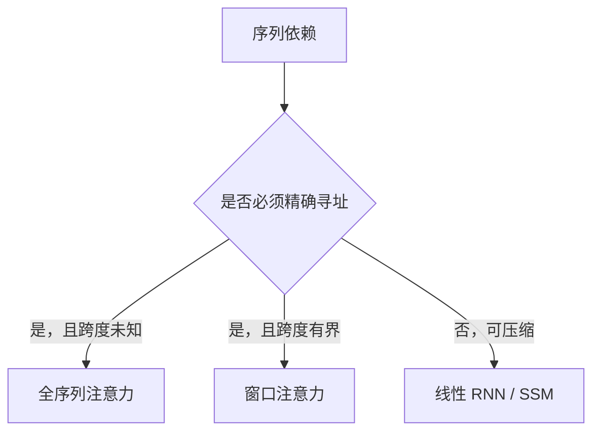

# 线性 RNN 与注意力的分工

注意力保存可寻址的过去；线性循环保存可压缩的过去。混合架构是在这两种记忆之间分配深度和宽度。

<footer>对照 Mamba、Griffin、Jamba 的共同结构</footer>

混合架构看起来像口味问题，其实是两种记忆接口不能互相吞掉对方的失败：注意力付得起地址、付不起长度；线性循环付得起长度、付不起任意精确拷贝。Griffin、Jamba、Mamba-2 只是在这条界上选了不同的切割方式。本篇把切割本身写清楚，细节公式留给各自专文。

## 问题

序列层只做一件事：让位置 $t$ 看见 $1\ldots t$ 的信息。看见的方式有两种极限。一种是**表**：把每一步的键值留下，查询时做匹配——softmax 注意力。一种是**状态**：把每一步折叠进固定向量，下一步只读这个向量——线性 RNN、选择性 SSM、RG-LRU。

两种极限对应两种失败。表的失败是资源：时间 $O(L^2)$ 或缓存 $O(L)$。状态的失败是信息：宽度固定，任意精确检索无法保证。2023–2024 年的混合模型并不是折中美学，而是承认这两类失败不能互相消化，只能**分工**。

本篇不展开 Mamba 的离散化、Griffin 的门公式或 Jamba 的层周期，只讨论分工本身：什么计算必须留给注意力，什么计算应当交给线性循环，以及这条边界在工程上如何被量出来。

「线性 RNN」在这里统称可扫描的对角或低秩递推，包括选择性 SSM 与 RG-LRU，排除不可扫描的非线性 GRU/LSTM。

### 评测把分工暴露出来

语言建模的负对数损失对两种层都友好：局部统计足够降 perplexity。一旦任务变成「在长上下文里找回唯一的键」或「按示范格式逐 token 拷贝」，纯状态模型掉点，纯注意力模型不掉但缓存先爆。分工的判据不在损失曲线的前半段，在检索与缓存同时被测量的时候。

## 方法

分工的方法是把记忆写成两种接口，再在深度上分配。

注意力接口：查询 $q_t$ 对 $\{k_j, v_j\}_{j \le t}$ 做

$$
y_t = \sum_{j \le t} \mathrm{softmax}(q_t^\top k_j)\, v_j.
$$

每个过去位置保持独立地址。代价是保存全部 $k,v$，或对它们做窗口、稀疏、核近似——近似一旦破坏地址的可分辨性，就滑向状态。

线性循环接口：

$$
h_t = a_t \odot h_{t-1} + b_t \odot x_t,\qquad y_t = c_t \odot h_t.
$$

$h_t$ 是对过去的充分统计（在线性假设下）。$a_t$ 小于一的时候，旧信息按指数遗忘；选择门可以保护某些方向，但不能把宽度 $N$ 变成 $L$ 个可独立寻址的槽。

混合的方法因此只有几条轴：

- **深度交错**：若干层注意力、若干层循环（Jamba）。
- **范围切割**：注意力只看窗口，循环看全局（Griffin）。
- **算子对偶**：同一层既能当扫描也能当结构化注意力（Mamba-2 的 SSD），仍不提供任意地址。

### 把「该用哪一种」写成任务性质

需要**内容寻址、抗压缩**的计算：精确拷贝、符号绑定、示范对齐、任意位置的键值查找。留给注意力，或留给窗口足够覆盖该依赖的局部注意力。

需要**积分、平滑、长程主题**的计算：语气、篇章约束、可损失的背景。交给线性循环。选择门（$\Delta$ 或 RG-LRU 的 $r_t$）决定写入，不决定随机访问。

一条依赖若既要长又要精确，单一接口不够：要么加宽状态直到接近 KV 的信息量（通常不划算），要么在路径上放一层真注意力。

## 机制

### 复杂度与状态的对照

| 接口 | 训练对 $L$ | 推理状态 | 精确检索 |
| --- | --- | --- | --- |
| Softmax 注意力 | 二次（或窗口线性） | $O(L)$ KV | 强 |
| 线性 RNN / SSM | 线性扫描 | $O(1)$ 宽 | 弱，受宽度限制 |
| 局部注意力 + 循环 | 窗口二次 + 扫描线性 | $O(w)+O(1)$ | 窗口内强，窗外弱 |
| 稀疏全注意力 + SSM | 按注意力层比例 | $O(L/l)$ KV | 取决于注意力密度 |

表不是实现细节，是接口契约。改 kernel 不能把 $O(1)$ 状态变成任意检索；加一层注意力才能改契约。

### 选择不等于注意力

Mamba 的 $\Delta_t$、Griffin 的 $r_t$ 都是内容门控。门控改变的是**写入与遗忘的时间尺度**，不是在 $L$ 个键里做一次归一化匹配。把「选择性 SSM」说成「线性注意力」可以在 SSD 的矩阵形式上成立，但在检索语义上不成立：半可分矩阵的秩由状态宽约束，softmax 注意力的有效秩可以随匹配模式升到 $L$。

SSD 证明扫描与结构化矩阵乘对偶，并不证明结构化矩阵能逼近任意注意力矩阵。

## 边界与工程取舍

分工是启发式，会被数据打脸。若预训练语料几乎不要求长程精确拷贝，纯循环的损失可以很好看，部署后在用户的检索型提示上翻车。若评测全是针堆，混合模型会被逼着把注意力加密，循环层变成昂贵的残差装饰。正确的工程顺序是：先列出产品真正的依赖类型，再分配层，而不是先选一个时髦骨架再找任务。

宽度可以买回一部分检索：状态宽到与 $d_{\text{model}} \times L$ 同量级时，循环在信息上接近 KV，成本也接近，分工失去意义。实用的循环层状态远小于 KV，这是它便宜的原因，也是它的上限。

另一条边界是实现复杂度。两套 kernel、两套量化、两套并行，只有在缓存或长度确实构成墙时才值得。短上下文聊天机器人里，纯 GQA Transformer 往往更简单，分工是过度设计。

MQA/GQA 压缩的是头数，不是序列维上的地址；它们仍是注意力，只是 KV 更窄，与线性 RNN 不是同类取舍。

## 小结

线性 RNN（含选择性 SSM、RG-LRU）与注意力的分工是记忆接口的分工：前者付固定状态、做有损压缩，后者付 KV、做可寻址匹配。Griffin 按范围切（窗口对全局循环），Jamba 按深度切（稀疏散布全注意力），Mamba-2 按算法切（扫描对结构化矩阵），都没有取消这条界。设计混合模型时，应先问依赖要不要精确地址，再决定那一层能不能写成扫描。出处见 Gu & Dao（Mamba，2023）、Dao & Gu（Mamba-2，2024）、De 等（Griffin，2024）、Lieber 等（Jamba，2024）。
