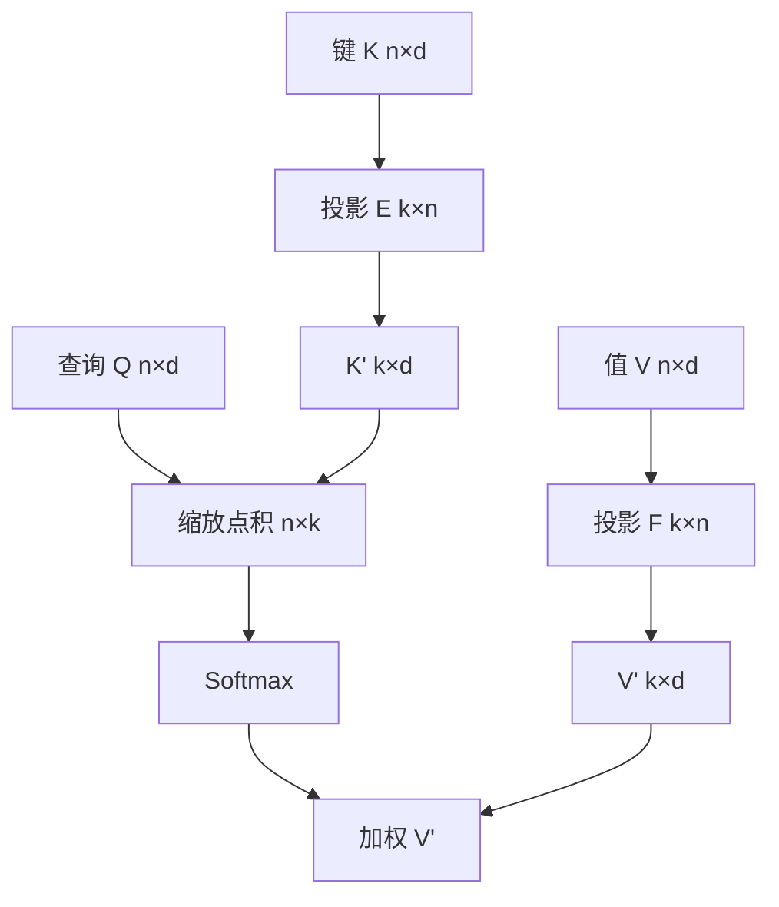

# Linformer 投影

    
若自注意力权重矩阵低秩，就可以先把长度维的键值投影到固定的 $k$ 个槽，再做缩放点积；复杂度对序列长度线性，softmax 仍留在投影之后。

    <footer>—— Wang, Li, Khabsa, Fang & Ma, Linformer: Self-Attention with Linear Complexity，arXiv:2006.04768，2020</footer>

2020 年 Wang 等人的 Linformer 不删边、不换核，而是在长度维上插两个投影矩阵 $E,F\in\mathbb{R}^{k\times n}$，把键和值从 $n$ 条压成 $k$ 条，再让全部查询去读这 $k$ 个槽。softmax 的对象变短，分数矩阵从 $n\times n$ 变成 $n\times k$。本篇按原文把这一投影怎么接进多头注意力、低秩命题在说什么、以及 $E,F$ 能否共享写完。架构导读见 [Linformer](/llm/linformer)。它与 [线性注意力](/llm/linear-attention) 的核结合律、[Performer](/llm/performer-favor) 的随机特征不是同一条代数。

## 问题

编码器自注意力的显存在 $n=512$ 时尚可，$n$ 到几千时 $P=\mathrm{softmax}(QK^\top/\sqrt{d})$ 先存不下。稀疏图靠删边保住尖峰；核化靠换相似度以换取结合律。第三条路是承认：**已经形成的** $P$ 在预训练编码器里往往近似低秩，因而 $PV$ 可以用一个瘦的中间因子来逼近。若 $k\ll n$ 且 $k$ 不必随 $n$ 线性涨，就可以在几乎不改 MLM 目标的前提下换掉注意力实现。

问题立刻分成经验与理论两半。经验：RoBERTa 式模型的注意力矩阵是否真的低秩，投影后 GLUE 掉多少。理论：对 softmax 产生的矩阵，低秩近似的误差如何随 $n$、$k$、$d$ 走。若 $k$ 必须随 $n$ 线性增长，所谓线性复杂度只是把二次换成「仍随 $n$ 涨的 $k$」。论文需要给出「$k$ 可取很小」的希望，又不能假装所有任务、所有头的有效秩都与 $n$ 无关。

### 低秩是对权重矩阵的观察，不是对点积的观察

SVD 或随机投影测的是 $P$ 这一行随机矩阵。不同层、不同头的谱可以差很多：浅层局部、深层语义；有的头接近低秩，有的头要把许多尖峰同时保住，需要的秩会上去。用单一 $k$ 切所有层，是工程平均。尖峰注意力的单行甚至秩一，但**不同查询指向不同位置**时，要把许多 one-hot 同时嵌入同一列空间，秩随「有多少不同的被看位置」涨。低秩投影更容易保住平滑的头，丢掉精确拷贝某一个 token 的头。

这是与稀疏选边的关键差别。稀疏保留被选中的原始键，尖峰可以原样留下；Linformer 的 $k$ 个槽是长度维上的混合，槽里已经是许多位置的线性组合。拷贝罕见标识符的任务，先验上更不该指望小 $k$。

## 方法

对第 $i$ 层引入 $E_i,F_i\in\mathbb{R}^{k\times n}$。键、值先沿长度投影：

$$
K'=E_i K,\qquad V'=F_i V,
$$

其中 $K,V\in\mathbb{R}^{n\times d}$，于是 $K',V'\in\mathbb{R}^{k\times d}$。注意力写成

$$
\mathrm{softmax}\Bigl(\frac{Q(K')^\top}{\sqrt{d}}\Bigr)V'.
$$

查询仍是 $n$ 条，键值只有 $k$ 条。分数矩阵 $n\times k$，再乘 $V'$ 得到 $n\times d$。复杂度 $O(nkd)$；加上形成 $K',V'$ 的 $O(nkd)$，整体对 $n$ 线性，常数含 $k$。原文尝试按层独立、$E=F$、跨层共享甚至跨头共享，以减少 $kn$ 参数。投影可以是可学习的，也可以是随机的；可学习更贴数据，随机更接近他们引用的低秩逼近论述。

### 投影接在 softmax 之前

关键顺序是：先压长度，再打分、再 softmax。被归一化的是 $k$ 个混合槽，不是 $n$ 个原始位置。因此近似发生在非线性之前——与 Nyströmformer 在 softmax 之后做列空间重构相反。若 $E$ 把真正相关的那一个键平均进一个槽里和许多无关键混在一起，softmax 再尖也尖不回原始位置。$k$ 增大则槽更细，退化到 $k=n,E=I$ 时恢复满注意力。

### 参数共享与变长

$E,F$ 的第二维是 $n$。变长输入要么 pad 到固定 $n$，要么按长度插值或用卷积式沿长度的下采样来避免「一行对应一个绝对下标」。原文主场是 pad 到 512 或 1024 的编码器。跨层共享把总参数从每层 $2kn$ 降下来，也强迫浅层与深层用同一套长度混合，谱差异大时会伤某一端。因果设定下，$E$ 的第 $t$ 列若依赖未来位置，就会泄漏；要对每个 $t$ 用不同的下三角投影，线性优势与实现复杂度一起坏。原文没有把因果 LM 当成主结果。

## 机制

Johnson–Lindenstrauss 一类随机投影可以在 $k=O(\varepsilon^{-2}\log n)$ 时保距离；论文进一步论述，在注意力矩阵近似低秩的观察下，$k$ 可以取与 $n$ 无关、只随 $d$ 与误差走的量级。工程上这个「与 $n$ 无关」不能当成物理定律：更长的序列、更多样的尖峰，有效秩往往会爬升。正确读法是：存在一个远小于 $n$ 的 $k$，使 MLM 与 GLUE 在他们的设定里掉点可接受；不是任意下游、任意长度都可以把 $k$ 钉死成 64。

共享 $E=F$ 意味着键的混合与值的混合用同一套长度权重。这在「槽 = 位置的固定分组」时自然，在「键需要一种分组、值需要另一种」时不够。分开 $E,F$ 多一倍长度参数，换来的是两套混合。随机初始化的投影若冻结，行为接近固定下采样；端到端训练会让 $E$ 的行去对齐那些常被注意的位置模式，可能学成软分段。这与 Nyström 的段均值地标相近，但 Linformer 的槽不必对应连续一段——$E$ 的一行可以是整篇上的一组权重。

证明与实现之间有缝。低秩近似误差界针对的是「存在一个好的低秩因子」；训练找到的 $E,F$ 是 SGD 给出的某一个，不一定是谱截断最优。评测应直接看下游，而不是只看 $P$ 的近似误差；反之，GLUE 持平也不证明 $P$ 被保真——模型可以改走 FFN。

### 为何因果与变长不友好

$E\in\mathbb{R}^{k\times n}$ 把「序列位置」当成特征维。生成时 $n$ 每步增加，要么重算整张 $E$ 并重投影全部历史（失去 KV 缓存的增量语义），要么预先 pad 到最大长度（浪费且与位置表耦合）。因果掩码加在 $n\times k$ 的分数上，并不能阻止 $K'=EK$ 已经混入未来键。要因果，投影必须对每个前缀合法，这几乎逼出一套下三角或卷积实现，论文主叙述不走这条路。因此 Linformer 投影应被当成**双向编码器的长度压缩**，不是解码器服务的默认层。

## 边界与工程取舍

主场是用线性层替换 BERT/RoBERTa 式自注意力，并在当时的 GLUE 与较长编码器设定上展示可行性。短 $n$ 上精确注意力往往又快又准；Linformer 的动机是 $n$ 大到 $P$ 不想物化、而又希望保留 softmax 形状。今天这一档长度更多被 FlashAttention 的精确核覆盖。投影参数 $kn$ 在 $n$ 很大、$k$ 不小时本身可观，跨层共享几乎是必需。不要把 $k$ 和 Nyström 的地标数、Performer 的特征维当成同一个旋钮去抄数字——三者近似的对象不同。

尖峰拷贝、对齐敏感的抽取式 QA、以及任何需要「精确指向某一个源 token」的探针，都应单独报。只用 GLUE 平均分给低秩投影背书，会掩盖那些被混合掉的头。与 Longformer 并列时：一个删边保尖峰，一个混长度保线性；任务若依赖尖峰，先验选边；若依赖平滑聚合，投影更顺。

$k$ 随层变化是合理的消融：浅层局部、秩可能更高，深层语义、更低秩。全文一个 $k$ 是论文为了简单。复现若只扫全局 $k$，可能把某一层推过误差悬崖却看不出平均分在掉。

### 不要把线性复杂度写成与稀疏图同类

稀疏图的输出仍是原始 token 的凸组合（在被选中的邻居上）。Linformer 的输出是 $k$ 个槽的凸组合，槽本身是 $V$ 的线性混合。可视化 $n\times k$ 的权重，不能当位置热图读——列索引是槽，不是文档下标。分析「模型看了哪一句」时必须把 $E$ 的行展开回长度维，否则会读错。

## 小结

- Linformer 投影用 $E,F\in\mathbb{R}^{k\times n}$ 把键值压到 $k$ 槽，再做 $n\times k$ 的 softmax 注意力。
- 近似发生在 softmax 之前；复杂度 $O(nkd)$，主场是双向编码器。
- 低秩是对 $P$ 的观察与论证，$k$ 在工程上仍是超参，并不保证与 $n$ 无关。
- 变长与因果不友好：$E$ 的第二维钉死 $n$，且易泄漏未来。
- 槽是长度混合，不是原始位置；尖峰拷贝任务先验更差。
- 出处：Wang, Li, Khabsa, Fang & Ma，*Linformer: Self-Attention with Linear Complexity*，arXiv:2006.04768，2020。
