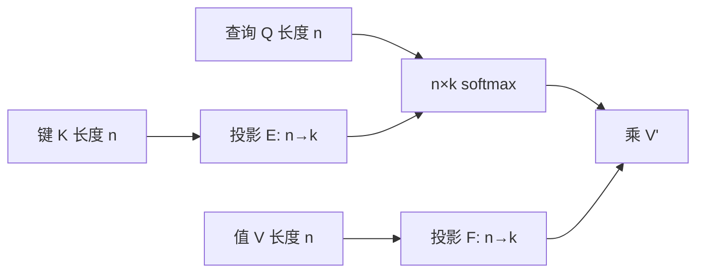

# Linformer

若注意力权重矩阵低秩，就可以先把长度维的键值投影到固定的 $k$ 个槽，再做缩放点积，复杂度对序列长度线性。

<footer>—— Wang, Li, Khabsa, Fang & Ma, Linformer, 2020</footer>

softmax 注意力的分数矩阵 $P\in\mathbb{R}^{n\times n}$ 看起来是满的，Wang 等人猜想它在预训练编码器里近似低秩，因而可以用 $n\times k$ 的投影把键和值从 $n$ 压到 $k$，再让查询去读这 $k$ 个槽。这与 [线性注意力](/llm/linear-attention) 的核结合律、[Performer](/llm/performer-favor) 的随机特征不是同一条代数：Linformer 仍然对投影后的序列做 softmax，只是键值条数变成 $k$。本篇写这篇 2020 年预印本的低秩命题、投影怎么接进 Transformer，以及它对变长与因果有多不友好。

## 问题

编码器自注意力的显存在 $n=512$ 时尚可，$n$ 到几千时 $P$ 先存不下。稀疏图靠删边；核化靠换相似度。第三条路是：**承认 $P$ 的有效秩远小于 $n$**，用低秩分解近似 $PV$。若 $k\ll n$ 且与任务无关地成立，就可以在几乎不改训练目标（仍是 MLM）的前提下换掉注意力实现。

问题立刻变成经验与理论两半。经验：RoBERTa 式模型的注意力矩阵是否真的低秩，投影后 MLM 与 GLUE 掉多少。理论：对 softmax 产生的矩阵，低秩近似的误差如何随 $n$、$k$ 走。若 $k$ 必须随 $n$ 线性涨，线性复杂度只是把二次换成「仍随 $n$ 涨的 $k$」。论文需要给出「$k$ 可取很小常数」的希望，又不能假装误差界允许 $k$ 与 $n$ 完全无关。

### 注意力矩阵被当成低秩的

低秩是对 *已经形成的* 权重矩阵的观察，通常用 SVD 或随机投影来测。不同层、不同头的秩曲线可以差很多：浅层局部、深层语义，有的头接近低秩，有的头需要更多奇异值才能复原尖峰。用单一 $k$ 切所有层，是工程平均，不是每张 $P$ 的最优截断。原文用这一观察为投影层辩护，并不是证明所有任务的注意力都低秩。

尖峰注意力（几乎 one-hot）的矩阵秩可以仍低——极端 one-hot 行甚至秩一——但 *不同查询指向不同位置* 时，要把许多尖峰同时保住，需要的秩会上去。低秩近似更容易保住平滑的头，丢掉「精确拷贝某一个 token」的头。这是与稀疏选边路线的关键差别。

## 方法

对第 $i$ 层（或共享后的一组层），引入 $E,F\in\mathbb{R}^{k\times n}$（论文按层或跨层共享做了消融），

$$
K' = EK,\qquad V' = FV,
$$

$K,V\in\mathbb{R}^{n\times d}$，于是 $K',V'\in\mathbb{R}^{k\times d}$。注意力写成

$$
\mathrm{softmax}\Bigl(\frac{Q(K')^\top}{\sqrt{d_k}}\Bigr)V',
$$

分数矩阵变成 $n\times k$。$E,F$ 可以是可学习线性，也可以先随机初始化再学。跨头共享投影能减参数；跨层共享更激进。$k$ 是主旋钮：原文在 MLM 设定下报告较小的 $k$（相对 512–1024 的 $n$）仍能接近基线，这是经验贡献的核心数字所在。

投影沿的是长度维，因此 $E$ 的列数等于当前 $n$。变长批次要么 pad 到固定 $n_{\max}$ 再投影，要么按长度切换不同的 $E$，要么用池化/卷积核做成与 $n$ 无关的下采样——后一种已经离开最朴素的「两个矩阵 $E,F$」。原文主设定更接近固定长度的编码器。

### 沿长度投影键值

查询侧保持 $n$ 条，因为每个位置仍要一个输出。被压缩的是「可读的记忆条数」。这很像强制所有位置去读同一组 $k$ 个混合槽。槽是长度维的线性组合，不是内容选中的 token，也不是 Nyström 地标的显式代表点。可学习 $E$ 可以学到「总是混合句首」或「均匀下采样」，取决于数据。padding 位置必须在投影前屏蔽，否则 $E$ 会把 pad 混进每一个槽。

### 与核化线性注意力不是同一条路

核化路线把 $\mathrm{sim}(q,k)$ 写成特征内积，用结合律先累加 $\sum\phi(k)v^\top$，因果时状态是 $d_\phi\times d$。Linformer 没有这条结合律：它仍物化 $n\times k$ 的 softmax。$k$ 代替 $n$ 的二次，复杂度 $O(nkd)$。不能把 Linformer 叫成 Performer，也不能把 Katharopoulos 的 $\phi$ 套进 $E$。三条线都「线性」，线性的对象分别是：低秩长度投影、确定核特征、随机特征逼近 softmax。

## 机制

梯度会更新 $E,F$，使 $k$ 个槽变成对 MLM 有用的摘要。若 MLM 主要靠局部上下文，投影可以学成近窗的平滑；若任务靠精确对齐，槽会不够用，模型可能把信息塞进残差旁路或 FFN，注意力近似误差被别的子层补——表面上 perplexity 不掉，头的拷贝能力已经没了。因此应在需要指代、对齐的任务上看，而不只看 MLM loss。

理论侧的低秩近似定理给出误差随 $k$ 下降的形式，常在一定随机矩阵或分布假设下。实践中 $k$ 是否随 $n$ 增长，要以目标 $n$ 做扫描：把 $n$ 从 512 拉到 4096 却冻结 $k$，等于把秩比 $k/n$ 砍掉 8 倍，定理并不保证你仍在同一误差平台。这是原文线性宣称最容易被误用的地方。

因果版本需要 $E,F$ 不看未来。下三角约束下的长度投影很难写成与位置无关的固定 $k\times n$ 矩阵，除非改成递归或卷积下采样。Linformer 的主场因此是双向编码器，不是自回归 LM。

### 变长与因果

变长：每个不同的 $n$ 改变 $E$ 的形状。服务时句子长度从 20 到 2000，朴素实现要么全部 pad 到 $n_{\max}$（$k\times n_{\max}$ 的无用乘），要么维护多套投影。这与满注意力「天然变长」相比是退步。因果：即使硬做掩码，投影混合未来键已经泄漏。所以不要把 Linformer 写进解码器-only 配方里当即插件。

## 边界与工程取舍

主实验是 MLM 预训练与 GLUE 类短到中等长度迁移，用来说明「投影后还能当 BERT」。长程基准后来更多交给 Long Range Arena、针测，那些不是原文的主表。$E,F$ 增加一组与 $n$ 成正比的参数（若每层独立且不共享），可能把「省下来的注意力」换成投影参数；跨层共享是在用表达力换参数。

硬件上，$n\times k$ 的 GEMM 在 $k$ 很小时可能填不满 Tensor Core，墙钟不一定线性下降。FlashAttention 让稠密 $n$ 在现代 GPU 上可接受之后，Linformer 作为「为了能跑 4K 编码器」的动机减弱。它留下的是低秩观察本身：后来的一些 KV 压缩、瓶颈注意力仍在引用「权重近似低秩」，但实现不再是两张 $k\times n$ 的满投影。

复现时不要用卷积下采样默默替换 $E$ 还沿用论文表格。下采样核有平移归纳偏置，可学习 $E$ 没有；两者的 $k$ 不可比。

## 小结

- Linformer 原文贡献是：用沿长度的可学习投影把键值压到 $k$ 槽，基于注意力矩阵近似低秩，使编码器自注意力对 $n$ 线性。
- 仍对 $n\times k$ 做 softmax，不是核化线性注意力，也不是稀疏选边。
- $k$ 是否可随 $n$ 固定，必须在目标长度上扫；定理不自动批准常数 $k$。
- 投影形状绑死 $n$，变长与因果都不自然，主场是双向、定长编码器。
- 低秩更容易伤害尖峰拷贝头，评测不能只看 MLM。
- 与 Nyström、Performer 的对照应落在「近似了矩阵的哪一步」。
- 出处：Wang et al., *Linformer: Self-Attention with Linear Complexity*, 2020。
