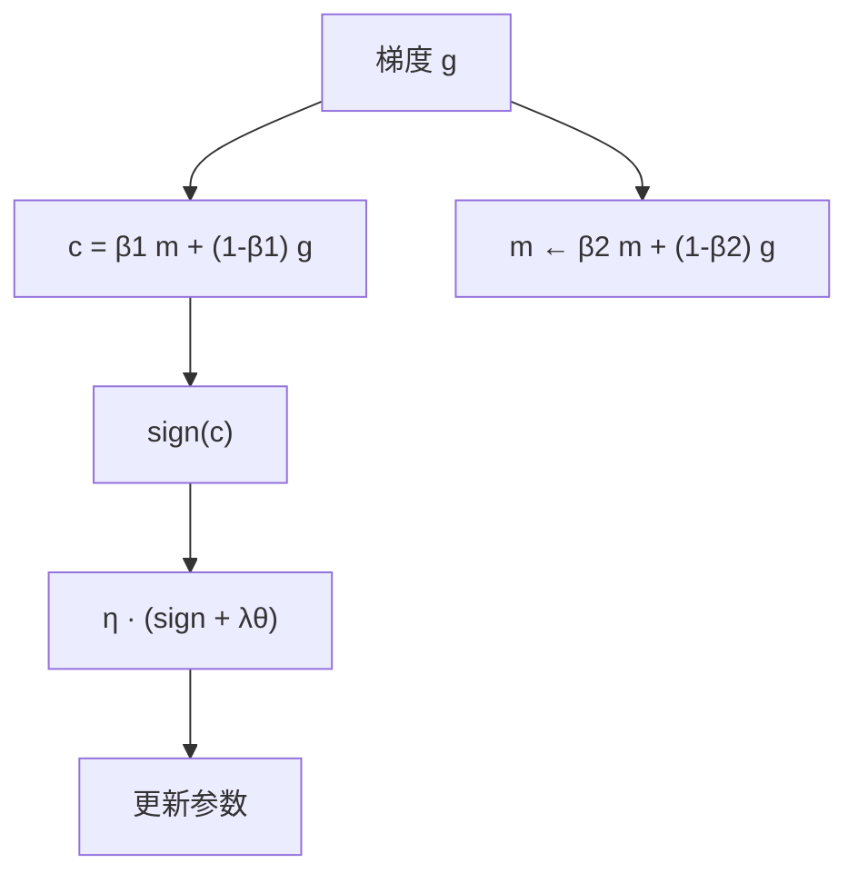

# Lion 优化器

更新由动量的符号给出，每维步长相同；搜索程序在符号程序空间里找到了它，而不是先写出一条新的自适应理论再实现。

<footer>—— Chen et al., Symbolic Discovery of Optimization Algorithms, 2023</footer>

Xiangning Chen 等人把优化器发现写成**符号程序搜索**：在无限、稀疏的指令序列里找能在代理任务上泛化到大模型的更新规则，再简化。搜出来的有效算法被命名为 Lion（EvoLved Sign Momentum）。与 Adam 不同，它只跟踪一份动量，不存二阶矩；与 SGD 不同，写回权重的是 $\mathrm{sign}(\cdot)$，因此每个坐标的更新幅度在乘学习率之前都是 $1$。论文在 ViT / JFT、对比视觉语言、扩散模型上显示可观的精度或算力节省；在自回归与掩码语言建模、以及微调上，相对 Adam 是相近或略好，并明确写下哪些设定里增益不显著。本篇写搜索得到的更新式、为何学习率必须比 AdamW 小一个数量级、以及符号更新对语言模型意味着什么。

## 问题

手写优化器的设计空间已经被一阶动量、二阶矩、解耦衰减占满，再叠加超参，人类很难穷尽「先插值再取符号」这类浅层组合。Chen 等人的问题是算法发现：如何在程序空间里搜索，使代理任务（小模型、短训练）上的胜者，到 ImageNet、JFT、扩散和语言模型上仍然成立。代理与目标之间的泛化缺口是搜索方法的老病；他们用程序选择与简化策略去桥，而不是只报代理上的冠军。

产物必须满足生产约束。Google 搜索广告 CTR 等系统关心显存：Adam 为每个参数存 $m$ 与 $v$，大模型上优化器状态与权重同量级。只存动量、用符号压缩更新幅度的规则，一旦有效，就同时解决「更好」和「更省状态」两件事。Lion 是搜索命中的简单式，不是为省显存而特意设计后再找理论。

### 符号程序而不是神经控制器

搜索对象是可打印的更新程序（加减乘、EMA、`sign`、clip 一类原语），不是另一个网络去预测学习率。这样发现的算法可以在任意框架里重写三五行，也便于做消融：去掉 `sign` 还是不是 Lion，改插值系数还是不是同一族。代价是程序空间组合爆炸，必须靠进化式或类似的高效搜索，以及严格的晋升门槛，以免过拟合代理。Lion 的「进化」指符号搜索的发现过程，不指训练时对种群做进化策略。部署时它是确定性的一阶优化器。不要和 NES、OpenAI-ES 那种用扰动估梯度的方法混名。

## 方法

典型实现维护动量 $m$，用两个系数 $\beta_1,\beta_2$（常取 $0.9$ 与 $0.99$ 附近）。一步是：

$$
c_t = \beta_1 m_{t-1} + (1-\beta_1) g_t,
$$
$$
\theta_t = \theta_{t-1} - \eta_t \bigl(\mathrm{sign}(c_t) + \lambda \theta_{t-1}\bigr),
$$
$$
m_t = \beta_2 m_{t-1} + (1-\beta_2) g_t.
$$

注意：写进 $\mathrm{sign}$ 的是 **$\beta_1$ 插值后的** $c_t$，随后才用 $\beta_2$ 更新真正的动量 $m_t$。这不是「先更新 $m$ 再取符号」的标准 SGD 动量。解耦衰减 $\lambda\theta$ 与 [AdamW](/llm/adamw) 同类，加在符号更新旁边。因为 $\mathrm{sign}(c)$ 的欧氏范数大约是 $\sqrt{\#\mathrm{params}}$，远大于 Adam 那种被 $\sqrt{v}$ 除过的更新，**峰值学习率通常要设成 AdamW 的 $1/3$ 到 $1/10$**；为保持 $\eta\lambda$ 这一有效收缩率，权重衰减数字要反比放大同样的倍数。

论文观察：相对 Adam 的增益随训练 batch 变大而更明显。小 batch 时符号更新的噪声更大，优势缩小或不显著。视觉与扩散上的主结果往往配大 batch；把 Lion 抄到很小的微调 batch 上，需要重新扫 $\eta$，不要预期 JFT 上的 5× 预训练节省。

### 搜索叙事与最终公式要分开引用

贡献有两层。第一层是方法：把优化器发现做成可搜索程序，并处理代理–目标鸿沟。第二层是产物：Lion 这条具体规则及其在多任务上的对照。只引用「Google 搜出来的优化器更好」，会把搜索框架的泛化声明和 Lion 在语言模型上「相近或略好」的有保留结论混在一张幻灯片里。复现语言模型时，应以论文中自回归 / MLM 表格为准，而不是以 ViT 的 +2% 为准。

## 机制

$\mathrm{sign}$ 把每维更新的幅度拉齐：梯度很小的坐标与很大的坐标，走同样的 $|\Delta\theta_i|=\eta$（衰减另计）。这与 Adam 相反——Adam 让历史梯度大的坐标步长变小。Lion 更接近「信任方向、不信任幅度」，再用动量把方向在时间上平滑。大 batch 下 $g$ 更接近真梯度，符号更稳，于是这种「只保留符号」的信息损失变小，论文中增益随 batch 增长与这一图像一致。

显存：状态只有 $m$，相对 Adam 少一份 $v$，大模型上可观。更新本身是逐元素，没有 Sophia 的 Hessian、也没有 Muon 的矩阵正交化，墙钟每步通常不慢于 Adam。数值上符号函数在零处不连续，实践中 $c_t=0$ 极少成为问题；混合精度下应保证 $c$ 的符号不被 underflow 成全零。

学习率不能从 AdamW 配置原样粘贴。只把 $\eta$ 除以十却忘记把 $\lambda$ 乘回来，等于把权重衰减几乎关掉；只放大 $\lambda$ 却不缩小 $\eta$，符号更新会一步走出稳定区。应锁定乘积 $\eta\lambda$，再扫 $\eta$。

### 何时增益会消失

作者检查了改进很小或统计不显著的情形：某些语言建模与微调设定、以及与强自适应基线（Adafactor 等）的对照。符号更新伤害的是「幅度里仍有可用信息」的任务；若各层梯度尺度已经靠初始化或 [μP](/llm/mup) 对齐，再取符号的边际可能变小。小 batch、强噪声、极稀疏嵌入表上，符号可能被单步噪声主导。这些不是隐藏缺陷，是原文已经写出的边界。

## 边界与工程取舍

语言模型预训练社区并未用 Lion 替换 AdamW 作为默认。原因包括：语言任务上的增益不如视觉醒目；超参换算（$\eta$、$\lambda$、有时含 $\beta$）需要单独网格；与 μP、与矩阵优化器的合写缺少像 Adam 那样的标准表。作为微调优化器，较小的 $\eta$ 与较大的 $\lambda$ 容易被漏抄，表现为「Lion 一训就发散或完全不动」。

与 [Sophia](/llm/sophia) 比：Lion 无曲率估计，不能按尖锐方向自动缩小步长，全靠全局 $\eta$ 与符号。与 [Grokfast](/llm/grokfast) 比：Lion 改更新几何，Grokfast 改梯度时间频谱，可以叠，但叠了就要扫两套增益。生产上若显存已被 ZeRO 切碎，$v$ 的节省可能不是瓶颈，Lion 的理由应从验证损失来，而不是从状态字节来。

Optax / Keras 里的 Lion 默认把「$\eta$ 比 AdamW 小 3–10 倍、$\lambda$ 大 3–10 倍」写进文档。这是经验换算，不是搜索程序证明的最优倍数。新模型宽度或新损失上仍要网格，尤其是嵌入表是否与隐藏层同一 $\eta$。

CTR 生产部署说明它在至少一类大规模稀疏模型上可用；这不能外推为「所有 Transformer 都该换 Lion」。

## 小结

- Lion 由符号程序搜索得到：对动量插值取符号作为更新，只维护一份一阶状态。
- 因更新范数大，学习率通常为 AdamW 的 $1/3$–$1/10$，权重衰减数字反向放大以保持 $\eta\lambda$。
- 增益在大 batch 的视觉、对比学习和扩散上更明显；语言建模原文写为相近或略好，并存在不显著区间。
- 发现方法（程序搜索）与发现产物（Lion 更新式）应分开引用。
- 不要从 AdamW 零改粘贴超参；与 μP、Sophia、Muon 的合写需单独验证。
- 出处：Chen et al., *Symbolic Discovery of Optimization Algorithms*，arXiv:2302.06675；实现 https://github.com/google/automl/tree/master/lion。
